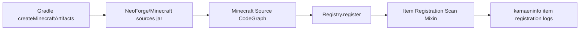

# Kamaen Info Graph

This vault is a small Obsidian-facing knowledge graph for the mod.

## Entry Points

- [[KamaenInfo Mod Entry]]
- [[Item Registration Scan Mixin]]
- [[Minecraft Source CodeGraph]]
- [[Visualization Options]]

## Current Flow

