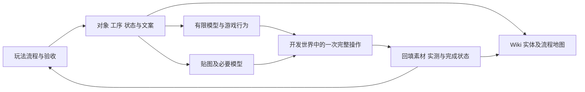

# D0：从玩法稿到画布、素材与游戏的开发计划

2026-09-10，环境探索后的实施计划。依据用户要求，先明确流程，再从前期逐段细化玩法、物品方块、贴图/模型与文案，并按流程填充 Wiki 自由画布。本轮交付计划与首批流程表，未修改游戏逻辑、正式素材或现有画布布局。美术按用户本轮修订：旧贴图不作参考，游戏纹理统一32×32，从零像素手绘或使用Blockbench制作。

入口：[首批流程与内容制作表](EARLY_DEVELOPMENT_FLOW.md)、[设计总入口](README.md)、[现有工具链](../../tooling/README.md)、[Wiki 文件注册说明](../../wiki/content/README.md)。设计来源继续采用 E1/E1.1 前期、R4 中期、L3 后期；实现进度由代码与运行证据独立记录。

## 1. 当前环境能做什么

| 环节 | 2026-09-10 核实结果 | 对计划的影响 |
| --- | --- | --- |
| 游戏工程 | 当前配置为 Minecraft 1.21.1、NeoForge 21.1.222、Java 21；沿用根工程 | 在当前工程补小闭环，不用下载的 MDK 覆盖工程 |
| 官方参考 | `.tools/mdk-1.21.1` 是独立参考，工具文档记录固定提交及不同版本 | 需要查 API/模板时比较具体版本，升级另立工作项 |
| 开发命令 | `tooling/dev.ps1 doctor` 本轮成功；Java 21.0.10；IDEA、Blockbench、NBT Studio 路径存在 | 复用 doctor/build/client/server/data 入口 |
| 游戏构建证据 | 现有构建日志成功，0.1.0 JAR 为 183389 字节；目录还有旧 1.0.0 JAR | 后续客户端/验收明确使用当前构建，不按文件名最大版本猜测；本轮未重建 Mod 或启动客户端 |
| Java 注册 | 当前入口有原晶、调谐晶体、探针三个普通物品，以及分馏塔、爆炸室控制器、黑洞核心三个普通 Block/BlockItem | 注册与显示占位可以复用；这些声明不能作为工艺、仪器或机器行为已实现的证据 |
| Wiki 服务 | 4173 的 `/api/workbench` 本轮返回 200，工具入口可检测 | 已有本地工作台，不必再建一套启动面板 |
| 自由画布 | 当前 `#/canvas` 使用 `FreeCanvas`；`CanvasPage` 是 legacy 入口 | 后续填充 `wiki/content/maps/`，不把新版内容写入旧 `canvas.json` |
| 文件内容 | 本轮验证 8 实体、2 地图、2 场景、1 曲线模型、1 自定义渲染；发展示例图 23 个组件 | 已可通过实体、说明、资源、场景、模型与地图文件扩展 |
| 自动检查 | 本轮 `npm test` 13/13，`npm run validate:content` 通过 | 保留现有保存冲突、注册、坐标及桌面桥检查，新增功能才补相应检查 |
| 文档导入 | `sync-content.mjs` 仍读 `review-tech-tree.json`；当前生成包 78 能力、292 导入条目、124 配方、73 文档 | L3 86 能力尚未接入阅读层；先处理版本来源，不能直接整包导入当作已完成内容 |
| 游戏素材 | 已有 6 张 128×128 PNG：3 物品、3 方块；语言只有 `en_us.json`；`art/models` 无 `.bbmodel` | 这些仅记录既有文件，用户已要求弃用其美术方案；正式纹理按32×32重新制作，中文文案按用途补齐 |
| Blockbench 自动化 | 桌面在运行，3000 端口属于其进程；`/health` 为 200，但 `/bb-mcp` GET 与初始化 POST 均 404 | 桌面建模可用；MCP 自动建模尚未验证成功 |
| 插件记录变化 | 本机 `plugins/mcp.js` 本轮为 568282 字节，已不同于工具 README 的“0 字节”旧记录 | 不按旧记录重新下载插件；先核实际加载状态、配置端点和协议握手 |
| 浏览器验收 | 当前 CUA 仅提供应用内浏览器，没有可用 Chrome 连接 | 本轮未复测拖拽、原位详情或视觉；后续画布验收接通指定 Chrome，保留既有测试记录的历史范围 |

已读代码依据：`KamaenInfo.java` 的注册与事件入口；`wiki/src/App.tsx` 的路由；`wiki/server/registry.mjs` 的文件编译；`wiki/src/world/types.ts` 的实体/地图/模型结构；`SceneViewer.tsx` 的体素预览；`sync-content.mjs` 的输入。当前场景是体素展示，不是现成的 Java 模型或 `.bbmodel` 查看器。

## 2. 一段玩法怎样成为交付内容

开发围绕玩家能完成的一件事推进，例如“从一次分离中取得材料并留下一份可比较的滤渣”。这一件事同时提供给设计稿、画布、游戏和图文说明，共享对象与流程引用。

每段固定交付六样东西：

1. 流程卡：玩家目的、前置取得、动作、可见反馈、实际产出、失败后继续方法。
2. 内容表：哪些是实体，哪些是实体的状态/工装，哪些是知识记录；首次来源和用途明确。
3. 最小模型：本段实际需要的状态更新、库存/能量结算和观测范围；有一组有效例与一组反例。
4. 画布内容：流程位置、实体引用、说明、必要的 2D/3D 示意、发展/生产/反馈关系。
5. 资产与文案：可编辑源、游戏导出物、Wiki 展示资源、名称/提示/失败说明和简短研究记录。
6. 实测证据：构建、开发世界操作、退出重载、物料与结果核对；完成后再更新对应状态。

画布可先展示明确标为草案的内容；它让我们讨论流程和缺口。游戏实现完成后，将实测回填同一批对象，不另造一套看起来相同的“正式版实体”。

## 3. 三种身份与四种完成状态

当前 Wiki 使用 `kamaen:*`，游戏注册使用 `kamaeninfo:*`，导入文档还有 E1/R4 前缀及旧稿 ID。它们保留各自用途，通过显式映射关联；不全量重命名历史引用，也不按中文名称自动合并。

| 身份 | 用途 | 例子 |
| --- | --- | --- |
| 设计来源 | 指明采用哪版思想、流程与旧 ID | E1.1 的晶种诱导过程；旧 `raw_kamaen_crystal` |
| Wiki 实体 ID | 跨地图、说明和关联入口复用 | 已有 `kamaen:raw_crystal` |
| 游戏注册 ID | 真正的物品、方块、组件或数据类型 | 已有 `kamaeninfo:kamaen_crystal_raw` |

映射还要记录对象角色、适用阶段、注册位置与证据。白噪晶种与粗晶体是不同过程阶段，不能因为都是晶体而合并；导波/抗压/稳谱优先考察材料状态与用途报告是否足够，不先创建三套没有状态关系的升级物品。

当前实体只有一个自由文本 `status`。建议增量补四个独立维度，旧字段兼容保留：设计详细程度、游戏实现程度、资产制作程度、验证程度。例如“设计已细化 / 仅注册 / 临时贴图 / 未进游戏”，比单个“完成”可靠。阅读次数与网页动效只表示浏览活动，不作为游戏科技完成证据。

建议新增的 `designRefs`、`runtimeRef`、分项状态和 `evidence` 均为待实施字段；现有 Schema/类型/校验器需要相应改造，不能直接写入 JSON 就声称已经被前端正确处理。

## 4. 画布怎样按流程填充

采用“一张全程导航＋按需打开的阶段地图”。全程导航使用 E1→R4→L3 的当前线索，前期地图逐段填到操作级，后续阶段先保留可导航的内容范围。完整科技图服务依赖查询，不将 86 项能力直接挤成首次看到的画面。

首张阶段地图建议为 `early-foundation`，沿左至右展示材料准备、分离留样、普通供能、均值化、晶种与参考测量。普通供能位于并行分支，随后接回工位。每段由下面三组内容组成：

- 中间：玩家正在操作的实物、工位和工序关系。
- 上方：目的、简短故事和下一条发展线索。
- 下方：输入/余料、观察与模型、实测和待完善事项。

复用现有自由坐标、原位详情、箭头、虚线框、2D/3D 和自定义组件。框只是标注，没有容器/分组执行语义；坐标不定义工艺先后或物理方向。已有地图中的用户布局和浏览器未保存草稿必须保留。

关系建议区分“首次能力前置”“实际物料流”“观测反馈”“可选应用”四类。目前自由线条不能承担这些可查询语义。第一批可先使用明确文字标签；随后增加独立关系数据与连线显示映射，仍允许自由画线。禁止从屏幕上下左右推断科技依赖。

现阶段不必先开发通用流程执行器。流程表在本文配套文件维护；结构稳定后，再将需要机器校验的步骤/关系抽为版本化数据。布局和实体内容保持分离，重排地图不改变玩法规则。

### 第一批填充的文件去向

| 内容 | 当前可用位置 | 约定 |
| --- | --- | --- |
| 阶段地图 | `wiki/content/maps/early-foundation.json`（拟新增） | 独立地图，不覆盖 `development.json` 与 `empty.json` |
| 实体说明 | `wiki/content/entities/`＋`descriptions/` | 同一实体多处出现只增加地图实例，不复制档案 |
| 曲线示意 | `wiki/content/models/` | 现有模型是单自变量、有限表达式曲线；尚不能当成多状态工艺求解器 |
| 工艺演示 | `wiki/content/scenes/` 或受限 `renderers/` | 先用体素/分步示意；复杂过程可用独立展示，不冒充游戏实测 |
| 模型源 | `art/models/*.bbmodel` | 可选，游戏不打包源工程 |
| 贴图源 | `art/textures/`（拟新增） | 可编辑源、调色与导出说明；不直接当游戏资源路径 |
| 游戏导出 | `src/main/resources/assets/kamaeninfo/` | 32×32 PNG、Java 模型、blockstates、语言；数据生成输出另在 `src/generated/resources/` |
| 展示素材 | `wiki/content/assets/` | 由登记清单复制/导出并记录来源，避免手改两份正式 PNG |

## 5. 必要的工具和前端改造

| 优先级 | 工作项 | 具体交付与验收 |
| --- | --- | --- |
| P0 | 当前设计导入 | 读取 L3 整合图并正确标记 L3 文档；保留 R1 来源。以输入集合验证覆盖，不继续增加容易过时的魔法数量断言 |
| P0 | ID 映射与完成状态 | 显式关联设计/Wiki/游戏；缺失、重复或错配可诊断。仅注册的普通物品不会显示“玩法已验证” |
| P0 | 首张前期地图 | 使用现有组件按流程填充、链接实体与说明；保存重载后引用、位置与用户标注保留 |
| P0 | 首个开发世界 | 使用当前工程启动并验收已有注册与资源，建立可反复复验的测试场景；不能用成功构建替代这一步 |
| P1 | 资产清单与检查 | 关联源文件、游戏导出、Wiki 引用和版本；检查缺失纹理、路径、语言、模型引用。同步操作只更新登记输出 |
| P1 | 关系语义与导航 | 在自由连线之上增加明确关系引用，支持阶段跳转/查前置；新增功能不改变已有坐标或框的自由标注语义 |
| P1 | 2D 工艺对照 | 支持固定输入的前后/对照展示、有效域和来源；有状态过程另建适合的演示，预测与实测分开 |
| P1 | Blockbench MCP 连通 | 检查插件实际加载及端点；完成 initialize、tools/list 和只读项目查询后才记为可用。修复前可手工建模或用普通 Java 方块模型 |
| P1 | Chrome 交互验收连接 | 使当前会话可操作指定 Chrome，再核画布、详情和工具入口；不修改用户默认浏览器 |
| P2 | Java 模型预览 | 有首个确实需要几何的方块后，支持所需 Java 模型子集、UV/旋转与贴图路径；复杂动画另算 |
| P2 | 更多集成 | JEI/指引书/分步教学、复杂动画等按已实现玩法决定；先验证当前版本适配再加依赖 |

当前不需要另换前端框架、再下载一个开发模板、一次装齐全部美术工具，或先做万能仿真编辑器。需要新增工具时，以具体缺失能力、版本、文件出口及验收动作说明需求。

## 6. 执行步骤与任务粒度

以下每一阶段交付一段可讨论/可玩的进展；跨子系统的阶段再拆小任务，通常一次只改 1—5 个主文件，自动生成资源单独记录。

| 顺序 | 任务与边界 | 前置 | 主要文件范围 | 验收 |
| --- | --- | --- | --- | --- |
| D01 | 当前版本导入与来源检查 | 本计划 | `sync-content.mjs`、导入测试、生成文件 | L3 图和文档被正确读取，E1/R4 来源与旧引用保留 |
| D02 | 先为现有实体建立身份/状态映射 | D01 | 实体 Schema、types、registry、针对性测试 | 当前 8 示例均不误报已实现；原晶正确对应已有注册 |
| D03 | 地图引用和状态显示适配 | D02 | 实体详情/库相关组件与少量样例 | 同一对象跨地图复用，缺证据有明确显示，旧数据可读 |
| D04 | F00—F02 流程地图与第一组图文 | D03 | 新地图、少量实体与描述文件 | 能顺着说明理解投入、操作、余料与用途；已有图不动 |
| D05 | 游戏运行基线 | 环境已就绪 | 必要的注册/资源修复，开发记录 | 当前客户端实际加载，测试环境能保存和重新进入 |
| D06 | F01 有限分离模型 | D04、D05 | 独立过程计算、物料接口及测试 | 合法组分有限分流；重复结算、满出口、余料均有明确结果 |
| D07 | F01 工位交互与保存 | D06 | 分开完成注册/方块实体、交互同步、资源数据三个小任务 | 从普通材料取得可用产物，退出重载不丢失或复制 |
| D08 | F01 素材与中文文案交付 | D04，与D06—07可交错 | 每批一个工位/少量图标，模型/纹理/语言分小提交 | 材料状态与操作面可辨，画布和游戏引用一致 |
| D09 | 第一闭环回填 | D07、D08 | 实体说明、截图/证据、阶段地图 | 画布展示实际运行结果；闭环前后物料可核对 |
| D10 | F03—F05 均值化、晶种、参考对照 | D09；F02普通供能按工位需求接入 | 按模型、工位、资产、文案分别展开 | 晶种有保守取得路径；参考与生长消耗分开；已测与未知可区分 |
| D11 | F06—F08 加载、脉冲、特化与生产回流 | D10 | 同样按单个工序/作品切小任务 | 改方向或历程会改变结果；特化件在原生产中产生实际收益 |
| D12 | F09—F10 应用、记录与中期交付 | D11 | 选一项应用、有限记录/分析与传感连接 | 旧工位可被观测和控制，物料/对象/信号进入后续 IC 工作 |

D07 是阶段集合，不作为一次跨十几个文件的大任务：先做库存与持久状态，再做输入/输出交互，然后补客户端显示和制作数据。每小步可单独验证，完成后合为 F01 的一次玩家操作。

D09 是第一个实际审查点：是否能完成一批处理、看懂结果、保留余料并继续。D10 完成后审查“第一枚晶种及参考用途”；D11 后审查“晶体已经改善生产”；D12 再交给中期。每个审查点都根据实测反向调整流程表、模型和画布。

## 7. 模型与素材的实施取舍

### 7.1 状态逐段增加

F01 先有原料族、允许组分/量、实际输出与余料；F03—F05 再引入温程、均值化/成核状态和观察；F06—F08 增加方向、局部结构与加载历史。接口保留版本和来源，避免把后期张量/算子系统一次塞进首台机器。

持久材料状态、设备运行状态、观测记录和玩家模型分别保存。模拟曲线不会生成“真实实验结果”；同一事件重放不能多产一份物料。拆装、掉落、跨库存和重载的状态行为随首个相关功能实现，而不是等机柜阶段再补。

数值首先使用固定有限工况，正常路线要可重复取得产物。之后加入有来源的随机扰动和留出对照。它们帮助解密规律，不用低概率掉落替代工艺设计。

### 7.2 资产由用途决定

用户已明确：**旧贴图不纳入美术参考，正式游戏纹理统一32×32，从零重新制作。** 不对旧128px图片做缩放、描摹或细节继承，也不沿用其轮廓和配色作为新风格依据。旧文件本轮保留原状，替换时逐个更新登记资源引用，避免在素材未接入前破坏当前工程。

第一批制作方式采用像素手绘或Blockbench纹理绘制。像素手绘可直接按32×32网格创作PNG；Blockbench同时处理需要几何的模型及UV。放大预览使用最近邻，检查100%尺寸、物品槽与世界环境中的辨识度，避免平滑插值和大图缩小造成模糊。

视觉先从早期材料与操作推导：碎屑、粉料、滤渣有不同轮廓与颗粒组织；晶种用紧凑结构表达初始结晶；机器能看出工件面、供给口和收料位置。频率与信息通过结构方向、刻度和少量功能标记表现。配色与纹理语言由这批新稿建立，不从旧图提炼。

普通立方块/平面物品可先用Java标准模型模板。夹具、坩埚、开合工装等确实需要几何时，再用Blockbench的 **Java Block/Item** 格式。每张正式PNG保持32×32，多面需要不同图案时使用多张32px纹理；不默认升级大图集、PBR或动画系统。技能中的通用Bedrock默认不适用于本项目。

正式验收分开检查：纹理尺寸与透明边缘、微缩轮廓、用途区分、UV/方向、游戏光照下的可读性。先完成一小组前期新素材的并排预览和游戏实测，再扩展其他工位；这些是制作检查点，不要求在每个像素修改前重新确认。

## 8. 本轮交付与后续完成标准

本轮已经完成环境/代码/内容入口探索、工具可用性检查、13项 Wiki 自动测试与注册校验，并写下此计划及前期流程表。还没有向画布填充正式前期内容、制作正式资产或新增游戏功能；这些对应 D01—D12。

开始实施时按 D01—D05 建立可复用入口与首段图文，然后完成 F01 的一次真实处理。全程图可以先标出后续路线，但正式内容完成度按每段实际交付更新。
