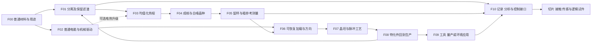

# D0：前期流程表、首批画布内容与制作清单

2026-09-10，配合[开发计划](DEVELOPMENT_PLAN.md)。以下 F00—F10 是开发流程定位，不取代 E1 阶段与全局 P 编号。注册名与配方数量尚未确认的部分保留为候选。美术规格已按用户修订：正式游戏纹理32×32，从零重绘，旧贴图不作参考；制作使用像素手绘或Blockbench。

依据：[E1玩法](EARLY_E1_GAMEPLAY.md)、[E1内容索引](EARLY_E1_CONTENT.md)、[E1.1工艺](EARLY_E11_PROCESS_MANUFACTURING.md)、[力学合成](EARLY_E11_MECHANICAL_SYNTHESIS.md)、[晶体模型](EARLY_E1_CRYSTAL_MODEL.md)、[应用发展](EARLY_E12_APPLIED_PROGRESSION.md)、[传感器到IC](EARLY_MID_SENSOR_TO_IC.md)。

## 1. 先确定玩家实际经历的流程



图中 C→D 表示电热是可用升级路线，首枚晶种仍允许已有燃料热源完成。F00—F02 不要求先把一整排新机器造完。普通原版铁铜能直接进入相容路线，圆石/木材/水保留自举兜底。

## 2. 流程表：每一步都交付一种用途

| 步骤 / 来源阶段 | 玩家目的与操作 | 最小对象与机制 | 立即得到什么 | 继续发展的理由 |
| --- | --- | --- | --- | --- |
| F00 / E0 | 找到建造和处理材料的起点，选一份普通基材 | 原版原料、粗处理工具、容器；原料族限制产物集合 | 可加工原料、普通结构材料 | 想从混合物中取得更有用的份额 |
| F01 / E0 | 粗碎、制浆、分流，保留粉料与滤渣 | 粗频谱碎屑/泥浆、滤材、材料处理槽；实际进出量 | 一份可用粉料与有来源的滤渣 | 滤渣仍有可重复响应，值得处理；量产也需要驱动 |
| F02 / E0并行 | 接普通发电/驱动，让处理连续进行 | 普通燃料供给、线/接头、驱动工装；局部负载与库存 | 一套能持续做有用工作的初期产线 | 提高重复性、安排物料和热路，而非反复手点 |
| F03 / E1 | 给滤渣/基材一个受控温程，比较处理前后 | 热程坩埚、容器/隔热/热源、合法基底；内能和处理历史 | 均值化基底、保留的未完成料 | 能否从共同基底形成稳定的结晶起点 |
| F04 / E1 | 用可重复冷却/成核过程制得第一枚晶种 | 白噪晶种、留样容器、生长用材料；种与料分别记账 | 可留作参考的晶种，或实际投入后续生长 | 相同起点在不同操作下出现怎样的差异 |
| F05 / E1—E2 | 留一份参考，用有限激励比较处理前后 | 简易激励/读出、夹持和参考位、记录；只显示实际可测范围 | 粗响应与参考偏移的区别 | 想区分临时加载、方向差异和持久材料变化 |
| F06 / E2 | 夹持、旋转、加载、卸载并复测 | 加载装配台、压头、可转夹具；实际接触、方向与恢复 | 可以预测的方向/加载响应，一套有用途的装配 | 想将可用结构保持下来，并扩大加工能力 |
| F07 / E3 | 定位晶种与基材，调整源/路径/缓冲后做短时处理 | 晶坯、脉冲工艺腔、靶座和收料；局部历程与保持 | 粗晶体、半成品、合法碎片/余料 | 不同方向和工序能否做出适合特定工作的材料 |
| F08 / E4 | 选定工况、调理并把实物装回处理槽或夹具 | 导波/抗压/稳谱等用途件、耦合工装、安装位置 | 原生产中可比较的分离、传输或承载改善 | 想为不同材料和工作条件保存方案、自动切换 |
| F09 / E4可选应用 | 将一种成果用在工具、建材量产或环境探测 | 复用同一工艺和测头，选一个原版用途 | 玩家日常建设或探索中看得见的收益 | 新场景提出新数据和控制需求 |
| F10 / E5 | 整理批次和工序，做查表/小模型并接回控制 | 有限记录载体、输入/输出接口、固定控制基线 | 可复验的选参与反馈，传感/逻辑试件的基础 | 接到中期编码、器件组合、芯片与计算中心 |

F09 的多个应用不是全部前置；F10 的记录从 F01 开始积累，早期不要求先造计算机。F07 可以使用电驱动脉冲或登记游戏爆震耗材，两者按脉冲形状、维护和重复能力比较。

## 3. 第一张地图的填充范围

首批只把 F00—F05 填成可讨论的完整区域；F06—F10 用简短出口和后续地图入口表示。新地图建议 ID 为 `early-foundation`，现有 `development` 保留示例与用户布局。

建议初始排版采用左至右六个流程区，给每区留出上方叙事与下方观察位置；F02 放在 F01 附近的并行区域。具体坐标由实际文字和素材尺寸确定，不作为锁死的布局规则。

| 地图区域 | 首批放入的内容 | 展示方式 | 应当能回答的问题 |
| --- | --- | --- | --- |
| 入口 | 普通基材、想完成的第一项建设用途 | 文字＋原版材料引用/合法参考图 | 为什么开始处理这些材料 |
| 分离 | 碎屑、泥浆、滤材、处理槽、粉料、滤渣 | 实体＋带标签的投入/产出线 | 投入去了哪里，余料能继续做什么 |
| 供能分支 | 普通供能、真实连接、驱动/加热工装 | 简图＋接口说明 | 哪些动作现在可持续，哪里仍受结构限制 |
| 均值化 | 处理前材料、坩埚、处理后基底 | 工序文字＋温程/状态示意 | 热程怎样改变材料，为何不是照配方名凭空产物 |
| 成核与留样 | 晶种、参考样、生长用途 | 同一实体的不同用途实例 | 参考为何保留，生长为何会消耗实际晶种 |
| 粗测量 | 激励、夹持、参考读数、未知样读数 | 2D曲线或独立对照展示 | 哪些是观察，哪些仍是解释；怎样进入下一次操作 |

同一滤渣可同时出现在分离出口与坩埚入口，两个地图实例都引用同一实体。原位详情保持地图位置；进入 2D/3D 内部操作不拖动底层地图。先用现有组件说明流程，再为已暴露的具体交互缺口扩展前端。

## 4. 首批对象与注册映射候选

以下是内容制作清单，不要求每一行成为新物品或新方块。每个被实现的对象先核对已有 ID，再决定复用、新增或状态变体。

| 内容 | 旧稿/现有引用 | 当前处理建议 | 资产与实现重点 |
| --- | --- | --- | --- |
| 粗频谱碎屑 | `crude_spectrum_scrap` | F01拟新增实体，游戏 ID 待对应 | 与粉末有不同颗粒轮廓；保存有限输入组分 |
| 泥浆及实际容器 | `crude_spectrum_slurry` | 首版可在工位内部保存批次；是否独立流体另判断 | 能看到液量/固体与出口，避免物品桶和槽重复库存 |
| 粗滤材 | `spectrum_membrane` | 可复用工装，清洗/更换对应实际状态 | 网纹及污染反馈；首台不依赖晶体 |
| 粉料 | `spectrum_powder` 与登记材料族 | 先选少量有原版用途的输出 | 不同形状/标记辨认用途，类型与量有合法范围 |
| 频谱滤渣 | `spectrum_slag` | F01拟新增，与后续热程共用 | 保留来源与残余组分；不能固定掉落无来源额外料 |
| 材料处理槽 | E1.1装置家族 | 首台小型处理工位候选 | 现有 `fractionating_tower` 是普通方块占位，需比较语义/外形再决定复用，不能直接宣布整塔已实现 |
| 普通供能/驱动 | E1普通电能支路 | F02按实际工位需要接入 | 清晰输入/输出接口；首版供给足以承担有用产线 |
| 热程坩埚 | E1.1装置家族 | F03首批工位 | 容器、加热面、观察/取料位置；燃料/电热可共台工装 |
| 均值化基底 | `whitened_cobblestone` | F03独立工艺结果候选 | 不把已有晶体调色当成处理完成；状态由热程产生 |
| 白噪晶种 | `white_noise_seed`；Wiki `kamaen:white_seed` | 保留 Wiki ID，后续显式映射正式游戏注册 | 与粗晶体区分；参考与生长用途分开说明 |
| 粗卡玛恩晶体 | 旧 `raw_kamaen_crystal`；Wiki `kamaen:raw_crystal`；游戏 `kamaeninfo:kamaen_crystal_raw` | 复用已有游戏注册，F07补实际取得与状态 | 沿用原料来源，不能把普通 Item 注册当成已经支持 CrystalState |
| 调谐/用途晶体 | 游戏 `kamaeninfo:kamaen_crystal_tuned` | F08核定为状态容器或兼容展示；不先铺满升级等级 | 方向、组成和工序影响用途；不同用途不只靠名字切换 |
| 粗测量工具 | 游戏 `kamaeninfo:info_probe` | F05考虑复用；先限定测量能力 | 当前只是普通 Item；实际读出、参考、反馈和保存需新增 |
| 加载/脉冲工位 | Wiki `kamaen:pulse_bench`；游戏 `kamaeninfo:explosion_chamber_controller` | 两者先做角色映射，普通加载与脉冲腔不自动合并 | 真实方向、源、靶座、收料；复杂几何按需求用 Blockbench |
| 记录 | Wiki `kamaen:sample_data`、E1工序/观察记录 | 展示样例先复用，正式类型另立版本 | 实际测量、解释、动作和完成结果分开；NBT示例不能直接作为正式契约 |

原版原料可以用文字或合法取得的图像展示；不要为 Wiki 展示而注册一套重复的铁锭、铜锭或圆石。

## 5. F01 的首个可玩闭环

**目标：** 玩家用普通材料进行一次分离，取得可用产物并保留可继续处理的滤渣。

**操作候选：** 放入一批合法碎屑与水→安装粗滤材→选择保守处理步骤→运行→分别收取粉料、滤渣与可回收液体。手动起步可以小批完成，普通驱动接入后可连续处理。

**需要确认的最小模型：** 输入允许哪些组分、分配到各出口的比例、处理未完成时保留在哪里、出口空间不足时如何停止。先做一个固定母批的确定性演示，之后再加粒度、污染和过滤条件差异。用同量输入对照不同工况，不靠重复随机抽奖比较优劣。

**首轮验收：**

1. 原版取得路径能到达第一次处理；全过程看得到投入、目标产物与余料。
2. 满出口、停止、取下工装、退出重载不会重发已确认产物或凭空丢掉整批输入。
3. 产物能用于一种后续普通制作，滤渣能进入 F03；Wiki 展示的来源与实际一致。

F01 不需要完整流体管网、所有物料配方、任意三维流场或机器学习。需要新增公共能力时，先满足这一批工位的真实需求，再扩展第二台。

## 6. F03—F05 的晶种与测量闭环

**目标：** 晶种既是世界观的起点，也是可反复使用的参考对象。

流程分为均值化、成核、参考使用三个步骤。热程改变合法基底的实际状态；成核形成晶种；参考测量增加对它的认识。三者分别保存结果，不能因研究册已解锁而让同一块未处理材料自动变为晶种。

第一张实验图只展示少量激励点和读数，不暴露整个开发者材料向量。先看同一参考在两次测量中的偏移，再比较加工过的样品；粗读出能力不足时明确“不足以区分”，后续更好的测头才提供新信息。

**首轮验收：**

1. 保守温程可以重复制得晶种，未处理或中途退出有可继续处理的材料状态。
2. 留作参考不会复制另一枚生长晶种；投入生长的实物从原位置扣除。
3. 临时改变激励、温度或夹持后，读数变化与持久材料加工分别解释；预测图不当作新增实测记录。

## 7. 每批素材与文案怎样交付

第一批资产围绕 F01，仅做少量碎屑/粉料/滤渣图标、滤材和处理工位。第二批才做坩埚、基底、晶种与参考夹持；脉冲腔和大量特化件跟随 F06—F08，不提前画全科技树。

| 首批新素材 | 固定规格与制作方式 | 检查重点 |
| --- | --- | --- |
| 碎屑、粉料、滤渣图标 | 每张32×32透明PNG，像素手绘 | 不依赖文字或颜色深浅也能分辨三类轮廓；边缘无缩图光晕 |
| 粗滤材图标/工装面 | 每张32×32，手绘或Blockbench绘制 | 网纹在物品槽尺寸仍清楚，与污物/破损反馈可区分 |
| 处理工位各可见面 | 每面32×32；立方模型先用Java模板 | 输入、操作、出料有清晰位置，正面图不会被错误用于全部面 |
| 必要的盆体/滤框几何 | Java Block/Item源模型，32px纹理 | 只有确实影响用途辨识时添加几何；UV、朝向和碰撞需分别检查 |

这批先形成统一的新像素语言，再制作晶种和仪器。模型几何数量与贴图分辨率是不同选择，不能通过增加许多小方块掩盖纹理辨识问题。


每个素材包记录：关联 Wiki/游戏 ID、源文件、目标模型类型、PNG/模型导出、正面与端口方向、状态变体、中文名称、短提示、用途说明、失败提示与截图证据。尺寸统一32×32；颜色、轮廓和部件语言从首批新稿建立，用少量实物验证可读性后再扩展。旧素材不参与这轮参考、描摹或调色提取。

| 对象/步骤 | 名称与用途短句候选 | 操作或失败提示候选 | 研究册片段候选 |
| --- | --- | --- | --- |
| 分离 | “材料处理槽：将混合料分流，并保留仍可处理的余料。” | “出口已满。先取出产物，当前批次会留在槽内。” | “筛出的只是其中一部分，剩下的材料仍在回应。” |
| 滤渣 | “频谱滤渣：保留着分离后的组分与处理痕迹。” | “可进入热程处理；当前状态可在记录中比较。” | “我们把它留了下来，下一次变化由这里开始。” |
| 均值化 | “均值化基底：经过处理、偏向减弱的结晶起料。” | “本次热程尚未完成，可以继续处理。” | “许多显著的偏向渐渐退去，共同的起点开始清晰。” |
| 白噪晶种 | “白噪晶种：一份接近共同背景的初始结晶。” | “留作参考，或投入生长；两种用途需要分别安排实物。” | “从同一个起点出发，之后留下的差异才有迹可循。” |
| 粗测量 | “粗参考测量：用已知激励比较当前响应。” | “当前测头只能分辨这些范围，更多信息仍待测量。” | “先记录我们看见的，再解释它为何改变。” |

名称、用途说明与状态提示分别维护，游戏短提示只给当前行动所需信息；较长故事与公式放进 Wiki/研究册的展开内容。新增 `zh_cn` 与保留的 `en_us` 使用相同键，不能只在 Wiki 写中文而游戏仍缺名称。

## 8. 后续每段使用同一张制作卡

```text
流程定位：Fxx / 对应E阶段 / 设计来源
玩家目的：本次要做成的具体事情
前置取得：实物、工装、供给、已有能力
操作：投入 → 布置/设定 → 执行 → 观察 → 收料/部署
对象身份：设计引用 / Wiki ID / 游戏注册 ID
状态和模型：真实变化 / 可测内容 / 解释模型 / 有效范围
失败后继续：残料、未完成动作、恢复与下一条提示
资产：图标、方块面、必要几何、状态变体、源及导出
文案：名称、用途、操作、失败、研究记录
画布：位置、实体引用、关系、2D/3D内容、下段入口
证据：自动检查、实际操作、保存重载、物料核对、截图
完成状态：设计 / 游戏行为 / 资产 / 验证分别更新
```

每完成一段，先核它是否确实服务下一段或日常用途，再回填全程图。这样可以在早期就发现材料来源、操作复杂度和图文解释的问题，避免等完整科技树铺满后再返工。
