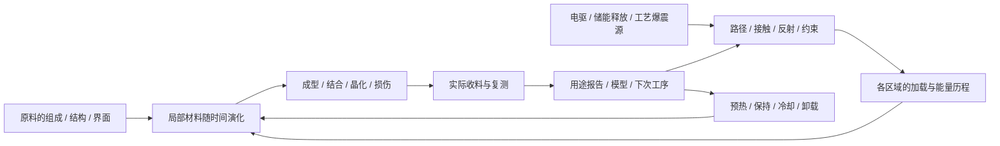

# E1.1：矢量力学工艺与卡玛恩晶体合成

2026-09-07，继续讨论的工艺设计。回应本轮修订：爆炸是建立短时力学/能量条件的一种来源；前期制造要能够从材料状态、实际结构与过程解释。阶段编号仍使用E0–E5，E1.1是稿件版本。

配套：[按工艺推导机器与生产线](EARLY_E11_PROCESS_MANUFACTURING.md)、[有限过程算例](EARLY_E11_PROCESS_EXAMPLES.md)。本稿细化并修订[E1晶体模型](EARLY_E1_CRYSTAL_MODEL.md)的M2；先前定向沉积D只保留为一个受限摘要，不能独立判定合成结果。

## 1. 玩家设计的是一次材料经历

同一组原料，改变接触面、冲击到达顺序、约束或冷却，会留下不同的结构、结合和损伤。目标产物是希望达到的状态；它可以帮助安排工序、给出验收条件，不能反过来决定物理结果。



第一轮不要求玩家输入张量。界面先显示样品、两侧加载方向、到达时间和加工前后对照；详细模型从这些操作逐步展开。

## 2. 力、冲量、能量与材料内应力各自负责什么

| 量 | 定义/表示 | 回答的问题 | 不能替代的量 |
| --- | --- | --- | --- |
| 接触力F(t) | 有作用位置、方向和随时间的大小 | 哪一面在推、拉或滑动 | 力的峰值不能代表总能量 |
| 冲量J | `∫F(t)dt`，矢量 | 对整体动量的改变 | 净冲量不能代表内部压缩和剪切 |
| 力矩与角冲量 | `r×F`及其时间积分 | 偏心加载怎样推动旋转 | 把所有源搬到样品中心会丢失这部分 |
| 机械功W | 接触处`∫F·v dt`，标量 | 实际向材料输入或取出了多少机械能 | 不存在可任意相消的“正负方向能量库存” |
| 应力σ(x,t) | 局部二阶张量，接触牵引满足`t=σn` | 同一区域不同切面上的正向与剪切作用 | 单一方向箭头或强度等级不足以表示它 |
| 内能、温度与热交换 | 与机械功、热源和相变能共同记账 | 能量去了哪里、材料何时热起来或冷却 | 温度不是源能量除以一个全局常数 |

表中的牵引/应力层次、接触与力矩关系参考[MIT结构力学Lecture 3](https://ocw.mit.edu/courses/2-080j-structural-mechanics-fall-2013/8e61abd2b094e2214465ce18ab8eb440_MIT2_080JF13_Lecture3.pdf)。具体卡玛恩材料规律为下文的游戏候选。

两面向内推动的合力可以为零，材料仍受压；两次先后推动也可能在整段任务结束时净冲量为零，却从未形成所需的共同加载窗口。支撑、模具和地基也参与交换力与能量。玩家卸下支撑后，不能继续沿用有支撑时的局部响应。

此稿应力采用常见的**拉伸为正**约定，压力为`p=-tr(σ)/3`。E1教学式曾按压缩为正记录S，不能直接混读；旧记录须带约定并转换。更不能把加工时外加压应力原样存成卸载后的残余应力。残余状态来自材料内部不均匀的不可恢复变化及剩余约束，要满足所选局部模板的平衡条件。

## 3. 一次加工按五层计算

### 3.1 源：给出可实现的释放过程

每个源保存来源、可用能量、实际输出端、启动时刻和经标定的释放族。输出包括相容的力/速度或牵引/运动关系、频域范围与持续时间；这些量不能全部由玩家独立填写。调高峰值、延长脉冲或提高重复率会重新检查源与驱动的可达范围。

| 源族 | 容易提供的过程 | 工程差异 | 发展位置 |
| --- | --- | --- | --- |
| 手动/普通电动压头 | 慢加载、保持、可控卸载 | 受压头、传动、支撑与接触面积限制 | E0粗成形、E2加载对照 |
| 储能电动冲击头 | 重复短脉冲、可调整间隔 | 实际充能、传递头、恢复与散热 | E3重复工艺，不等通用芯片 |
| 工艺爆震源/游戏TNT模块 | 不同短时释放包络与批量范围 | 耗材输入、源腔、间接耦合、衬层与残留 | E3初次冲击及后续粗加工 |
| 周期激励头 | 受支持频带内反复加载 | 工作频带、传递路径、疲劳与发热 | E2扫测，E4连续辅助加工 |

电力富余仍可保持。工艺限制来自源能输出什么过程、怎样送到材料，而不是只靠多造发电机解锁全部波形。爆震耗材仍采用虚构游戏配方，本稿不使用现实炸药成分和装药参数。

### 3.2 装置：路径与边界决定到达

| 实际构件 | 修改的对象/关系 | 可以观察到的差异 |
| --- | --- | --- |
| 导向通道/传递杆 | 路径、耦合面、传播时延、带宽和损耗 | 同时启动但到达不同；局部激励变弱或展宽 |
| 反射衬板 | 边界反射、返回路径、支撑反力 | 多次到达、局部叠加或离开有效窗口 |
| 缓冲/阻尼层 | 到达包络、耗散及支撑顺应性 | 峰值、到达时间和余振改变；可能丢掉所需快过程 |
| 模具/围束套 | 可移动方向、体积约束、接触与出料空间 | 相同源下的致密化、侧向流出或损伤分布不同 |
| 可转靶座/偏心夹具 | 晶体姿态、受力位置与接触面积 | 正向/剪切、扭转、取向和局部集中改变 |
| 可换中间层 | 界面接触、污染、滑移、粘结与消耗 | 两种材料是否贴合、分层、污染或形成可用接触 |
| 加热/冷却接触 | 实际热路径、温程及空间温差 | 表层与内部不同，卸载后能否保持目标状态 |

弱激励校准可用带时延的响应核`h(t)`，或相同信息的频域表示`H(f)`描述允许窗口内的传播。强冲击进入独立的非线性加工模板；不能直接把小幅扫频的传递率放大到任意冲击。时间域与频率域、离散分辨率须对应。[COMSOL瞬态声学文档](https://doc.comsol.com/6.4/doc/com.comsol.help.aco/aco_ug_pressure.05.058.html)用于核对这种表示和适用范围区分；其流体声学模型不充当本项目的固体冲击求解器。

反射可能改变波形的符号和到达顺序，不等于能量变成负数。每次反射都要跟踪尚在装置中的能量；截断计算时留下“未解析余能/后续过程”，不能把尾波当不存在然后发合格报告。相干叠加也不能只相加独立路径能量再任意增益。

### 3.3 工件：保留局部而有序的过程

首版采用少量加工区域，例如表层/内部或薄片的两面与界面；区域数由模板决定。普通压制、粉碎、两面合成分别有自己的局部模型，不立即做任意世界方块有限元。

每个区域接收：加载面与时刻、局部σ(t)/变形或模板代理量、温度/内能、流动与材料交换、接触变化。模型可以提取峰值、有效保持时长、变化速率、剪切剂量、重叠时间和冷却历程；这些量必须保留各自作用阶段和区域，不能再合成一个总分。

```text
安装结构与源状态
  → 边界加载和实际可用功
  → 加工模板求局部历程
  → 各时步更新材料/界面
  → 卸载与冷却
  → 收取实际物料与状态报告
```

未实现对应几何/接触的模板时，工程册提示“该工况尚无可信预测”，保留可编辑方案；不能随意套另一个模板输出精确合成概率。游戏初次可执行范围提供已有可达的结构与保守工序，模型扩展后再增加自由度。

### 3.4 材料：同一状态延续到加工后

在E1的`c,A,Q,S,d,z`上，按需要展开工件状态：

```text
区域：组成质量m[j]、相/有序状态ξ、孔隙率φ、几何/塑性形变
      持久定向结构A、残余应力S、缺陷d、内能U/温度T
界面：实际接触区、间隙、污染层、结合程度b、相对位移
历史：处理顺序、实际输入、来源/母批、规则版本
```

ξ和A不同：结晶/相变程度可以相同而取向不同。φ变化要落实到体积或实际排出/流失，不能质量、密度、体积各自独立升级。界面结合不会自动把两种材料变为均匀单相。

对于材料族，先登记它有哪些允许的状态转变及其能量/物质需求；再由实际历程求变化量。物质种类固定，分离、压实、形变和同组成相变不能制造新组分。真正的组成转化须有明确反应族、实际反应物/产物账和能量项，不能通过选择物品名称开启任意转换。

整个作业的边界账采用：

```text
源输入机械功 + 热输入
    = 工件/工装储能变化 + 外出机械功 + 外出热 + 出入物流净携能

内部：塑性/摩擦等耗散的一部分进入内能；相变和新界面各有能量项
物料：每个登记守恒组分的输入 = 各产物流出 + 装置内实际残留
```

摩擦变成的热不能同时记成已流出装置的“损耗”再第二次消失。可放热的转变先消耗材料的相应储能；有电源不意味着任何相变都能发生。

### 3.5 产物：由真实状态与几何验收

“导波件”对应指定方向、频带和安装下的传输能力；“致密坯”对应孔隙、完整性、尺寸和后续承载窗。一个物体可能通过多个用途测试，不因多张报告而复制库存。

更换作业目标名称不改变同一输入/操作的状态求解结果。首版工序卡可带建议动作和验收谓词；达不到时报告实际产物，例如松散料、半结合层板或有裂纹晶体，仍可补工序、降用或回收。

## 4. 力学工艺怎样产生不同结果

| 工艺 | 原料与原理 | 首版可计算关系 | 玩家可调与可见反馈 | 直接产物/用途 |
| --- | --- | --- | --- | --- |
| 解离与粉化 | 能量投入开裂和相对滑动，使颗粒从团块分离 | 碎裂进度由超过材料阈值的局部作用累积，输出粒径分布与新界面；保留能量及质量账 | 接触头、约束、脉宽；粒度、混入与可分离程度 | 粗粉、较易分选原料；细粉不自动更纯 |
| 压实与成形 | 孔隙闭合、颗粒重排或塑性流动 | `dφ/dt=-k_c g_c(history,φ)`，仅在允许范围；通过体积/流出收账 | 围束、接触面、保持；尺寸、回弹、孔隙和裂纹 | 晶坯、陶瓷坯、导体坯、衬块 |
| 定向结构改写 | 允许窗口内不可恢复的方向性重排 | A按有方向的有效塑性历程更新；E1的D只能辅助记录，不能跳过窗口与卸载 | 姿态、偏心、剪切/正向顺序；加工后方向谱 | 耦合件、方向参考、后续器件母晶 |
| 层间结合 | 实际接触、界面活化与有限相对运动促成结合 | `db/dt=k_b g_b(T,contact,slip,contamination)*(1-b)`，窗口外可能剥离/损伤 | 中间层、接触次序、法向保持、局部滑移；结合面积和接触损失 | 金属/陶瓷/晶体复合件、粗接触与热界面 |
| 晶种诱导转变 | 合格基材在晶种作用范围内经历可达过程，逐渐进入晶态 | `dξ/dt=k_x g_x(p,T,φ,seed_contact,history)*(1-ξ)-k_back g_back ξ` | 晶种位置、预热、压实、保持、冷却；晶态比例和局部未转变区 | 首批粗晶，之后是更一致的母晶 |
| 应力/缺陷调理 | 在特定温程与加载循环中松弛可恢复部分 | 对S及各类缺陷分别更新，结构恢复另有窗口 | 温程、循环幅度、卸载顺序；参考漂移、回弹与缺陷 | 稳定参考、可复测母晶及工艺返修 |

上述g函数是材料族内的具体候选律，后续由原型逐个标定。它们不是六个可以随意填入的万能加成：每个函数须声明输入、有效域、如何消耗能量/物料、哪些状态会变和哪些观测能检验它。前期先落地粉化、压实与晶种诱导三条，再逐渐展开定向和结合。

**压实和晶化分两步验收。** 挤成一个硬块并不等于长成晶体；ξ达到一定程度也不保证无孔隙、无裂纹或具有所需方向响应。第一条合成可以先获得局部晶化的粗晶，后续预热/保持与退火扩大可用区域。

## 5. 第一条解释得通的合成任务

目标：做出能安装到小试分离腔的粗耦合件。第一轮只有“源档位、样品朝向、一路延迟/缓冲”三项可调，预热和卸载先用保守模板。

1. **准备工件**：同批均值化粉料、实际晶种、定位模具；记录质量、装填高度、晶种位置和初始粗响应。先用普通压头做可搬运坯，低密度坯保留孔隙。
2. **建立对照**：同一夹具做低档单侧加载，观察位移/回弹；加入对侧支撑后再测，知道“向前推”和“把料压在一起”不同。
3. **第一轮冲击**：两侧源按模板释放，记录启动和实际到达时刻。左右结构不等长时，同步开关不能保证同时作用。源能量照样消耗，却可能只获得压实料和不均匀的晶化区。
4. **改装再试**：复用同批留样，只调整一条到达路径。测得共同作用时间增长后，复验晶态响应、孔隙及裂纹；成功来自过程改变。
5. **保持与冷却**：材料仍有温度和结构演化，按允许次序卸载。任务记录包含这一段；按钮触发瞬间不能立即把最终物品放出。
6. **加工并使用**：定向切磨可用区，装入真实耦合头，测传递窗并做同批分离对照。晶体合成、器件形状和安装方向共同决定效果。
7. **形成模型卡**：保存“共同加载时间/温程→晶化与缺陷”的局部解释。换尺寸、母批或模具后的结果另行验证，不能把单一到达差值当全工艺万能指标。

下一轮再提供“先压实、后小脉冲写入”的两步路线。只要输入来源、局部材料历程和其他相关因素等效，不同源或机器可以获得等价结果；设备名称本身不附送品质。

## 6. 把频率与信息真正放进过程

- **时间过程带有频谱内容**：脉宽、上升段和重复间隔改变激励中的时间尺度。单次脉冲保留完整时序；不能硬给它一个能描述全部行为的“频率等级”。
- **结构选择怎样传递**：晶体、接触层与通道对不同频带/方向响应不同。低幅扫测用于建立已测窗口，随后安排受限的加工试验。
- **材料记录加工历史**：工艺改变结构、相态与界面，使后续谱形/峰位/衰减改变。玩家从输出响应推测发生了什么，并设计新的对照。
- **信息来自真正观测**：早期用见证片、刻度位移、到达指示与粗谱；中期增加时序采样和模型拟合。早期记录无法解析的细节，界面保留未知。

同频周期源之间可以讨论相位；一次性宽带冲击更适合显示到达时差和包络。仪器采样窗/分辨率属于记录；游戏内部为作业积分使用的子步，不等于玩家已获得同等分辨率的观测。

## 7. 实现与验证的下一块范围

先做两接触面、少量区域、有限模板和事件内子步。结构变化时重建路径；作业运行时按时间更新工件，作业外只保留余热等实际需要的慢过程。子步需解析模板允许的最短过程，否则拒绝精确预测或细化计算。

首个空间原型需要验证：源/靶/模具能实际放入，作用面可接通，路径与渲染一致，待处理物流有去处，断电/中断留下实际半成品。暂不把旧3×3×3或任意可变腔体宣布为都已实现。

当前[过程例子](EARLY_E11_PROCESS_EXAMPLES.md)只检验“同总量不代表同历程”、有效保持、热/加载次序、局部覆盖和物料分类。这些例子尚未求解源到局部σ的动力学、完整能量平衡、裂纹、真实相变或任意装置。

旧稿依据：[早期晶体设计§7–10](../Kamaen_Info_Resonance_Crystal_And_Early_Game_Design.md)、[阶段表§3](../Kamaen_Info_Stage_Content_Line.md)。保留爆炸工艺、多方向、温度尖峰、冷却、装配平台和后期复用；原四项评分、世界XYZ绑定用途及“晶种+一次评分直接变粗晶”由本稿的过程链替代。
