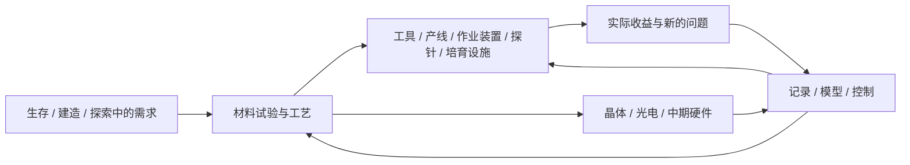

# E1.2：力学、机械与电气能力怎样改善Minecraft生活

2026-09-07，应用与发展动力工作稿。承接[E1.1工艺制造](EARLY_E11_PROCESS_MANUFACTURING.md)与[力学合成](EARLY_E11_MECHANICAL_SYNTHESIS.md)。本轮让同一技术体系服务装备、建造、生产、探索和培育，并把实际遇到的问题接到中期模型开发。具体物品名称、数值和外形仍供讨论。

详细状态、计算与原版衔接见[应用模型](EARLY_E12_APPLICATION_MODELS.md)。当前项目配置为Minecraft 1.21.1、NeoForge 21.1.222；本稿是设计，不代表这些适配已在游戏中完成。

## 1. 研究与使用形成双向发展

玩家研究晶体，是为了能够辨认和改变材料；这种能力应该很早就能改善一把工具、一条备料线或一座农场。实际使用又暴露寿命、流量、干扰和生长差异，促使玩家继续研究。

每个阶段要有两种交付：一种是新增的研究/工程能力，另一种是世界中能持续使用的成果。玩家可以围绕喜欢的应用展开深度；基础研究证据按实际能力共用，不额外设置五条应用支线全部完成的门槛。

R1的基础有机材料仍服务主线。大规模培养、锻刀挑战、自动矿场和复杂实体策略属于应用深化；当前不修改R1的75个能力节点和28个里程碑。

## 2. 把力、机械、电气到局部自动化走完整

这里的先后描述工程能力，电能仍可在E0早期取得。普通电驱与晶体发现可以并行，不要求玩家耗尽手工时代才允许发电。

| 前期发展位置 | 学会的能力 | 马上可用的成果 | 下一步自然遇到的问题 |
| --- | --- | --- | --- |
| E0 基本工具与电动加工 | 接触、杠杆/传动、切分、供给、物料出入 | 粗金属工具、批量线板/建材加工、泵与固定搬运 | 尺寸不一致、产物混杂、装夹/出料瓶颈 |
| E1 平均晶种与对照 | 留样、参考、读数与实际状态分开 | 简单工件比较、局部环境读数、稳定工位选址 | 是样品变了还是仪器/环境变了 |
| E2 加载、调谐与初步应用 | 有方向的作用、实际耦合、固定序列 | 第一组锻造工具、送料导向、田间观察、小试分离 | 回弹、断续供料、错过有效工作窗 |
| E3 脉冲工艺 | 到达、围束、冲击与温程的有序作用 | 可用粗晶、复合衬板、批量粗处理、局部矢量作业 | 局部损伤、对接失配、批次差异 |
| E4 专化与机电系统 | 连续生产、测量反馈、材料/结构适配 | 成套工具与稳定产线、受控培育、分区探测设施 | 多变量关联、容量共享、环境干扰 |
| E5 局部自动化与初级模型 | 阈值/滞回、批次记录、手工/固定统计 | 自动备料、停料恢复、培养条件控制、工序预测 | 单变量模型失效、记录太多、同时任务争用 |
| P06–15 中期承接 | 光电器件、封装、B01、模型/网络与可选集群 | 预测维护、多工序调度、环境地图与培育模型 | 跨地点/批次泛化、主动实验、世界底噪中的剩余问题 |

“走完前期”的体验目标是：玩家能从原料出发，用供给、加工、执行和测量组成一套可以反复工作的系统；还拥有几件实际喜欢使用的成果。科技节点本身不替代这种体验。

## 3. 锻造与装备：同一块料，为什么会做出不同工具

### 玩家动机与第一条任务

先让玩家做出一把有自己选择的铁刀/剑或矿用工具。取舍围绕刃部/接触几何、承载与结合、耐用性和操作节奏展开。角色能力仍尊重原版材料与工具用途层级。

任务“同炉双刃”：同批金属分成两份，粗成形→不同的局部加载/温程→磨制→装柄→在统一试件上比较→实际带出门使用。第一把采用已知保守工序；另一把用于观察更薄刃口或不同调理带来的差异。

| 工艺选择 | 玩家能看到的差异 | 直接玩法价值 |
| --- | --- | --- |
| 刃部/工具头几何 | 接触区域、重量分布、外形 | 偏向轻快作业、持续采掘或较强单次作用 |
| 内部结构与缺陷调理 | 试件上的磨损、崩口征象、弯曲/回弹 | 在适用负载下更可靠，减少失败批次 |
| 柄部/接触结合 | 松动、传递与受力方向 | 工具效果与装配质量有联系 |
| 晶体工装与探测 | 炉温/接触/重复试验更一致 | 好工艺更容易复制，降低制作精品工具的试错 |

晶体首先出现在锻造工装、测量和控制中。嵌晶刀具是随后可选用途，必须有实际作用，例如在允许目标上的短时振动辅助；会用到供给、接触与工作窗，不按镶嵌数量直接叠伤害。

基础合格工具应当能正常使用。复杂材料缺陷主要在试制、极端工序与高级任务中展开，不给每次挥刀新增随机断裂或强制打磨负担。耐久与修理尽量沿用玩家已有习惯。

### 回到研究

锻刀时学到的定向、界面和温程，可以制作更好的压头、切磨头、接触片和晶体夹具。中期模型可预测某批料在某工序下的合格率/耐用表现；模型建议仍要经过试件验证。

## 4. 物品量产：从造材料到完成建设订单

第一条产线以实际需求为目标，例如为一座仓库准备石砖、玻璃、木构件与照明物资，或为一条矿道备齐铁轨和工具。玩家关心收到多少可用成品、是否断料、余料去哪、补货是否及时。

生产分成三个相连过程：原料取得/回收→加工与分流→按已有配方装配。每段使用相应设备，原料库存与实际成品共同记账。

原版1.21已经提供合成器及其红石自动合成能力，因此这里让工程系统帮助备料、组织输送和控制工序；直接原版合成优先复用合成器。[官方1.21说明](https://feedback.minecraft.net/hc/en-us/articles/27547857163917-Minecraft-Java-Edition-1-21-Tricky-Trials)

| 前期玩法 | 有解释的改善 | 中期模型需求 |
| --- | --- | --- |
| 合格料先进入加工 | 分流与检测减少不合规格批次占机 | 批次分类、返工预测 |
| 定量送料与缓存 | 保持进料连续，满仓有明确停料位置 | 消耗预测、补货阈值 |
| 多工序协调 | 某台完成后再转移，复用工装需实际换线 | 工序排程、队列与维护计划 |
| 回收边料/次品 | 实际残料走允许路线，收益来自可回收部分 | 在回收成本与新料需求之间选择 |
| 建设订单 | 玩家设目标数量/保留库存，设备逐项交付 | 同时服务多个建设项目，解释缺料与瓶颈 |

量产可以增加规模与可再生来源的利用，遵守实际原料和可用配方。附魔、特殊掉落、容器余物、经验与方块状态不会因为转了一圈产线被复制。

首个量产奖励是“一次施工能从备料区拿齐物资”。中期集群的价值来自并发工序、多个地点和更大数据量；一条简单产线可以一直用固定控制。

## 5. 矢量利用：把加工知识带出实验室

前期先操作掉落物、载物装置和固定作业面，随后扩展到有边界的施工及玩家移动设施。力通过明确的作用区域和接触/传递路径发生，不在远处任意修改对象。

| 应用 | 首套搭法与玩家操作 | 实际收益 | 需要处理的工程问题 |
| --- | --- | --- | --- |
| 越沟送料 | 送料头、源、导向面、接料斗；调方向和档位 | 跨越地形间隙、把物料送到高处 | 发射节拍、落点、碰撞、收料容量 |
| 缓冲与分流 | 侧推/阻尼内件、导向槽和限位 | 把分离产物导到不同工序，减少散落 | 实际运动、堵塞、反力与热/损耗 |
| 牵引与升降 | 固定支架、驱动、载物机构与明确行程 | 矿道/建筑中的搬运与施工平台 | 承载、驱动路径、停止和检修空间 |
| 受控采掘/整形 | 支架范围内的工具头与进给机构 | 重复采掘、平整作业面、收集建材 | 正确工具、实际耗损、目标边界与掉落处理 |
| 起跳/着陆设施 | 固定作用面、驱动/缓冲、可见方向提示 | 在自己的基地设计移动路线和小游戏 | 速度范围、实际落点、碰撞与连续使用能力 |

同一源用于压实工件时看局部应力/变形；用于搬运时看整体动量、轨迹与接料。两种模型在物理量上相连，不能把“能搬动一个物品”直接当成具备某种材料合成能力。

任务“越沟送料桥”先手调接料成功，再接到产线；之后增加不同载荷与突发来料，对照固定设置和模型预测。原版活塞、水流、矿车及移动玩法仍可混用，不要求全部改造成一种运输系统。

## 6. 环境探针：读世界要有可用的结论

第一支探针用于选择工位、比较田块、发现近处干扰和记录活动。界面先给读数、时间与对照，后续才形成地图和预测。

| 探测任务 | 实际观察 | 能带来的选择 |
| --- | --- | --- |
| 炉区/工坊选址 | 温度相关通道、机械扰动、源开/关对照 | 分开热处理与敏感测量，安排支撑和冷却 |
| 农田与培育选址 | 实际亮度/水相关可读状态、时间、环境记录 | 对照不同位置与管理方式，安排灌溉/补给 |
| 基地活动记录 | 允许接入的振动/事件类别及其时序 | 门区通知、物流到达确认、区分设备自噪与外部活动 |
| 地层/材料调查 | 在已支持介质中的主动响应或实际取样 | 标出需要继续取样的异常区，不凭一个谱峰直接标出全部矿物 |
| 昼夜与天气观察 | 多时段的同地点记录及参考条件 | 调整生产时段、选择后续观察位置，为世界底噪研究积累档案 |

原版幽匿感测器、校频幽匿感测器和紫水晶振动共鸣可作为可选信号来源；其事件频率类别有自己的语义，卡玛恩探针通过适配读取。首个探针不强制玩家先进入相关危险区域。[官方1.20说明](https://feedback.minecraft.net/hc/en-us/articles/16499677456781-Minecraft-Java-Edition-1-20-Trails-Tales)

探测要允许不确定和多解。仪器能力不足时提供候选解释与下一次取样建议；模型通过多位置/多时段信息提高判断，不能凭计算替代从未取得的测量。

## 7. 生物科技：从农场记录到可续种的生产

前期先围绕Minecraft已有植物与有机物建立用途，再扩大可控培养。生物研究继续使用频率响应、环境测量、材料输入和模型验证。

### 三层内容逐步展开

| 层次 | 玩家操作 | 第一批有用产物 | 与晶体/机械电气的关系 |
| --- | --- | --- | --- |
| 有机处理 | 植物/木材/其他登记有机料制浆、分流、回收 | 纤维、树脂/粘结料、颜料或培养前体 | 处理槽与滤膜直接复用，晶体改善相容组分分流 |
| 田间观察与辅助管理 | 留对照田、记录阶段与环境、补给/收获 | 更可靠的补货、收获与农场运行 | 普通执行机构和固定规则先可用，探针解释波动 |
| 受控培育 | 实际培养物/接种体、基质、供给和环境管理 | 可续种培养物、纤维/黏结/菌类等登记产物 | 热程/流体/检测进入同一设施，后续模型预测与调节 |

培养首先改善有机辅料与常见生产：滤材、绝缘/密封、接触层与缓冲材料由这里取得，再反馈到机电设施。任务“第一盆续种培养物”要求留下实际接种份额，用另一份在新基质上复验；把整盆收获完就不能同时保有那份接种物。

牧场方面先做饲料、活动与收集记录，以及有明确动作的补给/分流设施。后续才讨论行为策略和育种深度；初版不自动赋予所有原版动物隐藏基因表。

旧稿的蜘蛛丝、黏液、烈焰和末影相关生物路线保留为不同深度的候选。记录样本只能提供研究信息；活性培养物、稀有反应所需实际物质与环境条件分别取得。普通有机浆不会因扫描一次末影珍珠就无条件持续产珍珠。

### 中期模型有实际研究对象

模型任务可以是预计到达收获条件的时间、下一批可用产量、是否需要补给，或辨认观察到的环境响应。先比较固定规则与简单回归；B01可用后逐步尝试多变量/小网络，跨批验证，再考虑多个培养区和集群。

模型控制只调节已有水路、补给、温程、激励与收获设备。实验会消耗真实时间和材料；规则可完成基本培育，强化学习是可选优化。生物过程中的不可观测状态不能直接用作训练标签或奖励。

## 8. 一座工坊的连续故事

以下是可以选用的任务链，不是新增六个强制钥匙：

1. **《同炉双刃》**：同一批铁料做出不同表现，玩家开始记录工艺。
2. **《第一垛石砖》**：加工、备料与原版合成器协作，真正交付一批建材。
3. **《越沟送料桥》**：让产物稳定到达目的地，认识方向、节拍与载荷。
4. **《山谷听诊图》**：新工坊干扰了测量，玩家通过源开/关与多点记录找出原因。
5. **《第一盆续种培养物》**：生产滤材和接触辅料，管理营养、时间与留种。
6. **《会解释的工坊》**：模型对下一批给出预测，实际试验揭示成功范围和剩余误差。

名字用于工序卡、报告或设施模板。剧情通过具体发现推进，例如“刀口先坏在同一处”“改了送料节拍，探针的杂讯也变了”“田块的平均读数相似，变化节奏却不同”。世界底噪的更大线索从这些未解释关系中逐渐出现。

## 9. 与既有发展线的交付关系

| 当前能力/节点 | 本轮补充的应用 | 后续交付 |
| --- | --- | --- |
| P01–03，manual/metal/power/raw/stress | 基础锻造、成形、批量处理、矢量作业 | 合格接触/支撑/导体，真实工艺与载荷记录 |
| P04，resonance/bio | 分离、耦合、植物/有机辅料 | 更一致的原料、滤材、密封/培养前体及样本 |
| P05，feedback | 本地探针、停料恢复、灌溉/补给、固定分析 | 有来源的信号、控制任务和可复现失败 |
| P06–10，材料/器件/计算准备 | 工具与界面工艺升级、批次/设备记录 | 器件实验素材、B01可用的数据与明确预测目标 |
| P11，sensors | 多地点带校准与时间来源的采集网络 | 环境图、生产/培育数据集；区别于早期局部读数 |
| P12–14，计算/网络/bio_policy | 多工坊排程、培育与物流模型、可选策略 | 跨批次/地点验证、实际吞吐与可靠性收益 |

这轮前移的是局部用途与基础培育，P11仍负责正式多点采集，P14继续承担培养/物流策略深化。模型与集群继承R4的真实内存、运算、记录和连接成本；应用名称不提供额外隐藏算力。

## 10. 本轮交付与下一步

本轮确定五组应用的动机、操作、收益、共用工艺和中期衔接，初步模型见[配套稿](EARLY_E12_APPLICATION_MODELS.md)。下一步先做锻造、送料和有机培育各一个小型体验原型，验证操作是否有趣、收益是否值得、普通模板是否可用，再补最终数值与物品外形。

旧稿依据：[早期设计§9–14](../Kamaen_Info_Resonance_Crystal_And_Early_Game_Design.md)、[发展线三§6–7](PROGRESSION_03_COMPUTING_AND_DISCOVERY.md)、[R4模型/研究](R4_RUNTIME_AND_RESEARCH.md)。本稿沿用实际基质/样本与统一平台思想；不恢复万能倍率、无限复制或取消电计算的旧规则。
