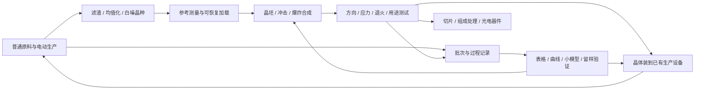

# E1前期工作稿：晶体、力学、电动生产与最初的数据分析

2026-09-07，供逐段讨论。承接用户确认：晶体构造直接反馈前期生产；电能早期可用，主要难度放在工程构建；晶体模型贯穿始终；先把材料、生产方块和工具平铺。本轮补玩法和模型，不冻结最终配方数量、多方块尺寸或注册ID。

配套：[物品、方块与工具目录](EARLY_E1_CONTENT.md)、[贯穿始终的晶体模型](EARLY_E1_CRYSTAL_MODEL.md)、[有限模型例子](EARLY_E1_MODEL_EXAMPLES.md)。中期承接[R4阶段设计](R4_STAGE_DESIGN.md)。

本轮修订入口：[E1.1矢量力学合成](EARLY_E11_MECHANICAL_SYNTHESIS.md)、[从工艺模型推导机器](EARLY_E11_PROCESS_MANUFACTURING.md)。前期机器按材料转变和实际能力组织；原平铺清单保留为对象索引。爆炸合成展开为加载/能量历程、局部转变、保持与收料，目标名称不决定实际产物。

E1.2应用续稿：[力学/机械/电气能力与原版增强](EARLY_E12_APPLIED_PROGRESSION.md)、[应用模型](EARLY_E12_APPLICATION_MODELS.md)。前期成果扩展到锻造装备、建设备料、矢量作业、环境探测和生物培育；它们的实际问题反过来推动晶体/模型研究。

## 1. 前期的完整循环

每一段晶体研究应交付至少一项能够实际使用的能力：改变有效激励的到达方式、减少混入、保持工作窗口、扩大可加工范围、改善工具和作业装置，或帮助玩家读环境与管理培育。研究成果既可以留作参考，也可以安装到设备；安装不会复制晶体，取下后其效果随实际连接消失。

“频率与信息”在前期具体表现为：材料在不同激励下产生可区分的响应，结构和加工历史改变这些响应，玩家据此选择加工条件，再把测量结果用于下一次决策。晶体不是发电燃料，目标样本也不提供无限复制材料的能力。

前期的发展动力同时来自Minecraft生活：做出适合自己的工具、拿齐建造物资、把产物送到高处、选择更好的工位或田块、稳定取得有机辅料。应用任务共用当前工艺与证据，详见[E1.2发展表](EARLY_E12_APPLIED_PROGRESSION.md)；不把每项应用都变成必须完成的科技门槛。

## 2. 电能尽早进入，工程难度随产线形成

第一轮基础铁铜取得后即可组装普通燃料发电设备，接电动破碎、搅拌、加热和粗压制；这些首台设备不要求晶体控制芯片。手筛、木盆和燃料炉用于起步、备用和小试，工业量产无需反复手动点击。常规生存的原版矿物可直接进入相容材料路线，木材/圆石/水路线提供已有自举兜底。

首台发电机的设计验收是能支持一套实际有用的初期产线，而非刚好点亮一台机器。先用相对额定功率G描述预算，最终E/FE及燃料数值随试玩标定：

| 示例负载 | 相对G的持续需求 | 工程重点 |
| --- | --- | --- |
| 电动破碎/筛分 | 0.20 | 进料、筛网、粉尘/残料和传动负荷 |
| 搅拌/分离 | 0.15 | 流路、停留时间、滤膜、沉积与污染 |
| 电热坩埚/粗热处理 | 0.30 | 加热位置、热惯性、容器、冷却和出料 |
| 测量与辅助供给 | 0.05 | 参考连接、线路返回、接口与有效读数 |
| 保留余量 | 0.30 | 后续装一个模块或安排工序重叠 |

这是一组配比候选，不是最终配方定价。增大发电易于扩展；同一根馈线、加热器、驱动头和散热面仍有自己的额定能力。电源富余时，错误装夹、偏离激励窗口、混料或堵塞仍然不能靠继续加功率解决。

冲击设备可使用电动驱动头及储能/释放模块，工艺爆震耗材和TNT模块保留为不同脉冲来源。脉冲库存必须先充入实际能量，连续作业的平均消耗也受供给限制。源的区别主要在脉冲宽度、重复性、耦合方式、维护和批量能力，不以稀缺燃料建立唯一解锁门槛。

早期不要求管理中期机房全部环境因素。先露出供给路径、发热/冷却、结构/方向、物料流；等玩家用晶体追求稳定测量和重复生产，再引出振动、参考漂移与串扰。裸机的固定开关/温控/保护可用，之后晶体反馈改善其能力。

## 3. 六段发展与生产反馈

### E0 普通生产与发现异常

起步链为手筛/沉降→基础粉末和滤渣→铁铜/玻璃陶瓷→普通供能与电动加工。第一枚晶种的发现不必等全部电动产线造齐，两条线可以交错进行。

玩家用同量原料比较两次处理，看到粉末分布和残余响应不同；保留滤渣并做粗热处理。这里先呈现能被复现的异常，不立即通过提示告诉玩家完整世界方程。

首次生产模型只处理合法产物份额、实际分离效率、污染和处理时间。原料分量不是凭记录解锁后才真实存在；一次测量也不能把圆石允许产物集合改成所有物品。

### E1 均值化、晶种与第一把参考尺

频谱滤渣经有效温程减弱偏向，再以受控冷却形成白噪晶种。未经同等处理的滤渣不能随便加回中性基底。晶种是平均背景的初始物质表示；玩家此时只用少量可测性质接近这一认识。

先留下参考晶种，再用另一份进行轻微加载/卸载对照。第一枚晶种的直接生产用途是校准粗比较和识别漂移：同样的参考在冷机与热机下读数不同，提示应检查仪器/供给，而非立即改原料配方。它没有先天指定的铁/铜偏好，因此不直接充当某个高增益分离催化件。

反馈到生产：保留参考、纠正读数偏移、改善下一批均值化条件，减少把“仪器漂了”误判为“材料变了”的无效返工。参考晶种长期留用；用于引导生长的晶种则进入新晶体结构，必须与参考用途分账。

### E2 初步利用与谐振装配台

简易夹具、刻度加载和粗扫测围绕同一晶体展开。谐振装配台先提供夹持、供给、输入/输出耦合和测量工装，能够装配零件及比较响应；换工装后逐渐成为中期晶体实验台的前身。

先改变当前加载或激励，再撤掉它；比较响应是否恢复。玩家开始区分“运行条件改变”和“材料内部被改写”。简单电驱动可以扫描几个激励档位；光学观察与机械响应读出使用各自的探头，不用分光镜直接读出完整力学张量。

反馈到生产：将已测晶体和明确耦合头装到一个小试分离腔，比较同批泥浆在失谐/合适设置下的结果。初始改善可以很小，但必须来自实际耦合和响应；界面展示目标产物、混入、剩料及时间，而非一个统一品质加成。

### E3 冲击成型与爆炸合成

实际晶种与合格基材先定位/成坯；便携爆炸室或粗冲击夹具提供第一组短时作用，再进入能改变反射板、缓冲层、靶座和源位置的结构。压实、晶种诱导转变和冷却保持分别验收，局部未转变坯可以继续加工。

首轮只调三件事：晶坯朝向、一处反射/缓冲位置、脉冲源档位。固定外形用于限制变量，具体尺寸留到空间原型；旧稿3×3×3是待验证模板，不能同时声称任意内装都装得下。

工艺结果分别记录成型程度、残余结构/应力、裂纹/损失和响应变化。相向冲击可以抵消整体推动，但仍对内部加工起作用；不能用合向量一个数替代全部材料变化。源输入被反射、吸收、泄漏及留存在装置中的部分共同守账。

同总量的两次冲击还要比较实际到达、共同加载时间和受力位置；加工过程可能因预热、围束、界面或卸载次序不同而改变。第一条任务及工艺模型详见[E1.1力学合成](EARLY_E11_MECHANICAL_SYNTHESIS.md)。

反馈到生产：冲击粗粉可回分离线，合格粗晶进入切磨，适当定向晶体改善局部能量耦合，失败残片进入有损回收/普通记录材料。爆炸工具后期继续承担粗粉化、批量冲击和特殊应力处理。

### E4 特化晶体改造已有机器

普通压头、支撑和加载机构即可搭首版I型力学框架；应力传感器和偏振晶体是升级内件。对同母批做方向、载荷和温程对照，得到可测用途而非固定世界XYZ对应的三种掉落。

| 晶体用途 | 实际安装位置 | 怎样改变生产 | 必须付出的条件/取舍 |
| --- | --- | --- | --- |
| 导波/定向耦合 | 破碎或分离腔的耦合头、传递段 | 更多输入激励到达指定工作区，减少无效外泄 | 方位、通道截面与窗口；不增加源能量 |
| 稳谱/参考 | 扫测器、激励驱动的参考与反馈支路 | 减少偏离工作窗口的时间，提高重复性 | 实际供给、驱动和比较环路；原片自身不持续振荡 |
| 抗压/承载 | 压头接触件、晶坯夹具、衬块 | 扩大可重复加工的载荷窗，减少夹具变形引起的失败 | 朝向、接触和结构用量；外部框架仍有极限 |
| 选择性共振 | 分离腔中可拆的工作晶体座 | 对已有合法组分改变回收/混入分布 | 目标样本、足够原料、实际激励；不凭频率制造不存在的组分 |
| 定向分析/偏振 | 测量支路和相容探头 | 增加可区分的方向信息，定位加工差异 | 参考结构与校准；不把装上传感器当作所有参数已知 |

这些改善反过来提供更一致的基底、夹具、晶片和参考，支持下一代晶体。更新一块工作晶体后需要复测关联工序；不强制推翻整座工厂所有无关报告。

改造允许多种解法：现有驱动还能调频时，可以先让设备适配旧晶体；多腔共用激励或驱动已到可达范围时，再改变晶体结构去适配设备。不能把“拿到新晶体名称”作为唯一通行证。首次分离算例只证明一个局部工作窗的改善，尚不证明任何用途晶体全面优于其他晶体。

### E5 初级数据模型与生产控制

工程册可整理已测记录、叠图、手工选择拟合线和保存工序卡。固定统计台随后支持有限点数的均值、离散程度、直线拟合与留样误差，物理实现为固定功能累加/比较/记录模块；无需等待通用芯片。其能力与占用见[模型稿](EARLY_E1_CRYSTAL_MODEL.md)，不提供任意脚本、神经网络训练或隐藏参数读取。

先用模型建议下一批的设置，再由玩家实际试做。随后接类型化信号、比较/滞回模块和执行接口，实现“污染高→暂停进料→冲洗→有效新读数恢复后继续”。停料、冲洗和恢复属于具体设备公开的执行口，不能用任何红石输出遥控任意原版方块。

反馈到生产：可保存工序窗口、批次选择与失败解释，减少靠记忆反复试错。中期接走同一批次记录和模型对象，增加更复杂算子、参数估计、学习与主动实验。

## 4. 同一批晶体贯穿的一次具体任务

1. 从同批均值化料获得参考晶种和若干试验晶种，分别标明用途；当前参考读数有来源。
2. 由同批基材制两组晶坯，保持质量和尺寸相同，比较单侧冲击与加缓冲后的加工。
3. 装到同一测量夹具，在相同温度范围扫测几个频段和两个方向；记录谱形、方向差异及可见缺陷。
4. 选择一块适合当前铜类分离窗口的晶体，安装到小试分离腔；用等量同批泥浆做失谐/调谐对照。
5. 记录“目标回收、混入、余料、时间、能量、工况”。若只是耗时减少，不能写成铜含量凭空提高；若目标份额增加，要说明减少了哪个其他流向。
6. 用未参加拟合的一批原料验证工序卡，再复制若干符合工作窗的晶体，扩到已有分馏设备。
7. 持续作业后发生漂移，比较参考与工作晶体；决定修正安装、等待冷却、清洗滤膜，或重新处理晶体。

这组任务同时交付更好的实际生产和一份有关晶体的可检验模型。作者指定的少量算例见[有限模型例子](EARLY_E1_MODEL_EXAMPLES.md)，实际产量及时间等待后续原型标定。

## 5. 前期设备怎样组织

当前按五个实体家族解释前期装置：材料处理槽、热程坩埚/炉、加载装配台、脉冲工艺腔、连续牵引/切磨设备。它们提供不同的输运、温程、加载/空间与几何加工能力。测量和记录共享，发电、配电、液体及搬运提供共同基础。具体功能与制造路线见[E1.1工艺制造](EARLY_E11_PROCESS_MANUFACTURING.md)。

通用工装节省首套设施，专用外壳利于持续生产。爆炸室的作用空间独立保留，不能因界面统一便把波路、夹具和全部生产功能折叠进一个万能槽。初期同一工程册打开不同设备，显示当前对象的物料、实际结构、记录与工序；复杂布线与部署视图留给中期。

“平铺目录”作为对象索引，制造逻辑由材料模型、工艺程序、产品规格共同解释。导波/稳谱晶体是同状态体系的用途变体；同样的材料历程不能因目标或机器名称不同而换一套结果。详见[内容索引](EARLY_E1_CONTENT.md)。

## 6. 向中期交付与需要回改的地方

| 前期交付 | 已验证的最低能力 | 中期接入 |
| --- | --- | --- |
| 金属/硅质/陶瓷/玻璃/有机前体 | 可稳定生产、知道基本混入与来源 | 绝缘、触点、处理剂、覆铜板与工艺耗材 |
| 参考晶种、粗晶与特化母晶 | 有母批、取向、处理历史和用途窗口 | 定向切片、组成特化与区域器件 |
| 粗热处理/清洗/压制/切磨 | 固定工序可重复，产物可复测 | 接触模板、掺杂试片及退火 |
| 导波、稳谱、抗压及分析用途件 | 在指定激励/方向/温程下工作 | 电门控、光路、读出、机械和环境结构 |
| 记录、拟合模型与工序卡 | 观测和预测分开，未见样品能检验 | R4数据集、参数版本、校准和模型编译 |
| 简单信号/执行闭环 | 类型、时效、批次和本地联锁明确 | 首个门/保持/窗口及封装芯片任务 |

本轮明确调整前期讨论优先级：

- R4的“框架直接产粗晶”需展开为晶坯、实际冲击源、传递结构和加工记录；其中简化材料数不等于最终爆炸配方。
- R4的64 E/s、3200 E/燃料是此前范例，不作为前期发电的能力上限或平衡目标。本轮采用有富余的产线供给要求；原R4生成的从零物料表尚未纳入E1新增工装和发电平衡，不能当E1整套成本。
- R4把拟合服务放在B01之后；E1补充之前的手工拟合和固定统计台。通用可编程模型执行仍由中期硬件承担。
- 晶体模型增加对持久结构与可松弛残余应力的明确区分，细化R4已有“组成/内部结构/方向/历史”思路，不新建一套无关晶体属性。

旧[早期晶体设计](../Kamaen_Info_Resonance_Crystal_And_Early_Game_Design.md)、[阶段表§2–4](../Kamaen_Info_Stage_Content_Line.md)、[复杂制造§12](../Kamaen_Info_Complex_Manufacturing_Process_Reference.md)与[前期总路线](PROGRESSION_WORKING_DRAFT.md)为思想来源。旧计划的“取消电计算”“世界XYZ固定用途”“单质量分”不恢复。18份旧源文件保持原样，本稿的新模型/对象仍供讨论。
