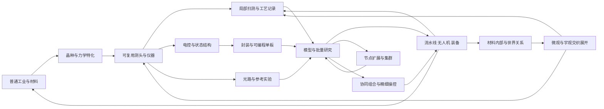

# 前中期总览：连通性、内容完整性、上手路径与后期入口

2026-09-08，基于当前E1、E1.1、E1.2、传感器衔接稿、R4及R1能力图的整合审核。**结论：主旨与技术因果链足以承接后期设计；本轮修正科技图的几个额外前置，并补充中期应用。前中期的全程物料、数值与实际易用性仍未完成验证。** 不将本次审核理解为实现冻结或游戏已经可通关。

2026-09-09，后期已完成[L3完整设计稿](LATE_L3_COMPLETE_GAMEPLAY.md)及[86项整合能力图](LATE_L3_TECH_TREE.md)。本文件保留前中期审查与交付要求，后期具体推进和验证以L3为准；下文L1/L2及30/32项旧记录保留历史范围。

入口：[当前科技图](LATE_L3_TECH_TREE.md)、[中期应用](MIDGAME_APPLICATIONS.md)、[传感器到集成电路](EARLY_MID_SENSOR_TO_IC.md)。后期已有思想框架保留在[微观与宇观发展线](PROGRESSION_04_MICRO_AND_COSMOS.md)，本轮先明确交付与展开顺序。

后期组织方式已依用户后续反馈修订为[L2连续玩法](LATE_L2_INTEGRATED_PROGRESSION_DISCUSSION.md)：先扩展现有生产、组合、控制和世界应用，再长出微观/宇观方向。本文件第6节同步此入口；旧能力图的验证不等于L2体验已经实现。

2026-09-09的[L2.1](LATE_L21_PLAYABLE_ROUTE.md)进一步用三个作品目标收拢后期，并展开回响作业头、三种组合和内部谱纹的首次来源；以已有R4能力起步，不重复解锁中期技术。

## 1. 一条主脉络，三类持续收益

玩家从普通工业取得材料与充裕早期供能，通过卡玛恩晶体将原本难以辨认和利用的差异变成可测信号。仪器留下记录，控制结构处理信息，计算中心组织模型与实验，再改善实际生产、探索和装备。已有模型的适用边界继续引出微观与宇观研究。

上图包含持续反馈，不是首次解锁依赖图；首次条件由机器可读科技图中的`requires_all`定义。光路可以很早参与测量，完整光电协作逐步形成；电单板首次工作不必等所有光学任务完成。

每一段都保留三类成果：可以继续使用的实物、可以复用的工艺/程序、可以再分析的记录/模型。复制知识不复制材料，算力增强也不直接改写世界过程规则。

## 2. 连通性审核：发现与处理

| 问题 | 审核证据与影响 | 本轮处理 |
| --- | --- | --- |
| 普通供能仍标在P03 | E1已明确早期电动生产，而图中位置容易被当成晶体后置时代 | `power`定位到P01，仍依赖实际基础金属；不依赖晶种 |
| 电计算入口间接依赖完整光电链 | 原`scan→bridge→optical`又被`eda/package/runtime`继承，限制了文字稿允许的独立电单板 | `scan`改为普通供给与已能工作的力学/晶体工具支持的局部扫测；光电完整扫测是整合用途；EDA补上实际已测电器件前置 |
| 单机训练被多点采集挡住 | 原`train→sensors`将正式多点采集作为所有监督验证的条件 | 小模型和局部有效记录足够开展首轮训练/验证；多点采集另行扩展 |
| 单工位主动实验仍要多点系统 | 原`active→sensors`与手动执行同一张实验单的设计不一致 | 主动实验依赖模型/策略与局部记录；底噪空间归因仍需要联网/多点能力 |
| 架构探索必须先造集群 | 原`model_families→train cluster`使可在单机运行的小结构实验也被后置 | 改为小模型入口即可探索受支持结构；实际训练、规模与内核仍按任务能力检查 |
| 信息中心含义混用 | 单节点档案/模型工作站和跨节点服务网络都被称作信息中心 | `runtime`允许本地中心角色，`network`明确负责联网扩展；名称不提供免费服务 |
| 中期收益集中在下一件研究设备 | R4有完整计算教学，但外出探索与常见Minecraft任务的成果较少 | 新增流水线、无人机、计算辅助装备三个深化能力，并明确制作基础、实际收益与研究反馈 |

科技图本轮形成78项能力：59项主线、19项深化，保留28个里程碑。新增能力是设计候选，不是注册ID或逐配方承诺。全部深化分支都能省略而不阻断现有终局主线；应用也不是后期基础实验的硬前置。

### 2.1 已存在的闭环继续保留

- 首枚晶种用普通热源、量具与保守工序取得；首台力学框架用普通压头工作，晶体传感器后装。
- 首批器件经粗模板/实验结构制得并封装，再帮助精密图案与批量制造；首板不依赖自己的高精度制造成果。
- 光学和电控制各有入口，桥接与混合计算需要双方实际能力；取消桥接不等于取消它的后续研究价值。
- 固定统计、局部反馈、单板模型、网络汇聚与集群是不同能力；简单任务可以一直使用简单方案。
- 低温工程用普通制冷与排热起步；首次天空观测不先要求量子设备；首次量子计数不先要求低温探测升级。

### 2.2 仍未闭合的数量与实现问题

E1追加了加载/脉冲工装、参考与测头制造，而R4名义物料表仍使用此前的简化前期配方。它能验证本身声明的成功路线，不能同时证明新版E1到R4的全程成本。

需要后续合并的一张“前期交付清单”至少覆盖：普通金属/绝缘/玻璃/有机辅材、晶体母批与区域片、接触与夹具、激励/读出/记录、实际热/加载工位、供给和边料回收。对每项记录首次保守路径、可重复量产路径、共用工装占用与测量条件。先核一座能制造首板的工坊，再核扩建，不把名义配方量误当含全部实验损耗的预算。

移动储能、紧凑机体、执行模块与装备适配是新增应用的专属待办；它们不能拖住普通计算板、初始低温或基础谱图的设计。

## 3. 内容完整性：哪些已经有，哪些还缺一层

| 设计层 | 目前已有内容 | 仍需完成的具体工作 |
| --- | --- | --- |
| 世界主旨与材料模型 | 固定物质种类、平均晶种、特化与历史；真值/观测/模型分离 | 第一种材料族的完整可达工艺窗口与统一数值标定 |
| 普通工业与力学 | 八类工艺、五类装置、有限区域/历程、实际物料回收 | 真实装配操作、完整工序时间与供给/产能平衡 |
| 传感与逻辑衔接 | 可换测头、参考、校准、受控通道、级联、状态与记录 | 具体尺寸/用料，动态响应与制造参数贯通到试件 |
| 芯片、单板、机柜 | 粗/精密双路线、实际阵列/槽位/线缆、局部因素和预算 | 交互原型、任意合法结构的求解/布线、生命周期验证 |
| 数据、模型与研究 | 来源、算子、有限训练、基线、主动实验、架构探索 | 使用实际过程数据检验模型价值；多任务资源与版本操作体验 |
| 日常使用与发展动力 | 锻造、量产、矢量、探测、培育；本轮三类中期应用 | 应用首个可玩任务的动作数、回报幅度、物料与状态恢复 |
| 教学与普及 | 统一入口、模板、展开深度、首次对照、可诊断失败 | 首次玩家实际操作测试，确认能独立理解并完成下一步 |
| 后期交付 | 独立低温、谱尺/天空、计数与联合研究框架 | 从本轮交付开始逐段定义首套装置、数据、实验及产物用途 |

完整性已经达到可以继续分段设计的程度；尚不适合宣布全程数值、配方、实现或新手体验已经完成。

## 4. 玩法普及性：让三种深度在同一套规则下成立

“普及”在本稿中指不熟悉电路和机器学习的玩家也能进入、得到收益并继续前进；目前没有用户试玩数据，以下是设计安排与验收目标。

| 使用深度 | 玩家主要操作 | 必须得到的认识 | 可以以后再展开 |
| --- | --- | --- | --- |
| 跟随模板 | 按投影搭建、装入真实材料、调整一个变量、比较一次实际结果 | 仪器测到什么、这次改动为什么有用、预测与实测的区别 | 原始方程、全部内部门、梯度推导与详细布线参数 |
| 自由工程 | 替换测头/模块、修改工序、编辑有限模型、安排实验 | 接口、范围、误差、资源与实际行为的因果关系 | 自建所有底层元件或高级架构 |
| 深度研究 | 解密材料关系、设计新结构/模型、组合多点与多尺度实验 | 识别模型边界，验证新的解释和工程方案 | 不设必须全部做完的横向挑战清单 |

三层使用同一实际材料和硬件模型。模板提供已知保守方案及可展开解释；它不会替玩家预知未知材料，也不把“点科技完成”当作实验结果。主线至少要求玩家完成有意义的观察、操作和验证，精确还原全部公式留给深度研究。

### 4.1 六个容易失去玩家的位置

1. **首次结晶前过长的备料。** 普通电能和少量直接装配配方尽早可用；第一枚晶种可以与产线建设交错，不必先建完整工业区。
2. **一次校准塞入所有误差。** 第一个测头只关注方向或一种交叉影响；参考、时间窗和多点融合在相关问题出现时展开。
3. **从阈值突然跳整台CPU。** 先完成条件→状态→节拍→存取/步骤表的小作品，重复阵列使用已验证宏模板。
4. **学会计算却只有另一台计算机可造。** 应用在单节点阶段就给真实收益：订单交付、往返作业、合适的出行装备；不把收益集中到集群末尾。
5. **训练等于盯进度条或填写公式。** 首个任务自带小模型模板与真实样本整理工具，玩家负责选择比较条件、查看留出误差和决定下一次实验；硬件仍实际执行计算。
6. **频繁故障代替工程复杂度。** 已验证模板应可靠；默认保留半成品、记录和回退方案。精细维护主要在极限工况和规模问题中出现。

### 4.2 阶段完成应看作品和理解

建议教学使用以下六个作品组织已有内容，不增加六种消耗型科技钥匙：

| 作品 | 玩家做出的东西 | 留下的线索 |
| --- | --- | --- |
| 第一把谱尺 | 同批参考、可测差异与一项初步生产改进 | 晶体怎样成为认识其他物质的工具 |
| 会留下记录的工坊 | 一套能反复加工、测量、收料的装置 | 操作、环境与结果需要关联 |
| 三帧回声 | 有条件、有状态且可复测的工艺控制 | 信息能组织动作，时间也是信息 |
| 第一张可检验预测 | 单板运行模型，用新批次比较预测与实测 | 模型的价值和适用边界 |
| 离开实验台的成果 | 从已有生产、培育、物流、无人机或装备中选择一个应用 | 计算成果能改善实际游玩，使用也产生新数据 |
| 能继续扩展的作品 | 让一种已知用途获得协同、组合或精细操控上的新能力，再带到新工况使用 | 从材料内部与世界关系中逐渐提出新问题 |

“选择一个应用”是教学组织建议，可用基础量产或已有用途完成，不把新无人机/装备设为前置。后期问题可以在使用和扩展作品时出现，不统一要求先集齐两类残差记录。

## 5. 中期补充玩法如何融入已有脉络

具体对象、任务和边界见[中期应用稿](MIDGAME_APPLICATIONS.md)。

- 流水线让工艺、控制、传感与订单变成一套持续工作的生产单元。模型用于工况与排程，实际机器和物料决定产量。
- 无人机把已会使用的测头与执行模块带到不同地点。先有固定任务和本地控制，再扩展学习、地图与多机协作。
- 装备用途将模型优化变成实体工艺、结构与有限主动模块。被动成果可离线使用，随身运行另有实际硬件与供给。

已有生物/培育、Minecraft行为和模型架构实验继续保留。它们既可服务生产，也可以成为独立研究题材。无需以新增设备数量衡量内容丰富度；应看同一技术能否在不同目标中产生不同取舍。

## 6. 后期入口：交付能力，不交一座指定外形的机房

R4两柜研究站保留为阶段整合样例。实际进入某项后期实验时，检查它所需的材料、仪器和运行能力，不统一要求完成所有应用、所有光五件套或最大集群。

| 向后期交付 | 最小可用形式 | 扩大实验时怎样增强 |
| --- | --- | --- |
| 可重复制造 | 一条有真实物料/工艺/检验记录的保守路线 | 流水线、并行工位与更好制程提高可用样本供给 |
| 可信观测 | 相应测头、参考与校准，清楚的时间/空间/范围 | 多通道、更快读出、多点采集与更好的环境控制 |
| 可检验模型 | 能在未用于拟合的样本上比较的基线 | 增加状态、变量、结构或新实验，而非只加参数量 |
| 可执行计算 | 某个任务的算子、存储、数据与时限能在真实节点上满足 | 集群扩展数据、规模和并发；通信和本地工作集继续计量 |
| 物理设施 | 普通供给、加载/场/热处理、排热和实际控制接口 | 分级低温、更稳定的作用路径与新的测量条件 |

第一台低温腔不要求它未来发现的超导材料；第一份天区谱图不要求先做完微观研究；新材料和观测结果随后又反过来改善仪器、计算和日常应用。

### 6.1 先从同一套作品继续发展

共同入口改为协同工坊、材料组合与更精细的工具：让多台装置组织动作，让计算中心比较不同结构，将成功作用写进材料，再用于原版设施、出行和环境作业。玩家先获得能用的新作品，而不是分别领取微观与天文的研究课题。

向内，玩家会想增加内部状态、缩小作用区域、让更多过程分别受控；向外，同一套工具会遇到不同地点、介质、活动和边界，产生绘图、选址、组织区域与寻找远端参照的需求。两种方向从共同的使用过程逐渐展开，成果持续互用。

“复温回线册”“离站背景图”以及L1.2的谱线/天区任务保留为相关需求出现时的研究素材。世界平均背景、局部干扰、原版事件与天空信号仍分别建模，共同使用不等于全部拥有相同起因。

### 6.2 后期深化的执行记录

L1展开[仪器与局部模型](LATE_L1_EXPERIMENTS_AND_INSTRUMENTS.md)，L2补连续体验；以下安排现已由L3推进至创世与持续使用。当前全局检查随L1增加至32项，第7节的30项记录对应本文件上一轮审核；这些记录不验证L2的新玩法。

1. 用少量现有构件组织一套协同工坊，给出有实际差异的组合成果与编排操作。
2. 选择一种可携带或可部署的作品，细化内部谱纹、制造、控制及在原版场景中的使用。
3. 让使用提出更精细的材料与更大范围世界关系需求，再按需要补低温、计数、模式、天区与其他研究玩法。
4. 从可写材料、局部作用区域和特殊连接过渡到边界工程，逐步细化终局设备；再同步阶段编号与物料交付。

这份顺序是后期设计的接续计划，不改变各分支已有的独立可达条件，也不把后期全部内容提前定案。

## 7. 本轮验收与后续工作安排

科技图本轮30项自动检查通过，覆盖全部节点可达/无环、保留28个主线里程碑、移除可选应用不阻塞后期/终局、局部扫测不需CPU或完整光学、电单板不需完整光路、单机训练/主动实验不需多点网络、架构探索不需先训练或造集群，以及原有覆盖/物理分支依赖检查。结果见[生成验证记录](REVIEW_VALIDATION.md)。

文档连通与能力图检查不证明新手已经能玩懂，也不证明新增机体、储能和装备已可制造。后续原型优先检验三个可观察事实：新玩家能否按提示完成第一个对照；能否在不用重新读全部文档的情况下把旧设备接入单板；能否在一个中期应用中辨认模型或结构改动的实际收益。

可以开始后期分段设计，同时保留两组明确待办：一组是E1→R4的统一交付/物料表与基础玩法原型；另一组是新增应用的储能、安装、执行范围和原版适配。它们按真实依赖回填，避免后期又从未定义的“高级材料/无限算力”起步。
