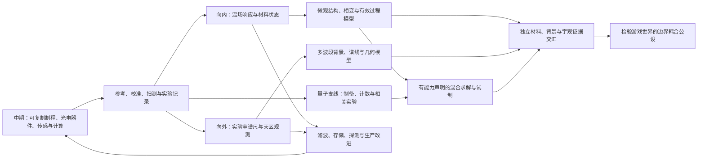

# L1：从光电计算走向微观与宇观的研究方向

2026-09-08，后期第一轮方向与调研稿。用户确认的起点是：中期光电计算支撑实验和观测，通过材料、制程与观测设备采集数据，解密模型，两条线交织发展。本文以下的装置分组、任务名称和细节是据此提出的候选，尚未冻结后期系统。

当前推进方式按[L2连续玩法讨论](LATE_L2_INTEGRATED_PROGRESSION_DISCUSSION.md)修订：先让已有工坊、材料组合、控制和原版应用继续成长，再从实际用途逐渐展开微观/宇观。本文保留科学资料与研究入口，其专题顺序不再等同玩家经历的顺序；新机制可依据卡玛恩世界设定创造。

承接[前中期总览](EARLY_MID_REVIEW_AND_LATE_ENTRY.md)、[发展线四](PROGRESSION_04_MICRO_AND_COSMOS.md)。首批已开始展开的操作、材料来源与模型见[L1实验与仪器](LATE_L1_EXPERIMENTS_AND_INSTRUMENTS.md)。

后续用户补充已记录为[L1.1探索与理论玩法讨论](LATE_L11_EXPLORATION_AND_THEORY_DISCUSSION.md)：L1提供仪器基础，后期还应包含依附原版世界的探索、可操作的过程/时空推演及边界信息实验。现已展开L1.2[材料过程任务](LATE_L12_PROCESS_GAMEPLAY.md)和[错时天区探索](LATE_L12_SKY_EXPLORATION.md)，将两条任务与材料制程并行推进。

## 1. 后期的方向：把已会控制的东西，变成能提出新问题的仪器

前期学会改变晶体，使其对某些作用更敏感；中期学会记录这些响应，用光电硬件与模型控制复杂生产；后期则主动改变温度、外场、激励频率、观测波段和观察位置，寻找原模型解释不了、又能重复出现的结构。

**卡玛恩晶体始终是研究媒介。频率提供可选择的激励、响应和观测轴；信息来自有参考、有条件的差异及其可检验关系。** 研究对象可以是晶体内部、普通材料、环境、生物与世界现象，随后延伸到微观状态和宇观分布。不要把所有新现象都定义成晶体专有魔法。

后期的第一份成果应当是一件更好用的材料、测头或工艺程序，同时附带一份解释其工作范围的记录。研究产生的能力立即回到生产与计算中心，再支持下一轮更复杂的实验。

图中的交汇是后续联合研究，不要求两条线每一步互相等进度。电气负责供给、控制、记忆和适合的算术；光学负责相位、传输、特定算子和光学观测，继续并行。

## 2. 重新读旧稿后，保留什么、修补什么

| 现有思想及出处 | 保留的玩法价值 | 本轮组织方式 |
| --- | --- | --- |
| [晶体旧稿](../Kamaen_Info_Resonance_Crystal_And_Early_Game_Design.md)的晶种、特化、应力与固有谱 | 同一实体沿加工历史持续变化 | 沿用[E1晶体状态](EARLY_E1_CRYSTAL_MODEL.md)；先扩展观测范围，再根据反例扩展模型，不换一套“后期晶体数值” |
| [阶段表§8](../Kamaen_Info_Stage_Content_Line.md)的低温凝聚腔、准粒子捕获器与凝聚态材料 | 工艺条件打开新的响应和材料用途 | 普通温控/制冷先行；测头测响应，由模型推断候选模式；数据片指导工艺，实体料仍需实体来源 |
| [GDD§5.8–5.9](../Kamaen_Info_GDD.md)的传播子、顶点、参数曲线与中观调度 | 将物理解释变成可计算、可执行的工艺 | 响应档案→有限有效模型→经典基准→所需量子测量→候选工序→实物验收 |
| [光计算§13–14](../Kamaen_Info_Optical_Computing_Design.md)的经典光与量子光连续性 | 复用光路、耦合、相位与统计工具 | 连续的是实验技能、器件工艺及部分数学表示；MZI传递矩阵不能直接证明某个微观相互作用，减弱激光也不自动制备合格单光子态 |
| [字典§9](../Kamaen_Info_Item_Block_Dictionary.md)的超导环、拓扑晶体、相变记忆、滤波器 | 新物性反馈硬件与实验 | 分成各有证据的材料用途；低电阻、可保持写入和边界响应分别验收，相变存储不统一以拓扑材料为前置 |
| 阶段表§8–9的SNSPD、单光子源、玻色采样 | 从连续信号进入事件与相关统计 | 初级计数头先能完成基础实验；SNSPD是低温升级；固定玻色采样与可执行变分任务的能力分开 |
| [信息系统旧稿](../Kamaen_Info_Information_System_Design.md)的噪声库、世界探测与模型 | 把零散观察组织成持续研究 | 地点/方向/时段/带宽/仪器状态一同入库；现场记录与模型预测分开；批量采样不是反复复制同一段历史 |
| [当前发展线四](PROGRESSION_04_MICRO_AND_COSMOS.md)的谱尺、余辉星图、测地卷与接界棱镜 | 微观与宇观多次互证，最后进入科幻公设 | 此轮落实第一次交汇——共同的测量方法和参考体系；不提前把所有残差解释为世界边界 |

旧稿“频率/拓扑数统一守恒”“两张电子传播子合成库珀对物品”“全部合成曲线由玻色采样给出”不作为新版通用规则。守恒与允许过程来自具体物理模型；材料、知识记录、计算任务各有自己的输入和结果。

## 3. 让主旨贯穿实验，而非只作为物品前缀

| 概念 | 本阶段的具体操作 | 玩家得到的信息 |
| --- | --- | --- |
| 激励频率 | 对相同样品扫频、改幅度、换作用方向 | 哪些模式容易被激发，模型在哪个工作域成立 |
| 幅值与相位 | 记录相对于参考的同相/正交响应 | 变弱、变慢、失谐与纯参考漂移的区别 |
| 光谱频率/波长 | 用参考源校正分光轴，测谱线位置、宽度与强度 | 候选组分、状态、目标谱移，而非直接读取隐藏组成 |
| 调制与采样频率 | 斩波、同步检波、改变积分窗口 | 在读出能力内提取某个信号；检验带宽、漂移与同频干扰 |
| 相关与事件 | 对齐实际触发、记录多个通道和未检出事件 | 共因、偶然符合与特定制备的统计差异 |
| 信息模型 | 为不同假设预测下一次读数，并选择能区分它们的实验 | 哪种解释暂时有效、哪些未知量仍无法分开 |

机械振动频率、光载波频率、光强调制频率、电子采样率必须带域与单位，不能因为都写“Hz”就直接接通。光电读出通常把光学变化变成较慢的电信号；Minecraft每tick更新的包络不等于仪器能无成本采样任意高频波形。

继续区分四个对象：白噪晶种的平均属性背景、局部热/机械/电磁扰动、天空各波段的辐射背景、后续游戏公设中的边界模式。它们可以在实验中被比较和建立关系，但不能由名称相似先认定同源。

## 4. 科学实验与理论怎样选进路线

以下资料在2026-09-08检索。使用agent-reach的Exa检索仪器资料，再以网页搜索与官方页面核对；只采用研究机构、仪器厂商、论文作者/期刊与诺贝尔官方资料。引用支持真实方法；游戏材料参数、装置尺寸和任务规则为本稿设计。

| 科学入口与一手/官方资料 | 对本游戏有用的部分 | 安排及读取边界 |
| --- | --- | --- |
| 同步检波：[SRS Lock-In Amplifier Basics](https://www.thinksrs.com/downloads/pdfs/applicationnotes/Lock-In%20Basics.pdf)，2020 | 参考相位、双通道读出与有限检测带宽 | L1-01；读取PDF正文。首任务学会提取指定频率的响应，同频干扰仍需对照 |
| 四端测量与反向电流：[Keithley测量手册§3.3](https://www.tek.com/en/documents/product-article/keithley-low-level-measurements-handbook---7th-edition) | 分开供电/测压路径，抑制引线影响与近似稳定的热电偏置 | L1-02；读取相关正文。接触非线性、自热与快速漂移仍保留 |
| 热噪声测温：[NIST Johnson Noise Thermometry](https://www.nist.gov/publications/johnson-noise-thermometry)，2019 | 随机涨落本身携带温度信息，可通过统计量研究 | 噪声支线；读取摘要，不把现代量子电压参考设成第一台温度计前置 |
| 超导磁响应：[2003年诺贝尔物理学奖说明](https://www.nobelprize.org/nobel_prizes/physics/laureates/2003/illpres/two.html) | 磁场排斥、临界场与不同超导类型 | 温场材料后的资格实验；读取说明，不能仅用仪器显示零电阻授予超导资格 |
| 相变存储：[IBM相变材料研究](https://research.ibm.com/blog/pcm-breaks-bottleneck)、[结构松弛与电阻漂移论文摘要](https://research.ibm.com/publications/collective-structural-relaxation-in-phase-change-memory-devices) | 实际结构状态承载记忆，保持与漂移需要检验 | 材料回馈硬件支线；读取介绍与摘要，不照搬其速度/寿命宣传数值 |
| 原子谱线与能级：[NIST Atomic Spectra Database](https://www.nist.gov/pml/atomic-spectra-database) | 参考谱线需要身份、波长、跃迁和条件，测量谱与解释分开 | L1-03；读取数据库说明，不声称已下载全部谱线表；首例用明确标注的游戏谱线 |
| 光谱解释：[NASA Spectroscopy 101](https://science.nasa.gov/mission/webb/science-overview/science-explainers/spectroscopy-101-beyond-temperature-and-composition/) | 谱线位置、宽度和强度提供不同约束，谱移要与实验室比较 | L1-03与后续天区目录；读取正文，不由一个谱移值独立给出距离、年龄与成分 |
| 拉曼散射：[Raman诺贝尔演讲](https://www.nobelprize.org/uploads/2018/06/raman-lecture.pdf) | 入射与散射光的频率差可以约束内部能量交换 | 下一轮材料谱学候选；本次仅读到检索摘录，直读失败、Jina匿名读取被拒；未核对整篇，不据此定量定案 |
| 布拉格衍射：[1915年诺贝尔颁奖说明](https://www.nobelprize.org/prizes/physics/1915/ceremony-speech/) | 波长、角度和晶体结构之间有可检验关系 | 微观结构支线；读取检索正文。先用光学周期结构教学，原子尺度研究再配X射线源/探测与制程，不让可见光直接看清原子 |
| COBE/FIRAS：[NASA仪器档案](https://lambda.gsfc.nasa.gov/product/cobe/about_firas.html) | 天空与参考黑体差分，明确波段、视场、自身热辐射 | L1-04的校准结构启发；读取正文。首设备不宣称复制FIRAS精度、低温或现实CMB测量 |
| 多频前景分离：[ESA Planck说明](https://www.esa.int/Science_Exploration/Space_Science/Planck/Planck_and_the_cosmic_microwave_background) | 不同波段共同约束前景与背景分量 | 宇观背景深化；读取正文。模型不可辨识时保留区间，增加通道不自动保证可分解 |
| 两光子干涉：[Hong、Ou、Mandel，PRL 59, 2044](https://journals.aps.org/prl/abstract/10.1103/PhysRevLett.59.2044)，1987 | 参数下转换、延迟与两光子干涉的测量联系 | P18；本次核对摘要，全文需授权。完整计数/损耗规则仍按发展线四的游戏概率候选继续验证 |

这批实验的共同价值，是给玩家不同的“提问方法”。名人名称附在相应仪器、实验任务或成果册上；无需先学完整理论史，也不把诺贝尔奖名词排成逐级消耗材料。

## 5. 两条路线与量子支线的具体方向

| 段落 | 向内：材料和制程 | 向外：设备和观测 | 可交付收益 / 进入下一段的证据 |
| --- | --- | --- | --- |
| L1，P16–17首批实验 | 同批样品扫频；温度/接触/外场对照；恢复原工况复测 | 实验室谱轴校准；多条天区谱线；对应波段的近远/开关/朝向对照 | 已测工作窗、稳定测头或滤波件；可追溯谱尺和有限背景图 |
| L2，P16–19材料深化 | 将组成/结构/应力与模式、松弛联系；分开相变存储、超导与边界材料任务；补拉曼/衍射 | 多波段与长期漂移；温度形态、谱移目录、空间候选结构 | 实际低噪读出、存储试件、精密表面；经新波段/新位置检验的解释 |
| Q1，P18，可与L2并行 | 制备源、初级计数头、延迟/相位结构 | 复用观测的校准、时间标签与统计方法 | 暗计数/效率/偶然符合档案；HOM等指定制备的实验资格，不要求先有宇观结论 |
| L3，P19–20 | 响应模型→有限有效自由度与耦合→过程图→经典基准→所需量子任务→实际试制 | 多组候选模型与更多观测共同缩小参数范围 | 有适用域的参数曲线、中观工艺协议；算力用于真正在执行的求值与试验选择 |
| L4，P21–23 | 精密间隙、表面/外场/边界位置对照 | 多像/形变和有限透镜模型，新目标/波段验证 | 材料与天空各自成立的残差证据，再检验本游戏共同边界项 |

**第一次交汇是方法，第二次是性能，第三次才是世界解释。** 谱学、时间参考与校准方法可共用，但不同波段仍需各自传递标准；新材料改善观测，观测反查仪器漂移；最终独立证据才进入联合模型。未识别的天体不自动充当绝对标准。

量子支线不是把电气/经典模型废弃，也不是所有微观工艺的强制黑盒。第一张工艺预测可以由查表、线性模型、有限状态模型或小型经典求解给出；更复杂的模型只有在新数据和任务需求支持时才有意义。

## 6. 设备按六类可组合能力组织

| 设备族 | 从中期继承 | 本段新增/深化 | 玩家主要设计什么 |
| --- | --- | --- | --- |
| 激励与参考架 | 电源、晶振、光源、调制器、相位器 | 扫频、调制/反向序列、参考切换 | 作用域、参考路径、强度和可测频窗 |
| 可换样品与环境腔 | 夹具、退火、机械加载、冷却管路 | 分级制冷、隔热、可控外场、样品实际温度读出 | 装夹、接触、温程与散热；按需安装腔体 |
| 响应读出架 | 电/光测头、转换、采样与局部控制 | 四端载台、同步检波、探测头校准 | 测什么、参考是什么、量程与等待时间 |
| 分光与成像架 | 分束、透镜/导波、强度读出、转向支架 | 狭缝/色散/遮光、校准源接口、光谱扫描 | 光路、视场、谱轴和分辨率 |
| 远场与背景接收架 | 多点记录、定向安装、可选移动探头 | 对应波段的喇叭口/天线或光学接收头、参考负载、重复指向 | 波段、视场、环境前景、地点与指向 |
| 实验控制与计算 | B01/B02、存储、机柜、模型/算子运行 | 实验序列、校准关联、候选比较、批量执行 | 测量计划、数据量、求值资源和下一组对照 |

这些是组合方式，不等于必须新增六台整机。中期实验台换载台和测头即可做前三类的入门工作；环境腔和观测支架因真实空间/接口不同再实体化。量子计数头将来接入同一记录系统，保留自身触发和计数能力。

工程入口继续采用[R4统一工作台](R4_UNIFIED_WORKBENCH.md)。一份研究项目串起“问题→装置→序列→记录→候选模型→下一次实验/工艺”，点击异常读数可以回到对应实际端口、样品和校准。默认提供可运行模板，再逐步开放替换结构、测量方式与模型。

## 7. 第一批故事与过渡成果

延续玩家自己留下研究笔记的叙事。动力从实际需求产生，不另加一套失落文明任务指令。

| 任务 | 故事起因 | 特殊名称及实体定位 |
| --- | --- | --- |
| 《把噪声放到一边》 | 扩建工坊后，小信号被驱动与机房干扰淹没；提高增益没有解决问题 | **同调针**：装有敏感片、参考与读出接口的实体测头；附响应档案 |
| 《回来时的另一条路》 | 相同晶片降温和复温的曲线不同，先检查样品温度与接触 | **复温回线册**：带原始记录、等待条件和模型候选的知识档案；可改进实际温程 |
| 《把工坊的刻度带向天空》 | 天区粗谱有结构，但仪器自己的刻度也会漂移 | **巴耳末谱尺**：实验任务名称和谱轴参考组件的显示名；附游戏谱线目录，不冒充现实氢谱定值 |
| 《离站以后，仍有回声》 | 移开本地热源后，某些方向差异仍可复测 | **离站背景图**：带未观测区和误差的观测档案；**余辉星图**留给后续多波段验证成果 |

之后才把合格实体预制件称为“库珀对种子”，把模型与实际试制结合形成“费曼过程蓝图”，把联合标定的实体模块称为“接界棱镜”。名字对应研究进展，而不是让数据变成神秘物质。

> “最初我让晶体适应工坊。现在，我开始让工坊能问出更细的问题。材料里的迟滞，天空中的细线，仍然是读数；当它们能预测下一次读数时，才逐渐成为解释。”

## 8. 本轮落实与下一次回收

本轮已展开[L1-01至04](LATE_L1_EXPERIMENTS_AND_INSTRUMENTS.md)：装置从哪里来、真实连接、观测模型、可执行对照、失败反馈和首批用途。它们是P16–17的开始，不等于已完成全部凝聚态材料或宇观模型。

全局能力图同步一处入口修订：`phase`与`spectrum`的模型前置由`train`改为`model`，保留预测/验证能力，不强制先执行监督训练流程。训练、主动实验和更深背景归因继续有自己的节点，未删除玩法。首轮局部测量可以更早进行，完整工作窗/谱尺的登记仍需相应模型与仪器验收。

下一轮优先把温场材料分成可保持结构、低损耗输运和特定边界响应三种不同证据链，补上制冷级别、材料组分与实物制程；同时把天区谱线扩展成有限目标目录与多波段背景。再从所需计数能力细化P18，不先重写整个终局。

本轮没有把E1/R4旧物料表中的空缺当作现成产物。首套新增组件给出制造来源与工装清单，逐配方数量、压力/低温介质、完整谱学分辨率与游戏试玩仍需要后续原型。计算资源从既有节点取得，不新增“研究算力分数”。
