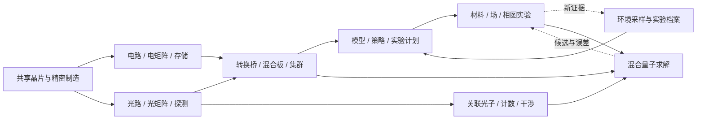

# 光电并行、学习与量子实验设计

> R1已统合完成：[当前审核总案](REVIEW_SYSTEM.md)。本文件保留为此前候选/审核依据，未按R1逐段重写，不作为当前完整流程的规范。

Rebuild 0.2，2026-09-06。用户方向：保留全部主要玩法，光学与电气并行，共同支撑计算集群、机器学习、强化学习、环境采集与物理发展。本文件补充SYSTEM的理论依据与实验规格；精确首次依赖以生成的科技树为准。以下数值与任务规模均为原型建议，不是现实设备性能。

0.3续篇见[微观与宇观：研究与故事](RESEARCH_AND_STORY.md)。本专题的光电/量子语义继续适用；后期新增宇观观测、双尺度标定与典型实验，阶段和物品以最新总案/科技树为准。

## 1. 本次修正的核心

0.1把电域模型放在C13，把主要光硬件和集群放在C15–16，导致光学成为电气完成后的接替者；II型精密框架又依赖训练结果。这与并行发展不一致。

0.2采用三个层次：

1. **设备层并行**：电逻辑/电矩阵，与经典光路/光矩阵，共用精密制造但各自可首次制造。
2. **设施层汇合**：光电转换、混合板、数据集与集群，共同提供学习和实验所需的计算、存储、控制与测量。
3. **科学层持续循环**：采样→建模→预测/策略→设计实验→实测→更新；量子设备后来接入这个循环，承担指定的态制备与观测任务。

长流程由更多不同实验组成，不靠把相互协作的技术强行串成互相替代的时代。C编号表示推荐教学位置；实际开启由科技节点决定。

虚线是运行反馈，不是首次制造前置。首次设备用公开模板与固定控制自举，学习和量子结果优化后续实验。

## 2. 真实原理如何约束设计

此处仅引用原始研究、研究机构说明和大学讲义；不把单篇实验的性能推广为所有任务的普遍结论。

| 依据 | 可借鉴内容 | 转为本模组规则 | 不能据此声称 |
| --- | --- | --- | --- |
| [Shen等，相干纳米光子神经网络，2017](https://www.nature.com/articles/nphoton.2017.93) | 光学电路可实现神经网络相关线性运算 | MZI小矩阵、权重校准、损耗与精度 | 放一束光就能执行任意模型 |
| [混合架构光子电路用于RL，2024](https://www.nature.com/articles/s41467-024-45305-z) | 光子芯片和电驱动/FPGA可协同完成特定计算 | 同板两域共同工作，配置/计算/读出各有成本 | 所有RL都更快，或实验收益可直接搬作倍率 |
| [Degrave等，托卡马克深度RL控制，2022](https://www.nature.com/articles/s41586-021-04301-9) | 物理模拟器、轨迹、策略训练与实机控制可以形成工作流 | 先受限模拟训练，再对照工况部署与验收 | 学会奖励函数就能任意控制未知物理系统 |
| [NIST，SPAD计数与控制电子学，2021](https://www.nist.gov/news-events/news/2021/04/light-fantastic-counting-single-photons-unprecedented-rates) | 单光子探测也有半导体路径，并依赖读出电子学 | 早期SPAD与计数电路；SNSPD为后续低温升级 | 所有单光子观测都必须先有超导设备 |
| [NIST，分束器输出的光子对观测](https://www.nist.gov/publications/direct-observation-photon-pairs-single-output-port-beam-splitter-interferometer) | 双光子干涉是可实际观测的实验内容 | 扫延迟、看符合计数变化，检查匹配与损耗 | 经典干涉条纹足以证明纠缠或通用量子计算 |
| [Peruzzo等，光子量子处理器上的变分求解，2014](https://arxiv.org/abs/1304.3061) | 小量子处理器与经典计算机协同估计能量 | 经典更新参数、量子测量、有限循环与基准比较 | 任意工艺能自动加速或一次测量得到准确答案 |
| [Knill、Laflamme、Milburn，线性光学量子计算，2001](https://www.nature.com/articles/35051009) | 通用线性光学量子计算需要额外状态、测量和控制结构 | 区分光矩阵、采样设备、有限任务处理器和容错计算 | MZI阵列加单光子源就自动成为通用量子CPU |
| [Preskill，NISQ论文，2018](https://preskill.caltech.edu/pubs/preskill-2018-NISQ.pdf) | 噪声、量子任务适用范围与纠错是独立问题 | 任务规模、校准、重复测量、误差与失败报告 | 增加qubit数量就能解决所有搜索问题 |

材料和过程理论的课程脉络参考[David Tong的理论物理讲义目录](https://www.damtp.cam.ac.uk/user/tong/teaching.htm)：电磁学、量子力学、固体物理、统计物理与场论解决不同层次的问题。这些材料支持内容组织，不提供本模组的合成配方或科技解锁顺序。

## 3. 光电两条线怎样一直有用

| 教学期 | 电气继续发展 | 光学同期发展 | 共同交付 |
| --- | --- | --- | --- |
| C08 | 比较、选择、寄存器入门 | 相位、分束、干涉、局域源 | 两种可解释的功能图 |
| C09–10 | 电矩阵、激活、持久存储、驱动/采样 | 小MZI矩阵、调制、探测、校准 | 封装、转换桥、混合计算板 |
| C11–12 | 采样控制、数据校验、寻址、调度 | 光传输、分通道采样、批量线性计算 | 环境档案与两板集群 |
| C13–16 | 分支、参数更新、状态、模拟器、策略评估 | 批量推理、适配的梯度/线性子任务、光域专化 | 监督学习、RL、主动实验 |
| C17–20 | 计时与符合计数、闭环驱动、优化器、误差统计 | 光谱/干涉、关联光子、量子态操作与读出接口 | 相图、量子测量、混合求解 |
| C21以后 | 安全控制、持久档案、调度与维护 | 更高容量传输、专化算子与光测量 | 复杂工艺与科幻终局 |

### 3.1 第一块混合板

功能链为：电存储读输入→电驱动/调制→光矩阵→光电探测/采样→电激活或选择→电存储写结果。首次只做固定小向量运算，所有中间值能诊断；不要求光控制核、光脉冲处理器或光RAM。

基础光源由初级CE、稳谱腔与前期光件自举；光源稳定度和MZI规模限制首版能力。F4用于更精密参考与跨模块协作，后续泵浦塔提供高负载供给。基础线性矩阵不需要先造非线性光介质。

算子不是只看网格大小就全支持：无损理想MZI网络适于特定线性变换；一般实矩阵需明确幅度缩放、符号/相位编码与读出方案。原型采用登记分解模板和带范围的输入编码，校验输入幅值、饱和与误差；不把光强直接当作有符号数。

一次任务显示：准备/调制、计算、读出、传输、排队、校准的时间与能耗；批量与流水可重叠，最终延迟按实际调度而非机械相加。比较至少包括小批量、重复大批量和频繁改权重三种任务，允许某些任务纯电更合适。光RAM面向短时光状态，长期档案与模型权重仍可用电/晶体持久介质。

### 3.2 第一套集群

C12用两块混合板完成“产线侧采样预处理→中央汇总→结果下发”。管理面由电控制，数据面可走光链路。节点能力分别登记控制、矩阵、存储、转换、带宽、可用精度和队列；任务不能只靠总算力分数凭空执行。

集群最先服务数据采集和批处理；随后同一设施运行模型训练、RL模拟回合和物理参数扫描。在线控制优先在本地执行，批量训练允许排队；中央节点失联时本地固定控制继续工作。电气和光学通过真实瓶颈分别升级。

## 4. 环境采集、ML、RL与实验科学的完整闭环

### 4.1 各对象不混用

| 对象 | 最小内容 | 产生方式与用途 |
| --- | --- | --- |
| 观测 | 地点/时间/批次、仪器与校准版本、单位、误差、工况 | 传感器采集；仿真样本明确标记来源 |
| 数据集 | 样本引用、标签/缺失、分组、训练/验证划分 | 相邻tick和同一批次不随机拆成假独立验证 |
| 预测模型 | 功能图、参数、输入范围、验证报告 | 估计良率、温度趋势或材料响应 |
| 动态模拟器 | 受限状态转移、观测误差、延迟、复位与终止 | 供策略进行有成本的有限回合试验 |
| 策略 | 观测→动作、状态、动作上限、部署有效域 | 经轨迹和奖励训练；输出通过执行器约束 |
| 实验计划 | 假设、下一工况、成本、观测目标、停止条件 | 根据不确定度与价值安排真实采样 |
| 工艺协议 | 材料、设备条件、过程曲线、实测证据、有效域 | 模型或量子输出都不能直接替代此验收 |

### 4.2 用一条热处理产线连续教学

**C11–12采样**：改变负载或隔热，在不同批次记录温度、输入功率、冷却和结果质量；两板归档并标记异常。第一套硬件使用固定控制，产线先能运行。

**C13–14监督学习**：用前段读数预测完成时间或合格率。玩家调整一个特征或参数，在独立批次比较误差。预测好不等于策略会控制；模型不能看到尚未发生的最终质量作为输入。

**C14模拟环境**：由固定简化热模型和已测响应建立可复位场景。模拟器要与实测对照，并给出有效范围；复制真实数据不算生成新的世界证据。

**C15强化学习**：状态包含温度偏差、变化趋势、剩余预算和上一动作；动作是受限加热/冷却设定；奖励同时考虑合格完成、能耗、超限和耗时。轨迹保存当前观测、动作、奖励、下一观测及终止原因。首次用有限离散状态和动作的表格Q学习，后续小网络策略继续使用混合后端。

策略验收由任务外的固定评价器执行：只关闭设备不能拿到合格产量奖励；重复回放不再产生新奖励；预测器自报成功不算真实成功。至少在未参与训练的初始温度、负载和传感延迟上测试，并比较同预算固定控制。回合数、历史与并发有上限；游戏中的硬件产能不提升真实服务器无限算量。

**C16主动实验**：给定有限测试预算，选择最能区分两种模型预测的下一组工况，完成真实试验、归档、再训练。入门用固定“不确定度/成本”选择器；RL策略负责试验执行，是否再用RL学习选点属于深化玩法。它不是不停挂机累加研究点。

**C17以后物理实验**：将同一结构替换为温度/外场/组分扫描、响应预测与相边界测量。更多算力意味着更多可排程候选和更复杂的有限模型，真实材料与试验成本仍需支付。

## 5. 理论物理内容按“看见什么、操纵什么”展开

| 层次 | 玩家操作与可见现象 | 新内容与成果 | 后续作用 |
| --- | --- | --- | --- |
| 经典电磁/波动，C08–10 | 改相位、偏振与电驱动，比较输出 | 干涉曲线、校准档案、转换桥 | 光电计算与仪器基础 |
| 噪声/统计，C11–16 | 改采样窗口，区分漂移和波动 | 重复性、误差条、漂移检测 | 训练数据可信度与控制稳定性 |
| 固体/热与相变，C17 | 扫温度、外场、组分与电/光响应 | 有效相图、材料工作窗口 | 超导、相变、隔离器件分别可用 |
| 单光子与多光子干涉，C17 | 扫延迟、计符合、比较信号/背景 | 量子实验与校准报告 | 量子制备和读出准入 |
| 有效模型与多体，C18 | 选自由度、耦合、边界与观测量 | 小哈密顿量、过程图、经典基准 | 让求解任务有明确物理含义 |
| 量子控制与估计，C19–20 | 重复制备、换测量基、校准损耗、更新参数 | 期望值/置信摘要与候选 | 辅助真实工艺试验 |
| 场论/引力/全息的科幻延伸，C21以后 | 检验模组登记的边界和稳定条件 | 弦膜/视界/创世规则档案 | 维持原有终局想象 |

统计物理和量子理论是交叉解释，不是现实世界按科技等级依次出现的规律。[Tong的统计场论引言](https://www.damtp.cam.ac.uk/user/tong/sft/sfthtml/S0.html)可作为相变和有效描述的阅读入口；本游戏只实现少量响应曲线与有限模型。

费曼图保留为过程编辑体验，但它表达模型中的贡献/相互作用结构，不与光路图、粒子轨迹或制造配方等同。界面检查模型允许的连接和参数，再由登记求解器与物理试验确定结果；“守恒合法”只是必要校验的一部分。

### 5.1 把理论落实为少量可计算关系

原型建议只暴露以下四组关系，参数从游戏设备和批次读取。公式帮助解释行为，不要求玩家手算：

- **经典线性光路**：`输出复振幅 = U × 输入复振幅`，理想强度读数与振幅模平方有关；损耗、探测和噪声另算。因此“相位权重”和“最终数值输出”之间需要编码与读出，不能直接划等号。
- **热处理环境**：`C × 温度变化率 = 加热功率 − 散热功率`，用有限步长、正热容、动作限幅和已登记的散热模型。它为RL提供带惯性与延迟的状态转移，不需要运行真实流体仿真；积分越界必须拒绝或缩步。
- **重复观测**：独立、同分布且有限方差的稳定样本，均值标准误差通常随有效样本数的平方根反比缩小。漂移和相关采样不满足这个简单收益；重复复制记录不会改善精度。
- **有限量子任务**：`H = Σ c_k P_k`、`E(θ) = Σ c_k ⟨P_k⟩θ`，其中P是任务登记的可测算符，系数来自选定的玩具有效模型。设备估计观测量，经典优化器更新θ；模型系数与真实材料之间还要实测标定。[混合变分求解研究](https://arxiv.org/abs/1304.3061)

光子芯片能复用部分经典光路制造经验，但从经典振幅到多光子态，不是把数据类型改名即可。输入态、测量和损耗模型改变了任务语义；单光子干涉本身也不能证明计算优越性。量子任务必须明确所需态与测量能力，经典任务继续使用自己的算子和性能预算。

## 6. 从经典光学跨入量子玩法

### 6.1 先有量子实验台，再有量子计算任务

首套实验：已有非线性介质与泵浦光路→关联光子对源→一臂预告、另一臂实验；已有半导体工艺→SPAD与读出→时间标签/符合计数。复用电控触发、光学对准与数据集系统，不制造一套脱离前文的新科技。

实验一比较不同源设置的计数统计；实验二扫描两光子相对延迟，看符合计数凹陷如何受模式匹配与噪声影响。详细原型应记录总触发、单路/双路/三路计数、检测效率、暗计数、窗口与不确定度。短窗口降低偶然符合也可能丢掉有效事件，不能只把窗口缩到零刷“高质量”。

单光子统计常用二阶关联量描述，多光子污染与来源需同时解释；双光子干涉可见度也依赖输入态、匹配和背景。不能仅凭一条干涉曲线断言纠缠。需要纠缠的后续任务必须另有登记态制备与见证/测量方案。

SNSPD在已有凝聚态和低温工程之后加入，升级所需任务的读出。量子光学不意味着整套设备必须同温度，也不意味着所有量子平台都要低温；本线选择低温探测器是工艺设计选择。[NIST的SNSPD说明](https://www.nist.gov/pml/productsservices/quantum-networks-nist/technologies-quantum-networks/single-photon-detectors)提供器件依据。

### 6.2 首个量子计算任务

选择**有限两自由度玩具哈密顿量**作为首个求解任务，声明维度、系数范围、允许态制备、测量基和经典精确参考。它不是现实材料的完整第一性原理模型。

循环为：经典优化器提出参数→经典控制设置量子电路→量子设备重复制备/测量→统计观测量与误差→经典更新参数或停止。每次测量消费新制备事件，不从一张“波函数页”无限读取完整量子态。

小任务可用有界状态向量/密度矩阵与抽样实际求值；更大任务必须拒绝或采用明确标注的登记近似，不能按设备分数生成一个看似正确的答案。测量结果要随参数/噪声变化，失败、超时和校准过期都有状态。经典精确求解器用于可验证基准，不通过故意拖慢经典CPU制造现实加速叙事。

首个成果是能解释为什么量子估计与经典参考存在误差，并把可信结果转成后续物理试验的候选。原有“量子曲线”保留为下游工艺对象，但中间增加有效模型到候选工艺的显式映射与实测，不能从任意量子样本直接输出最优配方。

### 6.3 保留量子深度，限制功能宣称

基础采样、有限变分任务、量子增强测量各自有任务标签。可选深度可加压缩光测量、更多可测量、误差缓解和小纠错演示；不得把误差缓解改名为容错，也不得把光子数、模式数、采样次数和逻辑qubit合成一个万能等级。

[NIST的量子非线性光学项目](https://www.nist.gov/programs-projects/quantum-nonlinear-optics-metrology-and-networking)说明非经典光可用于特定增强测量。对应游戏可选实验是固定资源下比较某一观测通道的噪声；收益限定目标、损耗与测量条件，不写成所有环境噪声同步下降。

## 7. 与弦膜、视界和创世接续的边界

保留C21以后的既有内容，但在知识册明确标记三类：真实原理启发、有限游戏模型、科幻公设。量子模拟可以研究一个模型，不代表能把模型中的黑洞或时空结构直接制造出来；场论、弦论和全息概念也不提供已验证的视界工程配方。

本模组的接续约定是：已有材料/场设备提供物质条件，世界边界档案提供模组观测，经典与量子验证限定模型可信度，登记的“卡玛恩边界耦合”科幻公设允许弦膜/视界制造。该公设从这里明确启用，仍受物料、供能、热、稳定与恢复预算约束。

0.3将这个约定具体化为接界棱镜：微观晶核/间隙腔/约束材料与宇观测地卷/边界档案一起完成标定。视界运行结果再与外部观测生成双尺度闭合图谱，最后装配晨曦世界种。卡西米尔边界力实验和天文引力透镜只是各自原理启发，不是跨尺度耦合已获现实验证的证据。

第一次视界要求完成量子交叉验证是保留玩法的教学门槛，不是声称现实制造视界必须先做VQE。知识掌握后保守工艺可继续维修和生产，量子设备损坏不能把整条材料链锁死。跨维度通信亦属本模组公设，不能用量子纠缠解释超光速传信。

## 8. 本次验证与下一轮原型

生成器新增反例检查：电/光基础矩阵可分别制造；基础光矩阵不等F4/模型/非线性介质；无光控/光RAM/光脉冲仍能运行集群、学习、量子任务与通关；无SNSPD/低温仍能完成基础量子实验；无校准不得进入混合量子求解。

下一轮最小原型建议按四个实验推进：同任务电/光/混合对照；带噪热处理预测和RL；单光子符合计数与延迟扫描；小哈密顿量经典/量子估计对照。分别验证端到端成本、奖励有效性、测量统计和求解正确性。结构检查通过不意味着这些运行机制已经实现。
