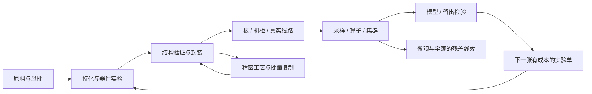

# 信息与频率：从晶体实验到计算研究设施的完整阶段设计

**R4阶段整合候选，2026-09-07，供本轮审核。** 本稿把已经讨论的玩法收敛为一条能逐步搭建、测量、解释和改进的链路。覆盖P01–05为中期提供的基础、P06–15的材料/光电/计算核心，以及本阶段可展开的高级支线。P16以后微观与宇观交织的发展仍接[R1完整科技树](REVIEW_TECH_TREE.md)，不在这里重写终局。

“完整”指本阶段的取得条件、操作、对象、数据模型、材料工位、装配、运行、失败恢复及旧稿去向已经连起来。所有数值是可复算的首版候选；没有宣称完成Java、GUI、真实物理模拟或可通关试玩。

前期续稿见[E1玩法与交付](EARLY_E1_GAMEPLAY.md)：P01–05展开实际晶坯/冲击、充裕早期供电和固定统计台。本文与生成目录的早期简化配方及从零预算是此前基线，尚未计入E1新增工装和供电平衡；中期器件、板柜、集群与通用模型执行仍按本组R4文档。E1的手工/固定统计不提前提供B01的通用算子服务。

本轮[中期定位与衔接记录](MIDGAME_DIRECTION_AND_EARLY_BRIDGE.md)补充阶段目标：将前期装置、观察和经验接入计算与信息中心，开展复杂控制、批量研究、量产及模型架构探索。两柜研究站是整合验收实例；单节点即可开始有限训练，生物行为、Minecraft过程和架构实验也是合法研究方向。Q03–06的入门步骤按该文继续展开，不另改硬件预算。

2026-09-08的[传感器到集成电路工作稿](EARLY_MID_SENSOR_TO_IC.md)进一步展开Q02–06的测量与制造基础：同母片测头/参考、校准与工艺记录、可级联控制、粗模块到共同基底，以及模型选参。该稿的测头/读出变体尚未并入R4装配单，不能视为新增的免费通道或资源。

同日[前中期总览](EARLY_MID_REVIEW_AND_LATE_ENTRY.md)将局部扫测、独立电单板、单机学习和架构探索同步到能力图；[中期应用](MIDGAME_APPLICATIONS.md)提供流水线、无人机、装备三条可选收益。其新增构件仍需单独配方/空间预算，后期按每项实验所需能力接入。

## 1. 主旨及本阶段结束时的体验

世界的物质种类固定。白噪晶种是共同属性平均背景的初始结晶，不是把瞬时热噪振幅取平均后变成晶体。卡玛恩晶体通过组成、取向、应力、缺陷与加工历史形成特化，让玩家有能力读取和干预其他材料及现象。频率、幅相、时序、相关和信息语义逐步成为玩家的研究语言。

玩家从一枚参考晶种开始，造出能辨别差异的器件；把一次成功的实验封装为重复工作的机器；让机器连成能够记录和计算的设施；再用设施研究最初依赖的材料与世界背景。**研究模型既是玩家使用的工具，也是游戏中需要通过实验逐渐理解的内容。**

本阶段的整合样例是一座可维护的两柜研究站：有来源的样品与记录，一颗可靠的终点芯片，一块能执行小模型的电板，一条经校准的光学实验路径，真实的供给/散热/接线，一个训练或拟合成果，以及一组尚不能解释的残差。它展示微观材料研究和向外观测如何接到后续阶段；个别后期分支可以在自身条件具备时先开始，不统一等待整座样例全部完成。

## 2. 阅读与版本顺序

| 文档 | 这轮已经定具体的内容 |
| --- | --- |
| 本总案 | 阶段节奏、完整任务链、共同规则、故事与验收 |
| [材料与机器](R4_MATERIALS_MACHINES.md) | 开局可获取资源、设备服务、逐配方、证据自举及三套从零装配单 |
| [模型与影响因素](R4_MODELS_AND_FACTORS.md) | 八类因素、分层状态、初始结晶/工艺/器件、容量模板及随机实验 |
| [统一工程入口](R4_UNIFIED_WORKBENCH.md) | 实验/制造/硬件/模型同项目，交互、版本、自动搭线与施工 |
| [硬件与集群](R4_HARDWARE_AND_CLUSTER.md) | 双制造路线、B01/B02、R04两托盘柜、供给/环境/网络和维护 |
| [运行与研究](R4_RUNTIME_AND_RESEARCH.md) | 数据、算子、M01推理/训练、RL、主动实验及高级模板 |
| [旧稿逐项去向](R4_SOURCE_RECONCILIATION.md) | 67项硬件旧实体、34个补充族、15个阶段ID与冲突解决 |
| [目录检查](R4_VALIDATION.md) / [有限玩法验算](R4_PLAYABLE_CHAIN_PROBE.md) | 自动核查结果和明确未覆盖范围 |

R4在本阶段优先于R2、R3讨论稿；R1继续负责全局主旨与后续科技关系。R4的A0–A5是建设能力带，不替换全局P编号，也不要求玩家串行完成每条横向支线。精密制造、光学和电控制允许互相帮助，不把光计算放到电气发展很远之后。

## 3. 从早期资源建立中期基础

| 能力带 | 首次可用的原料与设备 | 玩家解决的问题 | 向下一带交付 |
| --- | --- | --- | --- |
| A0 起步资源，对应P01 | 木材/圆石/水；手筛、滤盆、石炉、机械台 | 筛分/沉降把有限份额分出；制作铁铜、陶瓷、玻璃、碳/粘结料 | 结构、接触、绝缘、热界面、容器与普通供能；分馏塔自动化同一分离 |
| A1 晶体与粗工具，对应P02–05 | 热噪坩埚、均值基底、白噪晶种、I型框架、分光镜、探头/固定扫描、工程册 | 控制成核与取向；分辨平均背景与特化；建立粗反馈 | 可追溯晶片、导波/稳谱用途、固定温程退火炉、晶体实验台 |
| A2 器件实验，对应P06–08 | A/B处理剂、接触掩膜、粗刻蚀、区域片；电门/保持，光源/导波/相位/读出 | 物性如何通过结构形成函数与状态；光电并行对照 | 已测器件、双路干涉原型、退火终点原型、阵列测试片 |
| A3 封装与单板，对应P09–10 | 封装/装板工位、模块控制/矩阵、工作/持久阵列、B01 | 重复制造、封装后复测、本地程序与模型运行 | 芯片、真实页容量、初始数据/参数版本；反向改善精密工艺 |
| A4 机柜与集群，对应P11–12 | 托盘、背板、端口/线槽、风路、R04、交换/存储服务、B02 | 空间/方向怎样改变线路和环境；任务/数据怎样放 | 有测量的机柜、实际路径、两柜执行计划与校准光映射 |
| A5 学习与主动实验，对应P13–15 | M01、有限SGD/控制策略、环境探头、记录库、可见光巡天头 | 预测是否可信；改进模型还是仪器；下一次测什么 | 留出验证、主动实验单、环境与底噪候选、微观/宇观交界问题 |

铁铜/陶瓷等普通结构不依赖后期稀有晶体。粗力学框架不先要它未来才能制造的应力传感器。固定扫描器、炉控和粗读出不依赖可编程控制芯片。最初的程序板之后再造精密控制设备，切断“先有高级芯片才能制造第一颗芯片”的循环。

手筛/滤盆负责认识物料，之后搅拌分馏塔包含粗碎/筛分与搅拌分离，直接处理圆石+水，以同样干料份额连续生产。它不增加物质种类或凭空提高产率。手工路线仍可用，但大量重复料件可以交给塔及已有机械工位，避免每一座机柜都重做数百次手筛。

分离例统一8份干料，输出铁粉1、铜粉1、硅质2、陶土1、频谱滤渣3；滤渣经均值化才进入晶种路线。废水/残料有有限缓存和登记回收；其他物品一件的质量不同，不能拿件数做全流程化学守恒。完整料件数量和名义工序预算由[目录源](r4_stage_catalog.py)生成，方便后续平衡时同步。

## 4. 贯穿本阶段的工程循环

每次循环只要求玩家提出一个问题、做一处有意义的改变、观察结果，再决定下一步。工程册/工作台保存同一项目；实际结构、制造流程、数学图、部署和证据相互绑定，分别保留各自的真值。自动搭线帮助把已经明确的连接意图变成合法实体路径，不替玩家解决模型含义。

## 5. 十二个核心任务与交付物

各任务可用等价结构完成，验收行为而非指定布局。重复量产使用保存模板，不重复强制教程。实验消耗与生产合格测试可以共用设备，首次样品证据不要求先获得尚未解锁的成品。

| 任务 | 玩家实际操作 | 可保存的产物 | 必测反例 / 后续用途 |
| --- | --- | --- | --- |
| Q01 平均的起点 | 分离、均值化、受控成核；留两枚同批晶种 | 白噪晶种、参考记录 | 未处理滤渣不能直接当均值基底；为全部晶体加工留参考 |
| Q02 第一份差异谱 | 同母批切片，换方向/加载，重复扫测 | 导波/稳谱片、响应曲线 | 把方向变化与组成变化分开；供给电/光器件 |
| Q03 让响应成为功能 | 组成处理、门控/保持试装，同时做光路相位扫描 | 门/保持、读出、干涉试验及阵列试片 | 慢响应不算保持，单路强度不证明相位；形成两条并行器件线 |
| Q04 三帧回声 | 拼选频→读出→范围判定→连续窗口；再封装 | 退火终点芯片、结构/封装报告 | 短脉冲、过期、离窗、换批重置；控制炉子的结束请求 |
| Q05 能重复的工艺 | 同模板做小批，比较封装前后，找退火/应力差别 | 合格/降档模块、工序卡 | 错工序不能只靠校准修复；批量制造基础 |
| Q06 第一块会计算的板 | 装八槽B01、验供给/总线、地址花纹、固定M01前向 | 本地能力报告、第一条模型输出 | 权重文件不增加RAM，推理B64必须拒绝；反向造精密工位 |
| Q07 同一功能的两条路 | 选择一个已验证控制结构，用精密图案/裸片路线复制 | 精密裸片/芯片、对照报告 | 不重复收离散器件材料；已知功能与更好密度/窗口分开 |
| Q08 热机之后 | 插R04，跑持续负载，停机观察余热；改善一次风路 | 单柜负载/环境记录 | 挡住维护/回流、共享供给超限；打开环境工程 |
| Q09 确实连着的集群 | 两柜实际连接、自动搭线路线比较、分配任务 | 拓扑/执行计划、断链记录 | 跨柜RAM不能直接相加；解释通信瓶颈 |
| Q10 有出处的预测 | 采集有标签批次，母批留出，小批SGD并与简单基线比较 | 数据集、参数候选、验证报告 | 未来标签不能作输入；训练B32不适配B01 |
| Q11 光电相互校验 | 装B02或台上光路，单输入/双输入校准，再做热/振源对照 | 光映射、环境窗、修复前后记录 | 有符号通用矩阵不能强塞2×2强度映射；器件/环境/数学分别定位 |
| Q12 剩下的谱线 | 用模型分歧提出3组实验，完成并复验；增加一个环境/天空来源 | 主动实验单、残差档案、阶段研究笔记 | 未解释残差不提前认定量子现象；接微观/宇观发展 |

这些任务编号组织阅读，不强制依次完成。Q10的小批训练在Q06单板、合适记录与检验具备后即可开始，Q09集群用于扩展规模。Q07可以与Q08–10并行；粗模块能完成首个集群，精密路线提供长期复制与工程改进。Q11的基础光实验早在Q03开始，B02是其规模整合；不是等电系统结束才出现光学。Q12的自动实验也可先由人工执行同一张工单，自动执行器改善重复性和规模。

有限RL、光门/光保持/光脉冲、卷积/Attention等是有详细接入条件的深化玩法。它们可增强本阶段研究，但不成为首次完成Q12必须全做一遍的清单。保留所有玩法指保留有用途的路径和兼容关系，不把每个深度分支都强制塞进单一路线。

## 6. 第一颗芯片的完整行为

同批有效新读数落在闭区间[0.65,0.80]，连续3个采样窗才置ready。每个采样窗只计一次；过期、无效、离窗、缺测均清连续计数并拉低ready。当前批次由炉子的单调作业序号决定，输入记录不能自行切换批次；换批在处理新样本前清零，晚到的旧批数据无效，同一旧记录重播不能凑三次。ready是电平，炉子保存本作业是否已接受请求，按batch_id最多接受一次，存档重载不清这份状态。请求后仍执行炉子已有的冷却/联锁程序。

选频/读出只是从当前样品产生信号；判据与连续状态由实际门/窗口结构完成。验证报告保存量纲、采样窗、有效性和连接。封装内件与外置电源/样品输入/参考的边界必须明确，封装后复测同一套正常和异常向量。玩家允许用等价逻辑完成，模板只帮助初学者进入。

## 7. 复杂度怎样逐步开放

默认面板只显示目标、最紧约束和可信范围；八类因素在相关任务出现时展开。先学方向与工作窗，再学热积累/供给与接线，再看精密光的参考、振动和串扰，最后看调度与模型误差。每个问题至少提供一个当前已可获得的改进手段，避免提示玩家只能去造未来阶段物品。

工程自动化分三层：模板对齐/搭线降低重复操作；批量工位复制已经验证的结构；模型与策略优化未知工况。前两层不能凭空取得第三层的知识。模板生成的每件硬件仍有真实材料、路径、热和功耗，记录的历史不能只保留一个合成配方名。

默认失败让玩家得到诊断和可处理半成品：不匹配端口先阻止，超预算先限载，工况失效暂停并保留记录。只有明确物理破坏条件才损伤内件，教学不以无征兆随机报废推动重复劳动。

## 8. 背景故事与特殊名称的用法

沿用旧主旨中的研究者视角，不新增必须接受的先行文明或救世委托：

> 起初，你只是想让同样的材料表现得一致。平均背景结成晶种后，你终于有了一把可以重复使用的尺。沿不同方向夹住它，给它不同组成和温程，这把尺开始读出越来越多的差别。
>
> 你把一次成功的读数变成三次可靠的回应，再把回应封装成机器。机器替你留下记录，计算设施把记录组织成解释。但热机后的漂移、相邻设备的振动、远处天空的变化提醒你：仪器本身也在世界之内。
>
> 当你能把机器的误差从记录里逐步分离，剩下的东西仍没有完全安静下来。晶体内部和天空背景出现的线索，把同一个问题引向两个方向。你接着研究的，是这些差异怎样产生，又怎样彼此关联。

白噪晶种是实体材料；“第一份差异谱”“三帧回声”“热机之后”“有出处的预测”“剩下的谱线”是有来源记录/报告的显示名称。记录能作为任务证据和档案陈列，不每次制造都烧掉一份“知识”。稳谱参考模块、工作页载片、区域处理晶片等保留具体工程含义，名称不替代模型解释。

## 9. 本轮统一后不再并列的规则

| 冲突点 | R4采用 |
| --- | --- |
| 入门同时画原理图、微版图、封装和板图 | 实验结构为入口，自动派生需求；制造/装配视图编辑其真实差异，微结构作为可展开深度 |
| 多种因素不断追加品质扣分 | 八类归纳，局部状态/路径拥有贡献，覆盖不能重复 |
| 全部机器先要先进芯片 | 粗固定工装→模块控制→精密复制的自举顺序 |
| 几片保持器件直接变数KiB | 指定实际阵列模板、测试规模及用户/系统容量 |
| 封装既吃成品器件又吃整片原料 | 两制造路线分别结算，内件身份保留 |
| 原小柜四托盘加后部风路同时成立 | R04同外形两前维护托盘，明确12内部位置 |
| 满板继续免费插光模块 | B02真实侧载板/插座/光源，扩大轮廓并重算供给 |
| 任意光矩阵、远端RAM、参数空间天然免费 | 受限映射、实际传输/驻留、同图不同表现 |
| 自动搭线只是画连接特效 | 端点与线/弧几何唯一，材料/碰撞/损耗/渲染共用 |
| 训练/奖励直接得到隐藏物性真值 | 标签与奖励来自实际观测，世界模型和玩家模型分离 |

完整旧内容追踪见[逐项表](R4_SOURCE_RECONCILIATION.md)，没有在原稿上覆盖删除。新增设计键只服务审查与生成，不冒充已经确定的注册ID。

## 10. 这份设计的完成标准与实现顺序

设计验收看三条链是否闭合：材料到实体、实体到数据/算子、模型回到实验；每步有可获得输入、明确操作、真实输出、错误/恢复和下游用途。三套装配单从起始资源反推到终点芯片、B01、双柜；阶段证据只能依赖已有工具和未封装样品。检查程序确认声明依赖与名义数量，实际实验通过仍须运行验证。

后续按同一设计做四个可试玩切片：①粗材料/晶种/三帧芯片；②封装、B01及固定M01；③R04、统一面板和合法自动搭线；④双柜、真实训练与主动实验。每片都完成保存/恢复及一个有诊断的失败案例，再增加精密复制和深度内核；这是实现次序，不删除本稿其他设计。

尚需实际实现校准的范围明确限定为：工艺良率/密度与游玩成本，任意几何寻路/渲染，联合物理求解性能，多人/区块生命周期，以及真实数据上的学习效果。结构、初版配方、参数预算、示例算子、行为与失败边界已给出候选，后续应在这些具体结果上调整，而不是再回到无限追加互不关联的概念。
