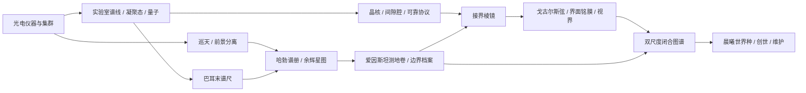

# 微观与宇观：研究篇章、命名物品与背景故事

> R1已统合完成：[当前审核总案](REVIEW_SYSTEM.md)。本文件保留为此前候选/审核依据，未按R1逐段重写，不作为当前完整流程的规范。

Rebuild 0.3，2026-09-06。保留0.2的光电并行与26章长流程，将后期组织为微观/宇观交织推进。所有新物品名、故事与合成关系均为设计提案；科学来源只支持其启发，不证明科幻制造可行。

后续讨论说明：用户指出本稿削弱了信息与频率主旨。故事、命名与交汇物品均暂存候选，不作为当前已采纳主线；先依据[模型发现基底](MODEL_DISCOVERY_DRAFT.md)重新评估其用途。

## 1. 简短背景故事：《接界计划》

最初，卡玛恩只是一种会在敲击后发出微弱回声的晶体。你尝试将它用于分离矿物，却发现：来自不同地点的晶体，会在同一组频率上留下相似的细纹。

当你终于分清机器的噪声与晶体的响应，一段残存的记录浮现出来。很久以前，一群观测者发起了“接界计划”。他们相信，微小晶格里的边界与遥远天空中的结构，可以用同一套测量相互参照。他们留下了仪器草图和未完成的星图，却没有留下最终答案。

你从此沿着两个方向继续研究：向内，追踪物质、量子态与场的细节；向外，辨认古老余辉、弯曲光路与世界的轮廓。每当一条路遇到瓶颈，另一条路便提供新的标尺、材料或证据。

最终，两份图谱在一枚接界棱镜中吻合。你得以建立受控视界，验证一个新世界所需的边界条件。计划的最后一页只有一句话：**“让新的世界亮起，并让它在你离开后仍能等待归来。”**

这是本模组的虚构背景。“吻合”和边界耦合属于卡玛恩设定，不作为现实量子引力已经统一的宣称。

### 故事怎样进入游戏

开局没有剧情前置；C06完成首个稳定信号实验后，研究手册自动保存一页残录。后续文本由已完成实验触发，保存在团队研究档案，可重读、可关闭弹窗。纸页只是记录副本，丢失可重印；不要求唯一遗迹、特殊出生点或不可再生Boss掉落。

| 时点 | 简短文本 | 玩家知道什么 | 下一件实际要做的事 |
| --- | --- | --- | --- |
| C03晶体 | “每次冲击都改变了纹路，却没有抹去那一笔。” | 材料有稳定可测的响应 | 调谐与对照 |
| C06残录 | “先关掉你自己的机器，再听。” | 噪声需要排除 | 布置隔离观测点 |
| C11巡天 | “把标尺带向天空。” | 近处实验可以标定远处观测 | 黑体校准与巡天 |
| C18双档案 | “光走过的距离不同，留下的谱线仍可辨认。” | 谱线把微观与宇观联结起来 | 匹配谱线并处理背景 |
| C21接界 | “我们缺少的不是另一块晶体，而是两份能够互相核对的记录。” | 两条研究线都必须可信 | 装配并标定接界棱镜 |
| C24闭合 | “先证明边界可以维持，再决定边界之内是什么。” | 创世先要稳定性证据 | 模板验证与维护规划 |
| C26归来 | “它还亮着。” | 完成的不只是点火 | 验证休眠、返回与恢复 |

科学家名字作为知识册的现实理论致意，物品简称可沿用。背景不需要这些人物在Minecraft世界中实际出现，也不额外建立复杂神话谱系。

## 2. 两条研究线交织，而非两个连续时代

| 时段 | 深入微观 | 展望宇观 | 交汇与收益 |
| --- | --- | --- | --- |
| C08–12 | 波动、光电响应、温度与仪器标定 | 巡天接收、天区/前景/背景的初步分类 | 同一光电仪器既测产线，也记录天空 |
| C13–16 | 学习材料响应、动态工艺控制 | 用集群整理天区数据、规划下一次观测 | 预测、RL、主动实验复用同一数据与计算设施 |
| C17–18 | 原子谱线、凝聚态、量子统计与有效模型 | 红移谱册、背景余辉、多地观测 | 实验室的谱尺让巡天数据可解释；新观测提出精度需求 |
| C19–20 | 校准量子求解、微观边界力、可选贝尔实验 | 引力透镜与几何档案、可选双站瞬变 | 两端都有可验证的模型，不是只攒研究点 |
| C21–22 | 稳定晶核、约束材料、膜与微观边界 | 边界档案、尺度/几何模型 | 接界棱镜完成两端标定，再制造弦膜并启动视界 |
| C23–24 | 受控视界中的读写、反馈与边界响应 | 外部档案约束世界模板 | 双尺度闭合图谱；内部测量和外部观测相互核验 |
| C25–26 | 装配可维持的实体世界核心 | 编译允许的世界规则与边界条件 | 晨曦世界种→创世→专化建设→维护与归来 |

三次正式交汇是**标尺交汇、边界交汇、创世闭合**。宇观不是新增一条必须造火箭的航天线；本轮先用望远/接收设备与有限天空模型承载。远程站和下界/末地调查保留，跨维度档案不能用普通星光记录替代。



精确科技依赖见TECH_TREE。图中的反馈不要求后期材料参与首次仪器制造；完成理论实验是教学里程碑，不伪装成现实唯一的技术发展顺序。

## 3. 用典型成果设计“发现时刻”

每项实验都包括主动调节、对照、可见结果、解释和用途。主线保留短模板；不能只播放历史介绍后领取材料。下表来源支持实验主题，具体尺寸、倍率和仪器配方为本模组建议。

| 位置/实验 | 玩家操作与可见结果 | 验收与后续用途 | 依据 |
| --- | --- | --- | --- |
| C08 杨氏干涉，主线 | 改双缝间距/相位或遮住一路，比较条纹 | 对照两次结果，保存条纹片，校准后续光路 | [双缝实验研究示例](https://arxiv.org/abs/2401.02351)；本章只要求经典波动演示 |
| C10 光电效应，挑战 | 在登记材料上分别改频率和光强，比较读出 | 区分能量阈值与事件率；不把所有探测器当作同一种器件 | [诺奖档案：光量子与光电效应](https://www.nobelprize.org/prizes/themes/the-dual-nature-of-light-as-reflected-in-the-nobel-archives) |
| C11 黑体辐射与普朗克谱，主线 | 改标准热源温度，比较谱峰和探测响应 | 分离仪器偏差，形成标定片；巡天先知道自己测到了什么 | [普朗克诺贝尔演讲](https://www.nobelprize.org/nobel_prizes/physics/laureates/1918/planck-lecture.html?ms=GT24X) |
| C17 巴耳末谱线，主线 | 对照样本灯与未知谱，匹配多条谱线 | 保存参考谱与校准误差，服务后续红移测量 | [NIST氢谱数据](https://www.physics.nist.gov/PhysRefData/Handbook/Tables/hydrogentable1.htm) |
| C17 双光子干涉，主线 | 扫相对延迟、比较匹配/失配时的符合计数 | 复用0.2实验台；结果不自动等于纠缠证据 | [NIST光子对观测](https://www.nist.gov/publications/direct-observation-photon-pairs-single-output-port-beam-splitter-interferometer) |
| C18 红移谱与余辉背景，主线 | 用实验室谱尺匹配红移；减去已测前景，比较背景模型 | 生成哈勃谱册和余辉星图；误识谱线或前景残留要能诊断 | [NASA红移](https://science.nasa.gov/mission/hubble/science/science-behind-the-discoveries/hubble-cosmological-redshift/)、[COBE成果](https://science.nasa.gov/mission/cobe/science/) |
| C19 贝尔关联，挑战 | 用登记纠缠态、多个测量设置及对照源比较关联 | 保存设置/计数/不确定度与选择假设；普通干涉不能代替此报告 | [Aspect的实验回顾](https://arxiv.org/abs/2212.04737) |
| C20 卡西米尔边界力，主线 | 改精密腔间距，比较力曲线与静电背景 | 校验微观边界模型，间隙腔用于接界标定 | [NIST纳米结构真空力](https://www.nist.gov/news-events/news/2013/02/calculating-quantum-vacuum-forces-nanostructures) |
| C20 引力透镜，主线 | 对比不同有限质量/几何模型产生的弧或环与观测 | 形成测地卷，保留退化解和误差；后续边界条件必须在有效域内 | [NASA引力透镜](https://science.nasa.gov/mission/hubble/science/science-behind-the-discoveries/hubble-gravitational-lenses/) |
| C20 双站啁啾，挑战 | 对齐两站时序，排查单站噪声和共同瞬变 | 保存相关信号与设备状态，用于后期异常诊断 | [LIGO GW150914探测器](https://ligo.org/science-summaries/GW150914Detector/) |

只将常见成果放入合适问题，不为了凑齐名人强迫逐项考试。贝尔、光电效应深化、双站瞬变有正式位置但不锁通关。卡西米尔力不代表可无限抽取真空能；红移解释依赖对象与模型，不能把所有红色信号判作宇宙膨胀；贝尔关联不提供超光速通信。

## 4. 新命名物品：名称必须连接功能

下表物品是**草案目录**，不是已注册ID。节点ID对应科技图中的获得能力，未必一节点一物品。研究记录可作为手持物呈现，但知识保存于档案；制造部件消耗实际基材。所有新名称都显示功能副标题，避免玩家只看到不知用途的专有名词。

| 编号 | 名称与功能副标题 | 类型 / 节点 | 首次获取 | 下游作用 | 消耗与恢复 |
| --- | --- | --- | --- | --- | --- |
| I01 | **杨氏条纹片** · 干涉参考记录 | 记录 / `young_record` | C08在普通记录片写入干涉对照 | `radiometry`光路/仪器标定 | 不消耗知识，丢失可重印 |
| I02 | **普朗克标定片** · 热辐射响应标准 | 校准件 / `radiometry` | C11标准热源测量后标定普通探测基片 | `sky_watch`、`atomic_spectra` | 装机占用；漂移重标定，无需重做全套科技 |
| I03 | **巴耳末谱尺** · 实验室谱线标准 | 校准件 / `atomic_spectra` | C17参考样本光谱与标定片共同测定 | `cosmic_baseline`识别谱线位移 | 基片可再造，记录可备份 |
| I04 | **布洛赫晶核** · 稳定周期晶格核心 | 部件 / `bloch_core` | C18合格凝聚态基材在III型框架加工 | `scale_bridge`的物质核心 | 装配占用，损坏有损回收；非“理论直接生成物质” |
| I05 | **哈勃谱册** · 位移谱线档案 | 记录 / `cosmic_baseline` | C18多谱线匹配与误差评估 | `metric_atlas`的对象/尺度约束 | 不当作燃料；更精确观测产生新版本 |
| I06 | **余辉星图** · 前景扣除后的背景档案 | 记录 / `cosmic_baseline` | C18巡天、前景对照和有限背景模型拟合 | `metric_atlas`、`closure_archive`外部参照 | 可备份；同份数据复制不增加证据 |
| I07 | **贝尔关联签** · 关联实验报告 | 记录 / `bell_record` | C19指定纠缠任务与设置对照 | 挑战陈列与设备诊断，不锁主线 | 可重印，无纠缠传信或持续量子态 |
| I08 | **卡西米尔间隙腔** · 微观边界校准模块 | 部件 / `casimir` | C20普通导体精密表面、间隙支架与已有读出装配后验证 | `scale_bridge`边界响应标定 | 模块装机占用，可由既有精密工艺维修 |
| I09 | **爱因斯坦测地卷** · 宇观几何约束档案 | 记录 / `metric_atlas` | C20巡天对象与有限透镜模型对照 | `boundary`、`closure_archive` | 可复制，不授予制造引力的能力 |
| I10 | **啁啾回声匣** · 双站瞬变记录 | 记录载体 / `chirp_archive` | C20两站关联与噪声排查 | 挑战与视界异常诊断模板 | 可重印；不要求等待不可重复事件 |
| I11 | **接界棱镜** · 双尺度标定耦合件 | 科幻部件 / `scale_bridge` | C21晶核、约束基材与间隙腔装配，用边界档案/测地卷/量子报告标定 | `string`、`membrane`首次跨尺度工艺 | 新装配消耗基材，记录只验证；装机可维护 |
| I12 | **界面铭膜** · 已标定全息信息膜 | 原物品命名变体 / `membrane` | 空白膜经已有刻写器写入边界参数，由接界棱镜标定 | 视界约束与全息读写 | 沿用`holographic_membrane`，不新造重复ID |
| I13 | **双尺度闭合图谱** · 内外观测一致性报告 | 记录 / `closure_archive` | C24受控视界结果与外部档案/候选规则对照 | `world_seed`筛选可行模板 | 可备份；更改模型/世界模板后重验 |
| I14 | **晨曦世界种** · 已编译维度核心 | 原核心的成品形态 / `world_seed` | C25世界之心记录、弦、实体核心基材与已验证模板装配编译 | `genesis`点火并绑定实例 | 点火绑定世界槽；复制记录不能复制世界 |

另保留**戈古尔斯弦、世界之心**等既有名称，不为统一风格强行替换。戈古尔斯弦属于卡玛恩边界耦合的科幻材料；世界之心是当前世界规则的受控采样记录，不要求挖走世界核心。

I04的布洛赫命名仅致意固体中的周期结构思想，不代表真实存在这种独立材料。I11以后优先用原创名称，明确从科学启发进入模组公设。避免随意堆“普朗克粒子、霍金锭、纠缠燃料”等无法说明用途的名称。

### 过渡链的实际关系

```text
实验室：杨氏条纹片 → 普朗克标定片 → 巴耳末谱尺
巡天线：初始星录 + 谱尺 → 哈勃谱册 / 余辉星图 → 爱因斯坦测地卷
微观线：凝聚态基材 → 布洛赫晶核；精密材料 → 卡西米尔间隙腔
交汇：微观部件 + 宇观档案 + 可靠协议/基材 → 接界棱镜
工程：接界棱镜校准 → 戈古尔斯弦 / 界面铭膜 → 受控视界
闭合：视界测量 + 宇观参照 → 双尺度闭合图谱
终局：闭合图谱 + 世界之心记录 + 实体核心 → 晨曦世界种 → 创世与维护
```

箭头表示获得能力或校准关系，不把纸张当作元素嬗变原料。谱尺和标定片不是每次生产都要重做；接界棱镜作为设备模块反复运行，运行仍需能源和维护。

## 5. 宇观观测如何在Minecraft里落地

本模组提供按世界种子与版本固定的有限天区目录，含源谱、背景、前景、透镜模板和可重放瞬变。它是**模组内的观测模型**，不声称原版天空已经真实模拟宇宙，也不要求联网下载天文数据。基础光电巡天先采可见/有限光谱，背景辐射章节需要对应的接收头，不能用可见光镜头直接测微波背景。

初版接收头由C11已有探测片、谐振/接收结构与电读出制造，灵敏度允许完成低分辨率基本观测；超导读出只改善后续精度，不锁初始星录。红移谱册和背景星图可拆成两个短实验，但共用`cosmic_baseline`节点表示章节的基础宇观档案成果。

观测模型输入包括目标天区、波段、曝光/积分时间、校准版本、所在维度与当地干扰。输出保留原始计数、仪器响应、噪声与来源；改变设置会改变结果，不能只是攒满进度条发星图。天区总数、每批样本和后台计算都有上限。

跨夜/跨地点是控制变量与复核，不是强迫玩家等几小时。提供可复位的校准目标和可重复触发的登记瞬变；复播只提供模拟训练或既有事件分析，不伪造新独立观测。没有天空的维度可回主世界巡天，外部观测档案与本地边界采样仍分别保留。

真实COBE结果启发“背景中的早期宇宙信息”；故事中的异常回声另有标记，不能说真实CMB藏着先行者留言。已有经典/量子计算为观测处理提供有限求值，未经实现的理论不自动产生正确答案。

## 6. 后期玩法收束

**C21–22是验证能否耦合。** 玩家把内外两套证据用于制造和标定接界棱镜，才进入弦膜和视界。卡西米尔实验只提供微观边界对照，真正的跨尺度耦合由科幻公设允许；不会用现实理论硬推出视界配方。

**C23–24是验证能否维持和描述。** 原有发电、存储、求解三模式保留。它们分别提供维持预算、记录能力和模型检验；单视界仍可顺序完成。外部测地卷不能被自产视界数据替代，否则研究会成为拿自己生成的答案证明自己。新图谱需绑定两种来源和各自版本。

**C25–26是选择新世界并让它可持续。** 微观制造提供实体核心和可靠边界；宇观档案限定可选模板。最后才编译晨曦世界种，绑定唯一实例。初版仍只开放已定义的居住/作业/低扰动等模板，宇观叙事不等于承诺真实星际旅行、任意时空度规或无限维度。

完成条件保留建设、维护、休眠、返回和恢复，故事结尾也落在这组行为。所有关键研究档案持久保存；已掌握的保守工艺保证修理，不要求设备损坏后重新发现整个宇宙。

## 7. 覆盖与验证

0.3新增14个能力节点、14个命名物品条目，三项实验挑战可关闭。旧164行物品字典仍逐项保留；新名称与旧ID的复用关系另在内容迁移表说明。

新增结构检查：基础巡天无量子设备也可进行；宇观测地档案无需先造视界；缺微观间隙腔或宇观测地卷都不能完成接界与创世；关闭挑战不阻塞终点；命名表引用的能力节点必须存在。检查不覆盖真实科学复现实验、物品数量、运行性能或游戏时长。
