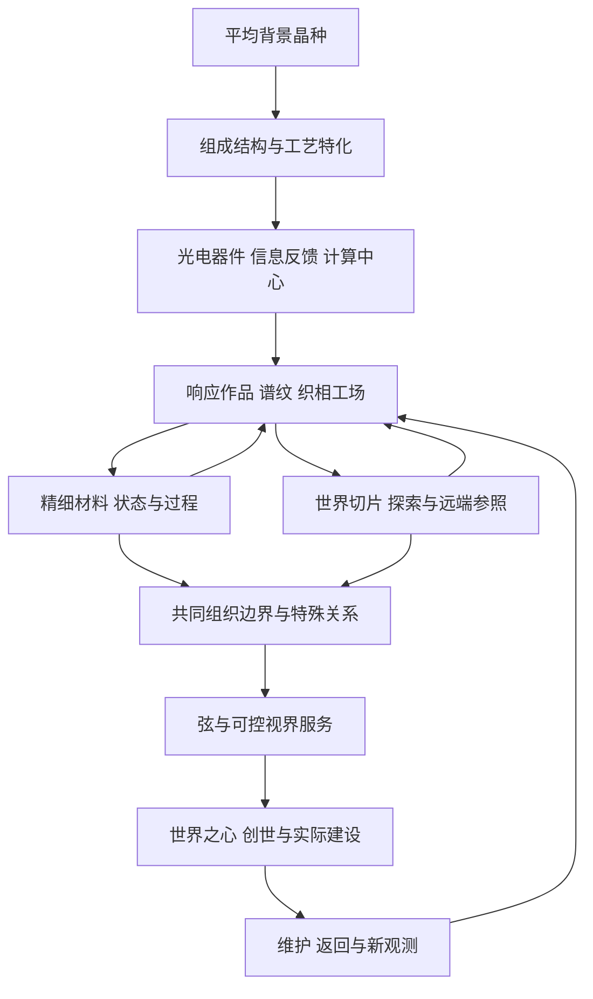

# 信息与频率：完整发展线审核总案

版本：R1主旨与全局总案，后期导航已于2026-09-09同步L3。用户授权本轮连续完成后统一审核。本稿统合发展线一至五；主旨来自已确认讨论，新增故事、机制、数值表达与安排仍供审核。完整指玩法与研究链覆盖到终局，不指配方、代码和数值已完成。

当前分段细节采用E1/E1.1前期、R4计算研究与[L3完整后期玩法](LATE_L3_COMPLETE_GAMEPLAY.md)。能力依赖以[L3整合图](LATE_L3_TECH_TREE.md)为准：86项能力、29项可选深化；本页同步后期索引与共同要求，R1旧生成图保留历史。

2026-09-07前期续稿：[E1前期玩法](EARLY_E1_GAMEPLAY.md)细化P01–05及中期交付，补回晶体构造/冲击对生产的直接反馈，明确早期充裕电能、手工分析与固定统计台，并[平铺材料工具](EARLY_E1_CONTENT.md)。这些前期细节按E1继续讨论；R4旧从零预算尚未包含新增工装，P06–15的通用计算、板柜与集群仍由R4承接。全局主旨和节点关系不因本轮工作稿另起编号。

同日E1.1继续修订：[力学合成](EARLY_E11_MECHANICAL_SYNTHESIS.md)保留实际作用位置、到达次序和局部材料转变；[工艺制造](EARLY_E11_PROCESS_MANUFACTURING.md)从模型推导装置与制造路线。旧平铺表作索引，旧总量D/评分不能独立决定合成产物。

E1.2补充[应用与发展动力](EARLY_E12_APPLIED_PROGRESSION.md)：将前期能力用于锻造装备、建设备料、矢量作业、环境与生物培育，并以实际数据衔接中期模型。基础有机材料仍在主线，应用深化可选择，不增加五条全部完成的门槛；原版行为及模型边界见[应用模型](EARLY_E12_APPLICATION_MODELS.md)。

本轮确认的[中期定位与前中期衔接](MIDGAME_DIRECTION_AND_EARLY_BRIDGE.md)：前期工具、工艺与观察逐步信息化、模型化，接入计算与信息中心，支撑复杂控制、批量研究和量产。研究覆盖材料、环境、生物行为、Minecraft过程，也包括模型与架构本身；生产力和算力共同承接后续微观/宇观实验。该文第1节为已确认方向，其余为衔接提案。

2026-09-08细化[传感器与仪器到集成电路](EARLY_MID_SENSOR_TO_IC.md)，沿用旧稿的传感器、数据接口、时序和制造闭环。用同一套前期工艺制造测头与控制试件，逐步接到逻辑、集成制造和模型选参；具体数值和结构仍为候选。

同日完成[前中期总览与后期入口](EARLY_MID_REVIEW_AND_LATE_ENTRY.md)：同步早期供能、局部扫测、电单板和单机学习的独立前置，加入[流水线/无人机/计算辅助装备](MIDGAME_APPLICATIONS.md)三项深化候选。该轮图为78项能力、59主线/19深化、28里程碑；应用不成为后期硬门槛。后期当前已按L3展开到终局，E1与R4全程物料及实际上手体验仍需原型收敛。

后期首轮已进入[L1方向调研](LATE_L1_DIRECTION_AND_RESEARCH.md)与[四组实验/仪器](LATE_L1_EXPERIMENTS_AND_INSTRUMENTS.md)：中期光电设施支撑材料响应和宇观观测，两条线共用测量方法与计算，保留不同测头的物理能力。温场工作窗、实验室谱尺以小模型为前置，监督训练按实际需求使用；该轮32项历史检查通过，20项局部反例另见[L1复算](LATE_L1_MODEL_PROBE.md)，两类检查不代表实物制程与游戏已验证。

当前P06–15专题采用[R4完整阶段设计](R4_STAGE_DESIGN.md)，2026-09-07统合：早期材料/机器自举、实验结构到芯片、八类因素、统一工程入口/自动搭线、B01/B02、R04两托盘柜、实际集群及模型/训练/主动实验。其[逐配方目录](R4_MATERIALS_MACHINES.md)与[逐项旧稿去向](R4_SOURCE_RECONCILIATION.md)优先于此前R2/R3的冲突细节。当前全局依赖由L3整合图组织；初始集群已同步为可由电节点建立，光电混合是随后并行整合能力。

[R2完整硬件/模型玩法](COMPUTING_R2_GAMEPLAY.md)、[R2.1设备与任务](COMPUTING_R2_CONTENT_PLAYBOOK.md)及[物品方块目录](COMPUTING_R2_CONTENT_CATALOG.md)保留为专题底稿。双视图微结构EDA入门已由R4实验拼接入口替换；旧四托盘柜与容量例不能与R4同时执行。R4的物理依据保留[R3.3现实调研](R3_RACK_ENGINEERING_RESEARCH.md)及此前局部模型推导。

[性质制程推演](R3_DEVICE_PROCESS_PROBE.md)、[空间接口检查](R3_HARDWARE_ADAPTATION_PROBE.md)和[机柜环境局部验算](R3_RACK_ENVIRONMENT_PROBE.md)仅验证局部候选和指定反例，不等于完整材料/环境模型、任意布局、线路渲染或游戏运行已经验证。

## 1. 核心体验与背景故事

世界的物质种类是固定的。白噪晶种是其共同属性平均背景的初始结晶；这不是把瞬时热噪振幅平均后变成晶体。卡玛恩晶体通过组成、结构、应力和加工历史形成特化，成为玩家读取、影响和研究不同物质及现象的共同媒介。

开局动力也来自日常世界：更可靠的刀具、更省事的建材生产、可用的搬运设施、更有依据的选址与培育。每段技术交付可持续使用的成果，实际使用中的误差与新需求继续推动研究；更大的世界模型从这些具体经验里逐渐形成。

**玩家从一个可重复的起点，逐渐学会辨认差异、传递信息、构造解释、主动干预，最后用经过检验的世界模型构建并维持新维度。** 频率是信息呈现与作用的重要方式，信息还包括幅值、相位、相关、时序与语义，不把一个频率数当作万物答案。

候选背景短篇：

> 你从普通材料开始工作。圆石初炼留下的滤渣，经反复处理后失去了明显偏向，却结出了能够保留细微差异的晶种。你把它称为卡玛恩晶体。改变它、比较它，让你第一次能够有目的地回应其他材料。
>
> 仪器随后变成网络，记录变成模型。你能解释的事情越来越多，仍留下的误差却逐渐显出跨越地点和尺度的关系。你向内研究晶体中的过程，向外观测天空与世界的背景；两条线让你识别出世界边界的一部分结构。
>
> 最终，你不再只是寻找更好的材料。你开始选择一个新世界应当具有哪些差别，检验这些差别能否共存，并建立让自己能够离开、返回和维护它的设施。最初那枚晶种仍是你的参考，研究也没有因为点火成功而结束。

采用玩家研究笔记串联，不预设先行文明、神秘委托或灾难使命；“接界计划”不作为本版背景。成功笔记依赖完成对照，失败留下待解释现象。主线不要求知道所有最终公式，未解释残差可成为通关后的研究。

## 2. 阅读与版本优先级

先看本总案的28个里程碑，再看相关发展线细节：

1. [晶种、特化与信息反馈](PROGRESSION_WORKING_DRAFT.md)：P01–05。
2. [组成、工艺与光电协作](PROGRESSION_02_MATERIALS_OPTOELECTRONICS.md)：P06–08。
3. [计算、学习与世界观测](PROGRESSION_03_COMPUTING_AND_DISCOVERY.md)：P09–15。
4. [微观与宇观](PROGRESSION_04_MICRO_AND_COSMOS.md)：P16–23。
5. [边界、视界与创世](PROGRESSION_05_BOUNDARY_AND_GENESIS.md)：P23–28。

[当前科技依赖](LATE_L3_TECH_TREE.md)、[后期内容](LATE_L3_CONTENT.md)、[L3有限验证](LATE_L3_VALIDATION.md)与本稿共同组织当前审核。机器数据为[late-l3-tech-tree.json](late-l3-tech-tree.json)。R1的[旧来源覆盖](REVIEW_CONTENT_COVERAGE.md)、[模型目录](REVIEW_MODELS_AND_EXPERIMENTS.md)、[旧科技图](REVIEW_TECH_TREE.md)及[旧验证](REVIEW_VALIDATION.md)保留追溯。

主旨及实物、观察、模型分离等共同规则贯穿各段。前期过程、中期硬件、后期玩法分别以E1/E1.1、R4、L3细节为准；旧课题顺序与新玩法冲突时采用L3，不并行执行两套解锁条件。旧SYSTEM/TECH_TREE/CONTENT_MAP及0.2/0.3专题是历史候选参考，不能与R1同时充当有效排期。D1模型库按需采用，不优先于发展线中的明确范围。

## 3. 完整里程碑：以研究成果推动能力

编号用于定位，横向支线可提前/并行进行，不是要求玩家按表串行等完每一章。

| 里程碑 | 玩家问题与主要行动 | 产物/知识及下一步用途 |
| --- | --- | --- |
| P01 圆石初炼 | 同量原料为何分出不同东西？筛分、沉降、分馏，并取得普通供能 | 基础粉末、滤渣、有限资源份额与初期电动生产 |
| P02 平均背景与晶种 | 怎样减弱偏向并保持起点？热处理、结晶、复测 | 均值化基底、白噪晶种、参考记录 |
| P03 应力特化 | 同样组成为何响应不同？冲击、装夹、对照 | 粗晶、导波/抗压/稳谱用途，改进已有供给与工艺 |
| P04 选择性共振 | 晶体能否识别并偏向真实目标？调谐与分离 | 目标谱、催化晶体、有机分离辅料 |
| P05 信息反馈 | 材料状态怎样决定下一步？探针、总线、滞回 | 类型化信号与首条稳定生产闭环 |
| P06 组成特化 | 应力调不到的窗口如何取得？掺杂交叉实验 | 可控组成试片与联合响应候选 |
| P07 模板与工艺控制 | 同配方为何不一致？先做粗接触模板、退火历史和刻蚀 | 可复制功能晶片、用途分档；控制芯片之后反向升级精密工位 |
| P08 光电协作仪器 | 门控/相位各能做什么？并行器件与桥接 | 自动扫测、真实带出处数据 |
| P09 工程设计与封装 | 怎样把器件组合成功能？实验拼接、验证、封装，随后精密复制 | 芯片/集成板、统一工程项目、诊断与可维修结构 |
| P10 数据与运行时 | 参数、记忆和临时结果为何不同？页、图与预算 | 单机模型图、参数空间、持久档案 |
| P11 采集网络与初始星录 | 不同地点的读数能否比较？校准、路由、巡天 | 环境/天空基线，独立记录来源 |
| P12 光电矩阵与集群 | 瓶颈在求值还是搬运？电节点先可联网，同时研究受限光映射 | 实际节点集群、光电混合对照；光五件套专化 |
| P13 解释与监督学习 | 哪个模型能预测新样品？拟合、对照、留出验收 | 可部署预测与模型版本；小模型不等集群 |
| P14 控制与策略实验 | 预测如何变成行动？热处理、培养、物流任务 | 规则/PID基线、有限RL深化、轨迹、留出扰动和回退 |
| P15 响应组合与底噪 | 将现有器件部署成作业头；分层对照，按需主动实验 | 可使用的响应作品、底噪记录与探索线索 |
| P16 谱纹与材料工作窗 | 分区加工、锁定与耦合；普通制冷先行 | 双区域片、功能锚，低温/记忆/拓扑材料 |
| P17 工场与谱尺 | 在空间安排作用；用实验室参考比较远端信号 | 织相工场、谱尺，宇观谱图按需深入 |
| P18 世界切片与精细读出 | 将可控制条件重建到局部；特殊探测按用途开展 | 有实际用途的切片；可选量子计数与校准 |
| P19 过程与远端参照 | 比较能解释新结果的过程；补可复测天区参照 | 有限过程蓝图、工艺模型与独立参照 |
| P20 特殊状态与求值深化 | 受支持状态/过程接经典计算，再到实际试制 | 工艺曲线、中观协议，量子与玻色采样等可选 |
| P21 材料与区域边界 | 细化作用区，同时追踪区域模式与环境关系 | 材料边界件、回响图和更可控的场域 |
| P22 特殊连接与远源深化 | 成对端点接工作位；复杂传播按需求探索 | 有限链路、可选透镜/测地模型与新部署方案 |
| P23 联合边界与弦 | 两侧证据能否约束同一未知项？新地点验证、锚定 | 互证谱册、接界棱镜、戈古尔斯弦 |
| P24 受控视界 | 能否成型、停机和修复？普通供能、约束、演练 | 可恢复的视界装置 |
| P25 视界生产服务 | 按实际需求选择供能、存储或求解，交付并停机恢复 | 能量/可读回信息页/可试制候选；三用途可分别扩展 |
| P26 闭合与世界之心 | 局部装置能否经受独立世界观测？交叉检验 | 双尺度闭合图谱、版本化世界特征 |
| P27 创世编译 | 哪些差异能稳定共存？七组参数、规则检查、点火 | 绑定单一实例的世界种与新维度 |
| P28 维护与返回 | 怎样让新世界可持续且可离开？休眠、恢复、复测 | 实际作业点、可靠返回、后续研究 |

## 4. 两条贯穿线与三种循环

材料循环：真实基材→加工→测量→按用途分档→设备→有损回收。信息循环：物理状态→带出处读数→解释/预测→受约束动作→重新观测。研究循环：已知模型→无法解释的现象→新的控制变量/仪器→对照验证→限定适用范围。研究解锁更多可选工艺和解释能力，不在升级时临时创造世界定律。

## 5. 统一材料、能量、信息和模型规则

**材料**：固定注册种类，产出必须属于输入允许的集合并满足有限质量/产量预算。圆石打开低效基本矿物；有机物供纤维、树脂、培养与维护；下界/末地样本与相应基底打开对应资源。取得样本是认识目标，不是免费复制目标。成核、生长、掺杂、蚀刻、失效回收均有物料来源。

**晶体状态**：组成、结构/取向、应力、缺陷和历史为底层状态；峰位、损耗、漂移、门限等是具体工况下的派生响应。中性、结构质量、用途合格互相独立。后续加工可改变已写入特化，重新测试有意义。

**能源**：本模组提供首个普通燃料/机械发电路径，外部FE可替代但不必需。FE是可用能量，不携带电信号波形。光学激励能量、参考稳定度和相干条件分开；能量转换有损失。首个视界不用视界发电自举，暂停也不免费产出资源。

**信息**：内容、编码与载体分离；类型/单位/形状/时效/出处/校准决定是否可用。复制档案增加副本，不增加独立样本，也不复制实体质量或世界实例。API、脚本和模型只能访问明确开放状态/动作。

**模型**：世界生成规则、仪器测量规则、玩家解释模型分层。游戏可以隐藏参数，但必须让目标在可用数据下有合理可辨识性；等价模型可合格。研究不要求唯一正确表达式，复杂模型需证明收益。真实物理、有限近似、原创公设在知识册分别标注。

**随机性**：世界/批次/事件使用稳定索引；仪器噪声另记；随机过程允许相关。基础产出有保守窗口和累积保障，随机只影响成本、工况与实验结果，不靠极低概率词条卡主线。每种关键实验预留未参与调参的新工况。

### 首次材料来源契约

以下是类别级自举约定，后续配方只能从已可达输入细化，不得重新塞入隐含后期材料。

| 材料/条件 | 首次来源与使用约定 |
| --- | --- |
| 木材、圆石、水、种植条件 | 普通世界可收集；空岛预设必须提供可再生起点，缺失则明确不支持该开局 |
| 木炭/燃料、沙质原料/玻璃 | 木材烧制；登记圆石粗处理可出沙质基材，普通熔炼出玻璃 |
| 铁铜与初级红石替代料 | 确定性累计分离出铁铜；早期需红石的模组配方允许登记导电/控制粉末替代，替代料不自动兑换原版红石 |
| 首批金/石英或参考材料 | 基础分馏的低效登记产物/普通探索可得；高效共振与精密源只改善产率和精度，不垄断首份 |
| 晶体生长基材 | 均值化基底的定量进料，晶种提供结构起点；不能只用晶种增殖质量 |
| 有机化学与封装前体 | 实际木材/作物→纤维、树脂、培养与清洗前体；用普通加热/容器先制备，再升级化工模块 |
| 掺杂、刻蚀与制冷材料 | 从已取得矿物/有机前体的登记配方制作；首版设备手动/普通电驱可用，不要求待加工成品控制自身 |
| 下界/末地类别基材 | 普通世界通过可达探索路线取得；空岛预设须提供有限、可再生的对应进料路线和进入条件，不用唯一龙蛋。未给出这些路线的数据包不能宣称全流程可通关 |

具体物料比例和替代料配方尚待原型。该契约限定合法来源，不能替代逐配方经济检查。

## 6. 尽量保留所有玩法，控制每次教学的范围

| 玩法族 | 入门主线体验 | 深化/可选规模 |
| --- | --- | --- |
| 晶体制造 | 均值化、冲击、掺杂、工艺历史 | 多轴、分层组成、复杂材料响应 |
| EDA/硬件 | 实验拼接、测试封装、可用控制板；光电随后整合 | 精细复制、更多封装族、机柜与专用芯片 |
| 光计算 | 相位实验、小矩阵与混合任务 | 全光五件套、长期光存储、WDM、全光交换 |
| 网络/Runtime | 本地任务、两地采集、预置服务域 | 多DNS、G1–G6、有界脚本、跨维度网关 |
| 模型/学习 | 小预测模型、一次监督验证、一次动态策略比较 | 多模型架构、大数据集、主动策略、多目标优化 |
| 生物/实体 | 有机材料、培养/物流应用模板 | 代理行为、对话交易、对抗回放 |
| 材料/物理研究 | 可用谱纹、材料工作窗与过程模板 | 量子计数/过程、贝尔、玻色采样、纠错与复杂模型 |
| 世界/边界 | 世界切片、区域回响、星录/谱尺和实际参照 | 多源逆问题、特殊连接、不同边界模板 |
| 终局 | 受控视界服务、世界之心、一个可建设并返回的世界 | 三用途各自深化、多视界/世界、持续研究 |
| 外部后端 | 同任务本地离线可完成 | 可选外部训练/推理/对话服务 |

主线保留各核心族的一次代表体验；并非要求完成所有挑战或制造每件升级物。主线作品与按需展开的模型/量子任务提供透明模板；取得相应结果仍需真实运行与观察。理解方法后维修与量产可用保守工艺，不要求每次重新做科学发现。

## 7. 命名物品与知识载体

名称均为审核候选；旧ID优先复用，新增名称不直接等于新增注册物品。

| 名称 | 类别/候选承载 | 获得方式与实际用途 |
| --- | --- | --- |
| 零谱参照片 | 合格白噪晶种/记录的显示名 | 重复均值化验证，作为跨批次参考 |
| 应力铭片 | `stress_recording_plate`数据 | 记录前后工艺与取向，复现特化 |
| 门槛试片 | `kamaen_wafer`实体状态 | 门控扫描验收，用于比较器/读出 |
| 杨氏条纹片 | 干涉报告/参考件显示名 | 记录相位/对比条件，校准光路；致意干涉实验 |
| 巴耳末谱尺 | 校准件与绑定谱线档案 | 实验室多谱线标定，用于天区识别 |
| 初始星录 | 数据集 | 入门巡天；保留独立宇观基线 |
| 余辉星图 | 数据集 | 多地点/波段背景归因；约束宇观模型 |
| 昂内斯相图 | 相图档案 | 低温响应与工作窗，指导超导用途工艺 |
| HOM符合谱 | 计数档案 | 延迟扫描与背景校正，检验制备/读出 |
| 费曼过程蓝图 | 原有数据物品 | 登记过程模型与工艺假设，供求值/试制 |
| 卡西米尔间隙腔 | 新设备模块候选 | 微观边界对照，提供联合测量的一侧 |
| 测地卷 | 数据档案 | 多源形变拟合，提供宇观几何约束 |
| 互证谱册 | 数据档案 | 两侧独立证据与版本，校准接界棱镜 |
| 接界棱镜 | 新实体模块候选 | 实际边界材料加工后联合标定，复用耦合 |
| 戈古尔斯弦 | 原有实体材料 | 对登记边界模式持续锚定 |
| 双尺度闭合图谱 | 数据档案 | 视界内外独立检验，限制创世规则 |
| 世界之心频率 | 原有数据物品 | 受控辨识世界特征，不摧毁原世界 |
| 晨曦世界种 | `compiled_dimension_core`显示名 | 编译实体核心，绑定单一世界实例 |

数据可以归档到统一记录载体；仪器参考件有物理状态，不能只靠换标签升级。后续美术/百科可通过不同封装表现特殊名称，无须堆叠无功能中间锭。

## 8. 已修正的主要冲突

1. 从“计算材料”回到信息与频率，以及晶体研究万物的共同线索。
2. 从光电先后替代改为共同工艺、并行器件与混合计算；全光仍有完整用途。
3. 从纯微观梯级改为提前巡天、三次交汇、联合边界验证。
4. 区分平均背景物质概念、环境热噪、宇观辐射背景，不用一个“噪声”混代。
5. 修复铁筛、高级压头、精密光源/掩膜、数据库/中心、视界供能和膜工艺的首次依赖环。
6. 模型在起步对照中逐步形成，单机先可运行；集群/量子不垄断首次建模。
7. 玻色采样、VQE、经典光运算分任务能力；数据页不复制未知量子态。
8. 费曼蓝图不是任意制造配方，记录不能代替原料，守恒校验不保证成功。
9. 创世固定物质种类与有限规则族，世界之心可复测；蓝图与实例绑定分离。
10. 所有终局设施保留普通能源、档案和返回路径，失败不回到零科技。

## 9. 审核与实现边界

本轮已完成全流程候选、旧实体去向、玩法族归位、初步模型/实验目录和能力依赖验证。未完成：逐配方材料数量、全部模型系数、用户界面、各段时长、资源经济实测、Java实现、多人/区块生命周期测试。不能据能力图通过宣称完整配方可通关。

本轮后期的整体审核从[L3总稿](LATE_L3_COMPLETE_GAMEPLAY.md)与[具体工程演示](LATE_L3_PROJECT_DEMOS.md)开始：三个作品目标是否不断带来实际用途；微观与宇观是否从同一工场逐渐交织；创世之后是否仍值得建设和使用。完整设计覆盖不代替实现阶段的可玩原型、物料/数值平衡与玩家测试。

仍待明确但不阻碍阅读的设计取舍：共享平均参考的跨维度约定；科技解锁是否团队共享；每段允许的自动化程度；名人命名的中文展示风格；创世维护惩罚强度。当前采用可恢复、低强制重复、规则透明的候选默认，不把这些当作用户已经批准。
