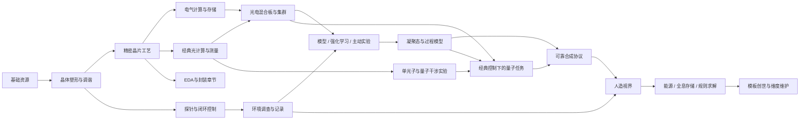

# Kamaen Info 完整系统重构总案

> R1已统合完成：[当前审核总案](REVIEW_SYSTEM.md)。本文件保留为此前候选/审核依据，未按R1逐段重写，不作为当前完整流程的规范。

版本：Rebuild 0.3。日期：2026-09-06。状态：建议稿，供讨论与原型验证。

后续讨论状态：本稿尚未按用户最新确认的“平均背景晶种→晶体特化→信息/频率与模型发现”主旨重整。章节与故事仍为候选；当前按[科技与故事逐段工作稿](PROGRESSION_WORKING_DRAFT.md)推进，并按需深化[模型发现基底](MODEL_DISCOVERY_DRAFT.md)，不以本稿取代已确认主旨。

保留0.2光电并行：C08–10同期建立电气与光学计算，C12形成混合集群。0.3将后期重组为微观/宇观交织，新增典型实验、命名物品和简短背景故事。计算与理论边界见[物理专题](PHYSICS_AND_COMPUTING.md)，本次内容详见[研究与故事](RESEARCH_AND_STORY.md)。

## 1. 玩家最终在玩什么

玩家从杂乱的物质中找出规律，用机械结构把规律写进晶体，再把晶体制造成测量、控制和计算设备，逐步接管更复杂的材料、环境和世界规则。

背景主线是未完成的“接界计划”：晶体中的异常回声引出一份残缺星图，玩家向内研究微观物质、向外观测宇观结构，用两套可互相核验的证据接续弦膜与视界，最终建立一个能持续维持、离开后仍可归来的新世界。残录由研究进度自然解读，丢失可恢复，不依赖唯一遗迹。详细短篇和章节文本见研究与故事。

核心循环固定为：

**发现目标 → 采样 → 理解差异 → 设计工艺/结构 → 试制 → 诊断 → 稳定量产 → 用新能力解决下一类问题。**

目标玩家：愿意投入长流程、研究自动化、结构与参数的科技模组玩家。用户已明确选择尽量保留全部玩法。本提案让各主要系统都有引导章节：普通玩家在模板基础上完成小规模设计实验，深度玩家设计更好的实现；不要求入场前掌握编程、EDA或机器学习。

成功标准：每阶段至少增加一种新的决策，而不是只增加更贵的中间件；每台核心设备有一个当前就有用的应用；玩家能从诊断知道下一步该改什么。

## 2. 方向选择与边界

| 可选方向 | 优点 | 代价 | 本提案 |
| --- | --- | --- | --- |
| 全部围绕晶体共振与全光，取消电逻辑 EDA | 主题高度统一 | 丢掉最新 EDA 设想，接口/存储需重新解释 | 不选为默认 |
| 晶体主线 + 多工艺域 + 可选深入设计 | 接住最新 EDA，同时保留普通玩家路径 | 许多已有玩法仍会成为边缘内容 | 不作为本轮默认 |
| 保留各主要玩法，分成长章节逐个接入 | 深度高，工程成长明确，每个系统都有用途 | 教学、编辑器和后期内容量大 | 用户已选；本提案采用 |

明确保留：Minecraft 内部有限、可观察、可恢复的玩法模拟。电域与光域从精密制造阶段并行，分别发展并在混合板和集群中协作；电气持续承担精确算术、控制、存储、优化和读出，光学承担适配的线性算子、互连与测量。量子是两者和实验科学共同支持的专用处理分支，不能作为全面替代。原理依据与本模组拟定规则分开；视界/弦膜/创世仍属科幻设定。未回写旧规范。

## 3. 四条工程线与一个汇合终点

| 工程线 | 解决的问题 | 演进 |
| --- | --- | --- |
| 材料 | 能制造什么 | 分离 → 晶体 → 晶片 → 光学件 → 凝聚态 → 约束材料 |
| 能源与环境 | 工艺能稳定运行多久 | 手工/燃料 → FE → 初级CE → 相干泵浦 → 低温/屏蔽 → 熵流 |
| 观测与控制 | 如何知道并维持正确状态 | 观察 → 探针 → 阈值控制 → 多源记录 → 曲线控制 → 世界规则校验 |
| 计算与制造设计 | 如何处理更多信息、做更复杂结构 | 电气与光学并行EDA → 混合集群 → 学习/实验模型 → 混合量子任务 → 视界搜索 |

视界需要四条线共同提供：约束材料、能源余量、世界样本、可信控制。创世再使用视界产物与规则档案。

四条是工程职责；微观与宇观是它们共同服务的两类研究对象。宇观从C11开始巡天，C18用实验室谱尺解释红移与余辉，C20形成几何档案；微观同期深入凝聚态、量子与边界响应。两线在C21接界标定、C24图谱闭合、C25创世装配交汇，不能先做完微观再突然进入“宇宙时代”。



首次解锁关系必须无环；量产优化可以有反馈。例如光计算提升稳谱晶体良率，但第一块合格稳谱晶体必须用早期固定工艺制造。

## 4. 统一系统对象

### 4.1 晶体：事实、能力、知识分开

| 层 | 内容 | 改变方式 |
| --- | --- | --- |
| 实际材质状态 | 频谱、局部方向、对称应力张量、缺陷、纯度、掺杂、特性 | 爆破、压合、退火、调谐、掺杂 |
| 派生能力 | 导波损耗、承压范围、稳相效率、非线性响应、热稳定 | 从实际状态计算，不能直接刷一个“全能等级” |
| 观测结果 | 已知字段、误差范围、置信度、仪器等级、观测版本 | 测量与研究；不会改写真实材质 |
| 运行配置 | 目标频谱、相位设定、写入参数版本、校准状态 | 使用端调谐或校准 |

内部张量用六个独立分量表示，方向另存。初级界面只展示三个倾向条；它们是功能摘要，不把世界 X 永久定义成导波、Y 永久定义成抗压。旋转机器改变的是局部晶轴与作用方向的关系。

未知特性可以影响额外收益，但标准工艺需要的能力必须可测且可稳定获得。不得靠抽中隐藏词条才能通关。

材质决定权重可实现范围、写入精度与误差；模型参数决定目标运算。更换模型通常重校准，而非重新爆破所有晶体；更换晶体需重新测量和校准。

同名晶体允许属性不同。为避免库存碎片化，量产按标准品级与专化收敛；关键实验晶体保留完整属性，普通组件只保留必要画像。保留已注册 `kamaen_crystal_raw`、`kamaen_crystal_tuned`，后续变体优先用组件，不直接重命名已有注册项。

### 4.2 四种“图”不能混为一体

| 图 | 定义什么 | 不负责什么 |
| --- | --- | --- |
| 工艺图 | 加工步骤、物料投入、条件、阶段产物、失败回收 | 不定义通用模型内部算子 |
| 功能图 | 输入→算子→状态→输出的逻辑语义 | 不凭空赋予算力或制造能力 |
| 布局图 | 世界方块或芯片版图的空间位置、线路、隔离、散热 | 不根据门数量自动猜出功能 |
| 部署图 | 功能绑定到哪块硬件、哪个端口、哪份参数 | 不改变原始功能图 |

世界方块光路与 EDA 微版图是不同尺度的布局；共享端口/成本规则，不强行共享全部几何验证。封装蓝图复制只复制设计，制造仍需完整物料；不能收起实验场就免费得到等价芯片。

### 4.3 实际执行与抽象预算

能控制机器的基础算子必须真正对有限输入计算结果：比较、加减乘除、Clamp、选择、滑动平均、显式延迟、小向量加权和、有限状态机。提供预设 PID/曲线跟随器，带输出限幅与积分限幅。

计算硬件的吞吐、延迟、精度与耗能用游戏画像结算；不会逐光子或逐晶体管实时模拟。一个只有门数和面积的设计可以得到制造评分，但没有功能图就不能输出任意任务答案。

模型、费曼搜索、量子任务用明确登记的有限算子、任务模板及候选集求解；未实现的运算直接报告“不支持”。脚本与模型训练按规模和指令预算渐进开放，不能用虚构的推理结果冒充实际求值；外部后端是同任务的另一种执行方式，有离线替代。

## 5. 能源、环境与资源经济

### 5.1 能源自举

1. S1 手动工作量与熔炉燃料完成基础材料；不要求 FE。
2. S2 用铁、铜、石材制造模组自带的燃料发电模块和能源接口；外部 FE 只是替代来源。
3. S3 稳谱晶体、调谐片、铜结构制造初级相干稳压器；输入 FE，输出有限 CE 并产生热。
4. S4 使用初级 CE 制造更好的光路、光源前体与 F3 基准。
5. C08以局域光源完成首个干涉实验，C09用固定工艺升级F4参考，C12组泵浦塔支持集群。基础光矩阵不要求跨节点F4；首次制造与启动不用成品泵浦塔输出。

CE 是游戏独立资源；相干度是链路质量，二者不等同。满 CE 但线路损耗/校准过差仍不能合格。资源式示例：

`下一时段CE = 当前CE + 稳压/泵浦产出 - 空闲维持 - 任务消耗 - 传输损失`

发电机接入的外部 FE 只表达数量。波形、三相和相位质量若保留，应来自模组的稳相/泵浦模块，不能从普通 FE 输入猜测。

低温不是更高等级电池：需冷却液、热交换、屏蔽和持续能源。第一台低温设备用普通铜线圈和机械冷却制造，超导件只做后续升级。

### 5.2 物质、样本、蓝图分账

- **物质**：矿浆、有机浆、晶体、基材、化学剂、部件；加工消耗。
- **样本**：样本物品/采样介质承载证据，记录来源和测量；稀有路线需首次合法获得对应样本。
- **知识/蓝图**：可重复使用的已验证工艺、频谱记录、功能图；复制不复制物质，不新增独立观测。
- **运行资源**：FE、CE、冷却、带宽、缓存；每次加工或任务消耗。

数据物品可以作为配方的验证条件或写入载体，但不能无基材直接变成金属、库珀对材料或弦实体。传播子片和顶点片是可复用过程记录；真正材料在腔体中由晶格基材与场环境制成。

### 5.3 资源产出规则

圆石提供低效率基础矿物路线；有机物提供生物路线；下界/末地样本及对应基底打开各自稀有类别。单纯调成某个频率不能让圆石产出任何注册物品。

建议所有资源配方登记：允许的原料类、可产物类、投入质量点、输出质量点、基础能耗、共振上限、副产上限、回收率。总有效输出受配方上限控制，共振在速度、纯度和产物偏向之间分配收益。

回收必须有损且需能耗；失败不能比成功更适合刷高阶残渣。样本是准入知识，不能在分离器中免费复制样本本体再解锁下一层。通关稀有样本必须可再获得，不依赖唯一龙蛋。

### 5.4 扰动与维护

每个阶段最多优先展示两种新的可调变量。振动、洁净度、温控等先以设施能力呈现；高级诊断再展开细项。

污染不会使基础产线永久零产出：水洗、换低级滤材和降负载均有恢复路径。缺陷晶体可退火或降级使用；普通维护用早期可量产的耗材。标准模式只在设备运行时结算磨损，不因玩家离线持续惩罚。

## 6. 玩家阶段总表

阶段编号固定 S1–S11，章节号、开发里程碑和 F/T 等级不再混用。

| 阶段 | 新决策 | 标志性成果 | 必需能力 | 可选深度 |
| --- | --- | --- | --- | --- |
| S1 基础分离 | 分离哪一类、如何排污 | 可重复获得晶种和基础金属 | 手工分离、燃料热处理 | 不同原料与滤膜配比 |
| S2 晶体塑形 | 方向、强度与缓冲布局 | 三类可用专化晶体 | 爆炸室、基本 I 型框架 | 复杂张量、特性实验 |
| S3 调谐与控制 | 读什么、达到什么条件才动作 | 一个有效闭环 | 探针、共振总线、阈值执行 | 多目标催化、反馈 |
| S4 光电精密工艺 | 电路与光路怎样实现功能 | 晶片、电逻辑、局域干涉与EDA | 初级CE、图案工艺、门与光路实验 | 微结构细化 |
| S5 光电信息设施 | 计算/转换/采样如何协作 | 混合板、环境档案、光电集群 | 电/光矩阵、转换桥、封装、存储、网络 | 紧凑布局与复杂协议 |
| S6 学习与实验科学 | 从数据预测到闭环决策 | 模型、RL策略、主动实验计划 | 混合集群、数据集、监督学习、环境模拟、策略验收 | 全光五件套、大型模型族与复杂训练 |
| S7 凝聚态 | 哪个过程与环境相容 | 超导/拓扑/相变材料 | 低温、过程蓝图、精密观测 | 自定义费曼图、隧穿网络 |
| S8 量子与可靠合成 | 搜索成本与运行裕量 | 量子采样验证与可靠参数曲线 | 保守曲线自举、量子实验、实测验证 | 高阶采样与优化 |
| S9 双尺度接界 | 微观边界与宇观几何如何共同标定 | 接界棱镜、弦膜与可控视界 | 双线证据、实体约束材料、熵流与独立停机 | 紧凑高效视界布局 |
| S10 视界工业与闭合 | 内部实验与外部观测是否一致 | 能源、全息档案、双尺度闭合图谱 | 三模式顺序工作、内外档案对照 | 多视界并行、WDM |
| S11 维度工程 | 规则与材料能否支撑持续存在 | 晨曦世界种、可恢复新维度 | 模板校验、实体核心、点火、维护 | 参数组合、跨维度设施 |

## 7. 完整阶段链路

以下为推荐功能配方，固定输入类别、设备职责与产物流向；不是最终材料数量表。标准件路线保证有公开工艺窗口。

### S1：先有完整手工链，再有自动分馏

普通生存沿用采集资源；空岛标准开局明确提供可再生木材、圆石来源、水和基础种植条件。不是“只有一块圆石”即可无中生有。

新增的自举配方：

```text
木材 + 木棍 + 木质格栅 → 手摇频谱筛（不需要铁/线）
木材 → 木制分离盆；木材/木棍 → 木碗
圆石 → 筛出粗碎屑
粗碎屑 + 分离盆 + 碗装水 + 手工工作量 → 基础粉末 + 滤渣
铁/铜粉达到固定积分 → 熔炉燃料熔炼 → 金属
沙质粉末 → 玻璃；木材 → 木炭
熔炉 + 石材 + 滤渣 → 粗热噪坩埚
滤渣 + 燃料热处理 → 均值化基底
均值化基底 + 滤渣 + 水 + 手动压制 → 白噪晶种
基础金属 + 玻璃 + 桶 + 搅拌轴 → 分馏塔
```

手工路线还提供少量红石相粉末的确定性后处理，保障 S2 控制器；不是任意稀有资源入口。陶/玻璃参考片可替代早期下界石英，F1/F2 不以去下界为硬前提。

分馏塔将手工动作自动化、扩大批量，不改变基础配方准入。最小物流先用原版漏斗、容器、手动液体输入；S3 补物品/流体接口和简易泵。

完成条件：从起始资源连续两批得到白噪晶种，并完成一次污染清洗。奖励：稳定的材料来源，剩余粉末立刻用于设备建设。

### S2：晶体必须能被改变，也必须能解释

```text
基础金属 + 石材 + 红石 → 小型爆炸室
煤质粉/木炭 + 滤渣 → 低强度工艺爆震粉（游戏耗材）
白噪晶种 + 粉末基材 + 模拟冲击 → 粗卡玛恩晶体
粗晶体 + 定向冲击/缓冲布局 → 导波、抗压、稳谱专化
粗晶体 + 活塞/铁 → 粗压头
爆炸室结构 + 粗压头 → 基本 I 型框架
基本 I 型框架 + 固定压合 → 偏振晶体
偏振晶体 → 应力传感器 → 升级框架精度
```

前三个实验分别教方向、强度、缓冲。加工前显示预计窗口，加工后显示差值；相同输入和配置的标准工艺给稳定结果。

失败产裂纹件或粉尘：低损伤可退火，高损伤回收成低级基材。TNT 是可选高冲击耗材，不是首块晶体的必要条件。

完成条件：制造三种专化晶体，能解释一次失败并用调整后的结构成功复现。旧爆炸室后续仍用于粗批量和应力再加工。

### S3：信息第一次产生实际收益

```text
粗晶体切片 → 调谐片
玻璃 + 粗调谐片 → 基础干涉仪；偏振晶体为精度升级
调谐片 + 金属 + 红石 → 探针 / 锁相器
样本物品 + 锁相器 → 固有频谱记录
专化晶体 + 记录 + 调谐 → 定向催化晶体
探针 + 导波总线 + 比较/阈值模块 → 执行器控制
稳谱晶体 + 调谐片 + 铜结构 → 初级相干稳压器
```

首条闭环固定选一条本模组产线：探针读取分馏塔污染→阈值模块停止进料并触发清洗→恢复进料。不依赖给原版熔炉增加原本没有的红石停机能力。作物成熟提示可以作为第二个示例。

催化效果只作用于注册支持的工艺，提升速度/纯度/偏向而非随意加快所有方块 tick。首次获得目标物品即可采频谱，基础流水无需猜 hash。

完成条件：闭环实际改变机器行为且 stale/断线时停止自动进料；不是仅让一盏灯亮。

### S4：制造能力发生第一次质变

前体支线补全：沙质粉 + 燃料 → 粗硅基材；铜/金属粉 + 分离提纯 → 掺杂前体；植物浆/木炭副产 + 水 → 清洗/蚀刻剂；玻璃/绝缘基材 → 掩膜基板和封装壳。它们是虚构加工配方，不提供现实危险化学操作细节。

```text
稳谱/导波晶体 → 切片抛光 → 晶片坯
晶片坯 + 掺杂剂 → 注入 → 退火
退火晶片 + 预设掩膜 → 曝光 → 刻蚀 → 清洗 → 测试
测试 → 合格导波件 / 阈值件 / 探测结 / 相位片 / 降级件
稳谱腔 + 相位片 + F2参考 → 光源前体
```

第一张掩膜在机械刻写台使用预设图案制得，不要求先有芯片蓝图台或算力芯片。第一台诊断仪继承 S3 探针，电控芯片仅提升诊断吞吐。拿到预设逻辑件后，玩家在蓝图台编辑一个比较/选择控制图，作为下一章流片的设计输入。

独立工艺站可以手工跑标准件；II 型框架连成流程后减少搬运、支持联动控制。框架不是制造其组成模块的唯一机器。

主线分章分别教掺杂浓度、曝光对准和基本原理图；其它环境用预设设施保证。版图、流片和封装在S5各自教学，不与第一片晶圆同时压给玩家。

电气与光学在C08同期展开：电路实现比较/选择，光路用局域源、分束器和移相器展示干涉与加权运算。两者共享晶片工艺，电逻辑的制造不要求光矩阵，光矩阵的制造不要求电矩阵或模型训练。EDA入口汇集两种实验，域间连接要显式转换。

完成条件：产出可用电/光器件，记录一次缺陷并将降级件用到低速接口。基础设备按公开工艺量产，不强制先训练模型。

### S5：从一根信号线变成信息设施

解决数据库自举：

```text
调谐片 + 稳谱粉 + 玻璃基板 → 空白记录页（持久介质）
记录页 + 普通结构 → 独立记录柜
调谐片 + 导波件 + F2 + 阈值模块 → 汇聚/索引核心
汇聚核心 + 探针 + 总线 + 缓存 → 信息中心控制器
独立记录柜 + 信息中心 + 底噪档案模块 → 底噪数据库系统
```

数据库不需要16个样本才能建造。样本用于填充/验证档案，空数据库也能安装。先有晶体记录介质；玩家做完EDA流片后，电存储页与接口芯片为主板提供更好的控制和读写能力。

基础底噪选三个易理解的层：热环境、群系背景、机器/红石扰动。量子层在 S7 获得解释能力；虚空/弦层在 S9 解析。未知信号可提前看见，但不会直接获得终局材料。

采样玩法：在产线旁与隔离区各布一个探头，比较两组记录，移动爆炸室或添加隔振结构，让 S4 光刻良率稳定。相同窗口重复复制样本不增加研究覆盖。

C11同时开启宇观入口：用C08杨氏条纹记录与标准热源标定探测基片，得到普朗克标定片，装入巡天接收台记录有限天区。天区/背景由模组的有界观测模型提供，需波段适配接收头；不是原版天空自动具备天文物理。基础接收头可由现有光电工艺制造，后期低温材料只升级灵敏度。

EDA正式章节循环：原理图→格点布局→连通/域/时序检查→预设工艺制造掩膜→流片→测试分档→封装→板级接入。首个模板要求玩家修改一个端口或缓存位置并修复一条DRC问题，不能只点领取芯片。后续布局可以更紧凑或更省资源。

C09以固定曲线制II型精密框架和F4参考；模型优化只改善后续良率。C10的基础光矩阵使用局域相干源和MZI，不以非线性介质或光RAM为前置。光电转换桥由电驱动、调制、光电探测与采样接口组成，记录转换精度、采样率、排队与校准成本。首次矩阵采用可解释小规模编码；相位网格不自动支持任意矩阵/算子。

C10混合板装入电矩阵、光矩阵、电存储与转换桥，同一组输入比较两种路径。C12将两块板接入带电管理面的光数据链路，形成首个集群，先做多源采样和批处理；光控制核、光脉冲处理器、光RAM尚未齐备也能工作。

完成条件：自制电/光芯片在混合板共同工作；环境档案覆盖多地点/工况，集群执行可追踪采样任务并恢复一次端点掉线。此时已经有学习所需的硬件和数据基础。

### S6：光电集群共同推动学习与实验科学

```text
S5混合板 + 数据集 + 集群调度 → C13有限模型与光电分区部署
标签/损失 + 留出批次 → C14监督学习与版本化模型
可复位工艺模拟器 + 轨迹缓存 → C14环境交互基础
状态/动作/奖励 + 有限回合训练 → C15策略与独立验收
策略 + 不确定度/成本 + 实验设备 → C16主动采样与闭环实验

已有非线性介质 + 波导/晶胞 + F4 → 专用光控/脉冲/RAM
专用光件 + 已有矩阵/互连 → C16全光五件套协作实验
```

标准任务：以温度偏差、振动、晶片批次质量为输入，执行预设加权预测与限幅控制，为退火/曝光提供参数建议。至少输出一个与输入有关、可对照的实际数值。

五件套全部保留，分为C10矩阵、C12互连、C16光控/脉冲/RAM。C16提供完整协作实验，但这一专化实验不锁首次机器学习、集群或凝聚态工艺。电控制、电激活和持久存储能够补足早期运行环节；选择全光子路径需要证明减少转换的收益足以覆盖校准和刷新成本。

主线从混合后端开始学习：光矩阵处理适配的批量线性算子，电域管理分支、非线性、状态和参数更新；部署图允许迁移某个算子并比较端到端预算。纯电路径作为基准和降级，不能把“光域迁移”设为首次接触光计算。参数实验空间仍是受限编辑场，三个视图编辑同一功能，不具备创世能力。

监督学习预测结果，强化学习根据连续行动的回报调整策略，主动实验选择下一次有价值的测量，三者分别验收。C15先在有传感噪声、动作延迟、能耗和复位规则的热处理模拟器中训练，再部署到受限真实工艺。奖励不能靠停机或重复提交旧轨迹刷取；验收检查合格产量、超限、资源和未见工况。本地固定控制与联锁始终独立。

毕业以同一产线串联：C13输出预测、C14训练并验收、C15策略保持目标且不过度耗能、C16选择新工况补测并更新模型。正常、扰动、供能不足都需有可解释结果。固定控制先能生产，学习成果解锁更复杂实验组织而非首批基础材料。

### S7：世界资料变成材料工艺

```text
铜线圈 + 换热组件 + 冷却液 + CE → 普通低温凝聚腔
低温腔 + 光学传感头 → 准粒子响应仪
晶格基材 + 环境档案 + 受控测试 → 传播子/相互作用记录
记录 + 守恒/环境约束 + 预设过程 → 费曼蓝图
晶格基材 + 掺杂/涂层 + 低温场 + 蓝图 → 初级超导环
普通场线圈 + 自旋过程 + 晶格基材 → 拓扑晶体
拓扑/激子过程 + 基材 → 相变记忆晶体
```

先有普通线圈/基础低温，才能制第一批超导；先用 II 型低温扩展制造凝聚态，再装配 III 型精密场框架。III 型不以“人造视界”命名，视界是它的后期应用。

先扫描温度、外场和组分得到有限相图，再使用费曼编辑拼装允许的过程：输入/目标、传播与相互作用、守恒标签、有效温度和观测端口。它是有效模型的界面，不是粒子真实轨迹，也不能只凭“守恒通过”确定材料可合成。超导/拓扑/相变是不同材料家族，不强制认为彼此具有线性物理前置。

与凝聚态并行的C17量子光学实验使用非线性关联光子源、SPAD和符合计数器，测单光子统计与双光子干涉；首个量子观测不依赖低温SNSPD或量子协处理器。C18将已观测的有限体系映射为登记哈密顿量任务，用小规模经典精确计算建立基准。基础量子力学从半导体与光谱阶段就提供解释，C17才开始操控和测量特定量子态。

奖励立刻兑现：超导、拓扑与相变件分别改善登记设备的损耗、隔离和存储；C17单光子统计改善测量可信度，C19低温SNSPD提升适配任务的探测能力。所有收益都需设备条件，不把材料名称当作万能加成。

微观与宇观第一次正式交汇：C17参考样本谱线形成巴耳末谱尺，C18用于匹配巡天谱线位移并处理背景前景，形成哈勃谱册/余辉星图。已有集群、数据版本和主动采样复用。微观线同期制造布洛赫晶核，继续有限哈密顿量与量子研究，不以巡天完成为其首次制造前置。

### S8：可靠协议与量子专用分支

同一个目标协议有两条合法路线：

```text
标准路线：已知有限过程模型 + S7档案 + 光电集群有限窗口扫描
          → 保守参数曲线 → III型框架试验验证 → 可靠协议

量子分支：已验证量子光学实验 + 低温读出 + 保守工艺
          → 有限量子协处理器 → 态制备/读出/损耗校准
          → 经典参数更新 ↔ 量子测量观测量（有界重复）
          → 有限模型候选 → 同一个框架试验验证 → 可靠协议
```

量子路线采用有限VQE式引导：经典集群选择参数，量子设备制备与测量，返回期望值和误差，经典优化再更新。它针对登记的小哈密顿量提供候选排序，不自动为任意蓝图找到工艺；与经典精确基准比较误差和总成本，量子更慢也属于有效实验。任何游戏效率奖励都由任务定义，不能声称研究已经证明普遍加速。首次视界仍要求一份经典/量子模型结果与独立物理试验的交叉验证报告。

标准曲线较慢、耗料更多，但成本有限且可自动化；它承担首次量子设备自举和故障备用。长流程模式要求完成一次量子实验，但设备损坏后允许用已验证保守曲线继续量产，不形成“维护量子设备必须用正在坏掉的量子设备”的循环。

波函数缓存仅是任务运行摘要与有效期；不能当作可无限复制、长期存储的量子态。界面主要显示采样通道、观测窗口、接受样本数和置信区间；不再混用没有对应机制的通用 qubit 等级。

完成条件：用验证过的协议制造高阶约束材料，包含失败诊断、重试或回退到保守曲线。

C20的第二组实验并行展开：微观线制造卡西米尔间隙腔并测间距/力响应；宇观线将巡天资料与有限透镜模型比对，形成爱因斯坦测地卷。两者分别有物质/数据产物，随后供C21接界标定。可选贝尔关联和双站啁啾实验保留科学深度，不作为必要配方材料。

### S9：微观与宇观接界，四条工程线汇合为视界

```text
下界/末地可再获得样本 + 高级探头 + 测地卷 → 边界档案
布洛赫晶核 + 卡西米尔间隙腔 + 约束基材 → 接界棱镜坯
棱镜坯 + 边界档案 + 量子交叉验证 → 已标定接界棱镜
接界棱镜校准 + 边界档案 + 晶体基材 + III型框架 → 弦残迹载体
拓扑晶体 + 末地普通材料 → 弦锚定器
弦残迹载体 + CE + 锚定器 → 稳定戈古尔斯弦
超导环 + 拓扑晶体 + 可靠协议 → 视界约束片
相变材料 + 约束片 + III型框架 → 空白膜基材
光学精密件 + 写入头 + S5存储接口 → 膜刻写器（不需要全息膜）
空白膜基材 + 膜刻写器 + 数据输入 + 接界校准 → 界面铭膜（全息信息膜成品名）
约束材料 + 常规泵组件 → 熵流泵
普通机械停机件 + 储备能量 + 熵流接口 → 紧急熄灭器
```

独立外部 FE/CE 供应负责第一次视界启动；黑洞发电是后续成果。熄灭器在总线中断、主控失稳时仍可触发；维护缓冲优先于产能任务。

接界棱镜作为可维护设备模块反复运行，档案仅校准/验证，制造仍付基材成本。卡西米尔、量子和引力理论不直接推出此制造过程；从跨尺度耦合开始启用卡玛恩科幻公设。两条研究线均提供不可被另一条替代的证据。

视界主框架一个控制权：核心模块负责活动过程，框架控制器拥有生命周期，附属模块不再各自做第二个主控。

完成条件：受控启动→低负载运行→完成一次安全熄灭→重新启动。不要求真实吸附实体或破坏基地。

### S10：共享核心，分开的三种服务

| 模式 | 输入与持续成本 | 输出 | 有意义的布局决策 |
| --- | --- | --- | --- |
| 发电 | 登记质量进料、CE维持、冷却 | 有上限的FE、少量正常运行残渣 | 供料、热交换与储备 |
| 存储 | 物理膜容量、待写数据、CE | 持久全息页、可验证读写记录 | 容量、读写带宽、校验 |
| 求解 | 已知规则/蓝图候选、世界档案、工作预算 | 合格规则候选、冲突报告 | 算力、内存与输入质量 |

单视界三模式互斥，但输出都能持久保存。普通玩家先发电充缓存，再存储写档案，再求解生成规则候选，无需同时开三座视界。

切换流程：停止接单→提交/取消当前批次→保存持久结果→安全降载→换模式→自检。非活动存储模式仍保留数据；外部普通存储可持有创世所需档案的工作副本。

CE 维持、散热和质量投入要从发电收益中扣除；禁止“熵流→FE→CE→熵流”无投入增长。黑洞残渣是消耗后的副产，不按失败强度无限奖励。

WDM 增加独立通道数，长期光存储改善访问成本，全光交换核增加全光域规模；它们不是“到这里才第一次拥有全光控制”。

C24新增闭合任务：把视界内读写/响应记录与外部测地卷和边界档案对照，经有限规则求解得到双尺度闭合图谱。至少保留一组独立外部观测，不能用视界自己生成的数据循环证明自己正确。图谱约束后续允许的世界模板；三模式仍可在同一视界依次完成。

### S11：创世是规则工程，不是免费资源结算

```text
当前维度有效档案 + 巨型节点框架受控采样 → 世界之心频率记录
世界之心记录 + 双尺度闭合图谱 + 戈古尔斯弦 + 规则候选 → 创世蓝图
实体核心基材 + 蓝图 + 预设模板参数 + 能源缓存 → 校验/编译 → 晨曦世界种
核心 + 可用世界槽 + 空间锚 + 点火环 → 入口
维护设施 + 能源/材料预算 → 稳定运行
```

世界之心采样不损毁原维度，也不要求永久超载事故。已编译核心绑定唯一实例；复制蓝图不能复制已有世界和库存。

晨曦世界种是已有“已编译维度核心”的命名成品，不额外加一套重复核心。它同时体现微观制造能力和宇观边界模型；故事在此兑现“接界计划”，最终成果仍以可维持、可休眠与可归来验收。

首版模板建议：稳定居住平原、矿物作业区、低干扰实验区、底噪调查区。每种提供明确收益与维护成本；不在首版承诺全局时间加速、任意重力和任意流体规则。

已生成维度的地形规则不可原地重写；新参数需新槽位或仅作用于明确允许的运行规则。固定槽位耗尽应明确提示；不能悄悄复用仍有玩家建筑的槽位。

维护中断：正常→警告→停止生产增益/禁止新任务→休眠。保留返回通道、出生救援和重连入口；已有方块/容器不因离线自动销毁。恢复要能从主世界补供给完成。

终局目标：在新维度建立一条专化工厂，证明其产出收益能覆盖维护；还可做不同规则组合的低成本、高稳定或高产能挑战。新维度资源受维护和配方白名单约束，不自动生成所有终局材料。

## 8. 支线内容如何长期有用

| 支线 | 入口 | 内容链 | 当前用途 | 后期回报 |
| --- | --- | --- | --- | --- |
| 生物分离 | S3，植物与基础有机样本 | 有机浆→纤维/培养基/树脂前体→目标频谱产物 | 滤膜、清洗剂、绝缘封装、基础耗材 | 专用冷却介质与维护材料 |
| 稀有生态样本 | S5，实际获得相应原版样本 | 首次测量→类别解锁→合适基底加工 | 蜘蛛丝/黏性材料/烈焰类/末影类配方 | 下界/末地边界调查；不绕过首次探索 |
| 晶体研究 | S2起 | 异常观察→对照实验→特性确认→复现实验 | 特化晶体而非一味升级 | 低损耗、耐热、强约束等布局选择 |
| EDA与自定义深化 | S4–S5正式章节 | 原理图→版图→掩膜→裸片→封装→板级 | 控制、接口、记录、小规模运算 | 光芯片、低温载板、紧凑设施 |
| 模型优化 | S6 | 采样→数据划分→参数搜索→留出工况验证→部署 | 工艺预测、调参、分流 | 凝聚态窗口优化、视界低耗调度 |
| 量子采样 | S8 | 单光子工艺→低温隔离→候选采样→验证 | 减少指定搜索成本 | 提高约束材料产能与规则搜索效率 |
| 通信与集群 | S5形成光电集群，S6学习扩展 | 本地总线→光电链路→远程站→实验节点 | 分散采样、集中存储、并行任务 | 多工厂协作；跨维度只在S11 |

基础作物/动物玩法使用实际获取的样本与有机基底；实体行为模型、对话/交易、强化学习和外部API在下文长流程中各有应用入口，提供离线模板，不要求真实外部模型才能体验。

## 9. 机器架构：工艺模块与空间结构

| 家族 | 独立操作 | 框架升级 | 保留理由 |
| --- | --- | --- | --- |
| 分离与培养 | 筛、盆、分馏塔、分离/培养模块 | 共振分离阵列 | 原料、过滤、污染、物料管路 |
| 力学 | 爆炸室、压头、退火 | I型力学框架 | 朝向、距离、反射与缓冲 |
| 精密制造 | 注入、曝光、刻蚀、清洗、封装测试 | II型光路工艺框架 | 工序、对准与洁净隔离 |
| 光学 | 逻辑/矩阵/记忆宏模块、校准头 | 光背板与泵浦设施 | 连线、相位、刷新与热布局 |
| 精密场 | 低温、场线圈、响应仪 | III型精密场框架 | 屏蔽、温度、观测、约束闭合 |
| 世界边界 | 锚、熵流、膜、点火与维护 | 视界/巨型节点应用结构 | 全系统稳定与规则预算 |

非线性介质制备、门组装、晶胞组装、控制核封装、RAM封装、脉冲封装分别是工艺程序/工装；只有不同空间布局确实影响玩法时才新增独立机器。不能只因为配方产物不同就再造一张工作台。

通用框架复用：模块识别、局部坐标、端口、结构缓存、工艺步骤状态机。各家族单独定义评分规则与外形，不做无边界万能设备。

## 10. 信息、计算与存储规则

### 10.1 InfoSignal 与控制端口

信号至少明确：类型、shape/单位、值或数据引用、来源、采样时刻、有效期、置信度、schema版本。传输另带介质、协议、时序域与质量，不把“载波等级”塞进材质频谱作为同一对象。

执行器依次检查：目标可用→类型/单位匹配→样本未过期→工艺版本一致→值在允许窗口→提交动作。普通缺失信号不是0；不确定时执行设备默认安全动作。

基础控制只需本地固定地址、条件与滞回、缓存、超时；服务发现和多级DNS不进入基础控制的强制链。

### 10.2 四类数据的生命周期

| 数据 | 例子 | 保存与恢复 |
| --- | --- | --- |
| Input | 当前温度/批次信息 | 有时效，恢复时重采 |
| Parameter | 权重、控制增益、目标曲线 | 持久版本快照，校准引用版本 |
| State | 积分项、延迟值、FSM态 | 显式声明可检查点或必须重置 |
| Activation | 本次任务中间输出 | 临时内存，失败/取消后释放 |

记录页是持久介质；运行缓存是短时资源。二者可用相同数据格式，但不同寿命。数据库的物理容量不是通过“持有16个样本”凭空增长。

### 10.3 EDA 域、角色、频段、时序

物理域只保留 electronic、photonic、quantum_photonic；温度/屏蔽是环境要求；control/matrix/storage/bridge是角色。一个 bridge 封装包含明确的端点域，不是可以无限混合的第四种万能裸片。

F1控制、F2数据、F3精密调谐、F4相干光互连、F5跨维度协议；T0事件、T1周期、T2采样缓存、T3流水、T4相干刷新、T5观测/维度同步。二者不是两个都必须逐级刷满的科技等级。

F2刷新单元可在 F4设备内部以较慢周期运行，需同步边界；不能因配方写了 F2就让整台光RAM失去光域资格。检查具体端口能力与桥接，不做单纯数字大就全部兼容。

### 10.4 光RAM的修正规则

容量用固定数据槽及每槽容量表达，区分标量、向量及状态所需槽数。1 bit晶胞只是基元意象，不把一块16 bit设备宣称为任意模型缓存。

保留衰减：`strength = initial × max(0, 1-age/life) × (1-d)^reads`。

刷新建议必须满足目标强度：给定预计读取次数，求允许的最大 age；求不出就提示减少读取、增加缓存或换更好器件。粗制、life=20、d=0.1且最多一次读时，age≤5可维持0.65以上，8–10 tick不能保证。

刷新消耗CE、写入带宽和时间；只允许从仍可信的当前值或有效检查点刷新。已经丢失的数据不能靠刷新“恢复原值”。

### 10.5 控制错误的闭合

低质量硬件影响耗能、精度、速度、invalid与重试率。主线不把随机位翻转直接改成“随机打开执行器”。模型输出是建议，设备控制端口拥有最终范围校验权。

安全停机不依赖同一套正在失稳的光逻辑；储备、机械阀和本地联锁独立于高级网络。

## 11. 研究、引导与节奏

研究不单设万能科技点。每个节点有发现条件、制造条件、验证实验、掌握记录。发现界面提前显示目标及缺失前置，避免反复盲试。

每阶段任务分三步：给一个可复制的标准实例→要求改变一个变量并观察→用结果解决生产问题。基础窗口公开，隐藏工艺只奖励进阶产能与外观，不锁主线。

个人图鉴记录发现；团队可共享已验证蓝图和档案。制造/部署仍依赖本地物料与设备。已获得的知识不会因拆机或失去样本倒退。

早期一轮实验应快速反馈，中期允许批次制作，后期长任务必须显示剩余工作量和瓶颈。具体分钟数经实际游玩再定，避免把“持续运行十分钟”当作理解证明。

优先做六个完整任务模板：分馏污染控制、晶体定向实验、光刻缺陷排查、两地环境对比、光学工艺预测、视界安全停机。它们共同验证核心玩法，后续大型系统复用相同交互语言。

## 12. 运行架构与失败恢复

建议实现层次（职责建议，不冻结Java类名）：

```text
材料/配方注册与数据定义
→ 结构扫描与布局编译
→ 工艺/任务验证与成本估算
→ 运行调度、预算、事务式产物提交
→ 物品/能源/信号/存储/执行器接口
→ 诊断轨迹与客户端展示
```

工作量与速率分开：1000单位任务可在每tick100单位节点上做10tick，不应因1000>100直接拒绝。内存容量、端口资格是准入条件；时限不足才应拒绝或提示排队。

| 事件 | 材料与数据 | 恢复 |
| --- | --- | --- |
| 断电 | 已完成步骤保留；当前步骤按配方声明暂停或产降级半成品 | 恢复供能、自检、重采输入 |
| 输出堵塞 | 不提交新的成品，不反复扣料 | 清空输出后提交一次 |
| 拆改结构 | 标记结构版本失效，停止新任务 | 重扫/校准后才重启 |
| 区块卸载 | 暂停结算，保存工艺检查点；链接ID不删除，只标离线 | 重载后确认端点/版本；过期Input重采 |
| RAM丢失 | 不伪造State，当前任务失效或回检查点 | 重新初始化/安全重试 |
| 蓝图更新 | 正在运行的批次绑定旧版本，不能半程切换 | 完成后再启新版本 |
| 视界失稳 | 停料、消耗预留熄灭预算、关闭产能任务 | 修复和重新校准，核心结构可恢复 |
| 维度休眠 | 不删除世界数据，保留逃生/救援 | 从主世界补给并恢复 |

物料扣除、步骤结果和产物发放使用同一个批次ID和提交状态，防止重载复制/丢失。多方块跨区块不完整时不能继续推进。

所有网络、结构体积、任务并发、图节点、数据页、历史长度、每tick工作量有服务端上限；GUI显示预算与拒绝原因。游戏内硬件性能不能替代真实服务器预算。客户端粒子不决定玩法结果。

## 13. 开发顺序与验收

玩家阶段不等于开发顺序。先在测试环境快速拿到材料验证特色，再补完整生存自举。

| 里程碑 | 交付 | 必须证明 |
| --- | --- | --- |
| M0 晶体实验 | 晶体状态、探针、模拟冲击、诊断 | 两种结构得到可解释不同结果；保存重载属性不变 |
| M1 生存自举 | S1–S2完整获取、能源/回收 | 从约定开局无作弊造出第一块合格晶体；无铁/TNT循环 |
| M2 工厂闭环 | S3信号、执行器、手动控制 | 读数真实影响机器；过期/断线时安全回退 |
| M3 精密制造 | S4–S5预设流程、持久记录、环境差异 | 首片掩膜和数据库无自举环；两地点读数可区分 |
| M4 光电共同计算 | S4–S5电/光矩阵、转换桥、混合板、局域集群 | 两域并行可造；真实小算子；转换/校准预算；不用专用光RAM也能工作 |
| M5 学习与实验 | S6参数空间、监督学习、环境模拟、RL与主动采样 | 预测与策略分开验收；未见工况有效；实际回报不可伪造；固定联锁独立 |
| M6 凝聚态与协议 | S7–S8保守路线、量子自举和交叉验证 | 第一台量子设备不用量子结果制造；量子故障不使已掌握材料停产 |
| M7 视界工业 | S9–S10 | 第一台视界用外部供能启动；一台顺序完成三模式；停机可恢复 |
| M8 创世 | S11模板槽、入口、维护 | 实例绑定唯一；槽满有提示；玩家不会被休眠困住；重载不丢档 |

研发可用测试模板提前验证M6，正式长流程发布则需要M5引导闭环。研发顺序不能冒充玩家能跳过设计与网络章节；后期图形细化仍可分批交付。

## 14. 二十六章长流程

十一时代用于总览，二十六章用于玩家任务册。每章表中的成果都是可观测的行为，不是单纯拥有某个物品。各章允许回旧区升级，编号不是强制全线单队列。

| 章 | 时代 | 主题与新系统 | 引导实验/交付 | 承接的需求 |
| --- | --- | --- | --- | --- |
| C01 | S1 | 圆石手工分离 | 从无金属起点得到首批铁铜 | 制造基础设备 |
| C02 | S1 | 分馏、排污、白噪种 | 连续产种并恢复污染 | 给晶体实验稳定供料 |
| C03 | S2 | 向量爆破 | 改一个缓冲位置，比较两次晶体 | 理解物质可以写入状态 |
| C04 | S2 | 压合、张量、特性 | 三种专化与一次退火修复 | 稳谱、导波、承压分工 |
| C05 | S3 | 共振/生物分离 | 用真实样本定向生产一种生物材料 | 滤材、树脂与制造辅料 |
| C06 | S3 | 探针、阈值、执行器 | 自动清洗与断线停料 | 解决手动工艺维护 |
| C07 | S4 | 前体化学与晶片 | 制一批标准晶片并利用降级件 | 精密器件的物质基础 |
| C08 | S4 | 电逻辑/光干涉并行与原理图 | 比较器与杨氏干涉实验，保存条纹片 | 理解两种计算物理载体 |
| C09 | S5 | 光电版图、时序与流片 | 两域DRC/端口检查；公开工艺制II型/F4参考 | 制造与校准不依赖模型 |
| C10 | S5 | 双矩阵、转换桥与混合板 | 电/光矩阵同期制造；封装、接转换/存储，比较同一算术任务 | 两域共同支撑后续计算 |
| C11 | S5 | 多源观测、标定与巡天 | 对比地点/工况，制普朗克标定片并记录初始天区 | 微观仪器与宇观观测同期展开 |
| C12 | S5 | 光电网络、集群与数据集 | 两块混合板协作采样；DNS/队列/故障恢复，分组数据 | 先建立学习与实验基础设施 |
| C13 | S6 | 混合模型与参数空间 | 改权重/结构，分配电/光算子，输出工艺预测 | 同一功能可有不同部署 |
| C14 | S6 | 监督学习与环境模拟 | 标签/损失/训练验证；校验带延迟的可复位模拟器 | 从拟合结果走向动作试验 |
| C15 | S6 | 强化学习与执行 | 状态/动作/奖励/轨迹，有限训练后在未见工况验收 | 动态工艺控制与实体策略 |
| C16 | S6 | 主动实验与硬件专化 | 选择下一组采样并实测；保留全光五件套协作实验 | 计算/数据/控制共同推进物理 |
| C17 | S7 | 凝聚态、谱线与量子光学 | 相图/材料、巴耳末谱尺、双光子干涉 | 实验室标尺服务巡天 |
| C18 | S7 | 微观模型与宇观档案 | 布洛赫晶核/哈密顿量；哈勃谱册/余辉星图 | 两条线第一次正式交汇 |
| C19 | S8 | 保守曲线、量子设备与校准 | 经典自举，读出校准；可选贝尔关联 | 可信态制备与观测 |
| C20 | S8 | 混合求解与双尺度边界实验 | 可靠协议、卡西米尔间隙腔、爱因斯坦测地卷 | 为接界提供两类独立证据 |
| C21 | S9 | 接界棱镜、弦膜与边界材料 | 两线标定棱镜，再造稳定弦与界面铭膜 | 数据/物质/场三者汇合 |
| C22 | S9 | 视界搭建与安全 | 启动、联锁熄灭、恢复 | 进入高成本稳定工业 |
| C23 | S10 | 发电与全息存储 | 单视界切换两模式，持久保存输出 | 创世的能源与档案基础 |
| C24 | S10 | 双尺度闭合与终极光网 | 内部视界数据对照外部观测，生成闭合图谱 | 让创世参数有独立证据 |
| C25 | S11 | 世界之心、晨曦世界种与创世 | 制实体核心，编译已验证模板并点火 | 两线共同实现新维度 |
| C26 | S11 | 维护、跨维度与再设计 | 休眠恢复、F5跨维度服务、建设专化产线 | 创世后仍有持续玩法 |

主线让玩家逐个接触各大系统。自由脚本、每一种模型架构、每一代无线和极端版图不全部列为勾选式毕业任务；它们拥有正式解锁、用途和挑战支线，保留可玩内容而避免重复考试。

### 14.1 电气、光学与量子如何共存

电控ALU/寄存器/缓存/I/O与电矩阵、激活瓦片持续发展；C10已与光矩阵并行。电域处理精确/分支/状态/参数更新，光域处理适配的批量线性任务与传输。性能由具体任务画像和转换成本决定，不能把“电必慢、光必省能”写成普遍物理定律。

两域同期升级：更好的电驱动/转换器改善光路精度与训练更新，更好的光器件改善适配任务的吞吐与传输。经典主机在量子阶段继续承担优化、调度、校准和结果归档；相干/量子区通过桥接接入，不能用普通电/光算力分数代替特定量子态与测量能力。

芯片封装保留DIP/QFP/BGA及光口、低温、无线封装，但它们是接口/面积/环境选择，不是一条必须逐一替换的等级表。主板、光背板、低温载板都有标准模板与自由布局。机柜保留供电、冷却、布线、维护可达性；集群保留调度与个体诊断路径。

### 14.2 网络与Runtime正式内容

C12的第一套网络含预配置 local resolver、zone、cache、root 角色，玩家注册采样服务，完成解析/缓存恢复和两块混合板协作。复杂度逐步展开：

```text
本地固定端口 → 可命名服务 → schema转换 → 缓存/队列
→ 多节点路由 → 光纤互连 → 无线远程站 → 权限/故障回退
→ 集群任务分配 → 跨维度网关
```

共用网络职能模块提供switch/router/dns/auth/gateway/monitor角色。不同角色消耗控制、路由、存储与端口预算；不再每种角色都要求新机器家族。保留地址、服务版本、TTL、订阅/发布、广播/组播、QoS和跟踪路径，但常用设置由模板生成。

无线G1–G6全部有定位：G1控制、G2少量数据在S5后段；G3状态/G4远程请求在S7；G5低延迟/G6高密度站在S8–S10。高代际不是覆盖范围一概更大，可选择范围、并发或延迟策略；所有代际都依赖实际已加载的端点和明确网络范围，不隐性强加载世界。

Runtime三层：C12配置图（固定操作）；C14受限表达与循环；C16以后可编译/预算化的高级脚本。所有层使用相同任务输入输出、权限、截止期、资源、诊断规则。它是游戏运行系统，不是外部网络访问或真实操作系统的承诺。

### 14.3 参数空间、模型族与实体玩法

参数空间在C13成为正式内容：可进入的预置实验场，按会话加载有限编辑区域；进入前保存位置，随时可返回。场内只允许模型/EDA编辑组件，不挖矿、不刷怪、不放普通容器、不提供额外资源维度。其内部与画布是同一文档的两种编辑方式；世界模型方块也能扫描导入。

模型族分批保留：

| 模型/应用 | 解锁与有限实现 | 输入→输出 | 验证收益 |
| --- | --- | --- | --- |
| PID/滑动平均/阈值 | S3–S5，固定小状态 | 工艺偏差→限幅指令 | 减少波动和无效开停 |
| Linear/Embedding/Pool/Normalize | C13，小shape实际求值 | 物品标签、库存、环境→需求预测 | 少空转、少缺料 |
| RNN/历史状态/门控 | C14，限制历史与维度 | 过去N次读数→趋势/动作 | 识别滞后与批次变化 |
| CNN/Attention/MoE | C16后，固定小网格/序列/专家数 | 区域观测→分类/分工/路由 | 工况识别与专用节点选择 |
| VAE/DiffusionStep | S7–S8挑战，有限latent与迭代 | 工艺样本→候选参数组合 | 生成受约束候选，仍需实测 |
| Loss/Reward/Optimizer | C14起，有限搜索/小模型更新 | 目标与结果→反馈→参数新版本 | 留出工况效果变好才部署 |
| 实体控制与协作 | C15后，指定可控代理/训练场 | 路径、库存、障碍→搬运/跟随/分工 | 任务时间、成功率、资源消耗 |
| 对话/交易/对抗 | S6后挑战，有限状态NPC与回放 | 结构化事件→意图/报价/策略 | 可重复的交易或任务评分 |

实体执行采用明确支持的代理或适配器，不能默认控制所有模组生物。对抗训练使用可重置任务环境；模型输出通过动作白名单与本地执行约束，错误不会直接破坏基地。

外部API在C16后保留正式网关：相同任务可选本地简化后端/外部后端，携带成本、时限、限流和状态。对话有离线状态机版本；训练有有限本地版本；外部服务不可达不锁通关。API不给制造/科技权威，返回结果仍走同一验证。

### 14.4 为保留内容付出的代价

这个方向的主要成本是多个编辑与运行系统：原理图/版图、参数空间、模型求值、网络服务、世界规则。必须以二十六章任务作为内容验收边界，一次只完成一个完整实验。不能用增加数百个占位物品宣称已实现这些玩法。

数值和样式可以后调，功能语义不能后补：EDA须有可执行功能，模型须有真实小规模输出，网络须有可重现的延迟/失联，量子须有登记任务与验证，维度须有持久实例与恢复机制。

## 15. 仍需验证的假设

- 二十六章长流程的引导密度是否合适；用户已选择尽量保留玩法，具体必做实验的深度还需原型评估。
- 晶体的丰富参数是否产生可理解选择，还是只增加物品不可堆叠；用前三个实验判断。
- 光电混合相比纯电的端到端收益是否明显；在相同算法/精度下比较转换、校准、存储、吞吐和能耗。学习策略与阈值控制另做同硬件对照，避免混淆算法和硬件收益。
- 经典S8备用路线是否在合理成本内；量子应有明确任务收益，故障后不能让全线无法修复。
- 维度维护是否有趣；首版应优先奖励专化设施与节省维护，而不是惩罚离线。

这些是待实验的产品假设。当前提案完成链路和职责重建，不把未经游戏测试的倍率、尺寸或节奏称为最终平衡。

## 16. 文档职责与后续迁移

本目录当前是一个整体提案。旧文档继续作为设计来源，不将新旧规则混合使用。后续采纳时应按系统成组迁移，并在旧文件顶部标明被替代的章节和新位置；本轮尚未执行替代。

| 内容 | 唯一维护位置 | 其他文档如何引用 |
| --- | --- | --- |
| 核心体验、系统边界、恢复规则、章节目标 | SYSTEM.md | 专题只补细节，不另写一套阶段规则 |
| 背景、典型实验、命名物品与双线交汇 | RESEARCH_AND_STORY.md | 记录/校准件/部件分别引用科技节点；物理依据回链专题 |
| 首次能力依赖与节点编号 | build_design.py 的节点数据，生成 tech-tree.json/TECH_TREE.md | 任务、配方引用节点ID；量产反馈另列 |
| 旧内容去向 | CONTENT_MAP.md，由生成器维护 | 实体字典迁移时逐项核销，不凭名称猜测 |
| 正式物品、配方、工艺与数值 | 后续独立内容规格，当前尚未形成 | 每项声明所属节点、首次来源、产出、损失和恢复路径 |
| 实际实现状态 | 开发日志与可运行证据 | 设计稿中的“应当”不作为“已实现” |

建议的落地顺序是：先把C01–04做成从起始资源到首个可控晶体实验的可玩闭环，核实基础材料配方；再分别补C05–12制造与网络、C13–20模型与量子、C21–26视界与创世的详细规格。每段进入实现前，除了能力依赖，还必须检查物料清单、首次设备制造、启动能源和维修物料，确保没有被能力图掩盖的配方死锁。

变更记录应同时说明受影响章节、前置条件、旧存档/旧物品处理、引导任务和验证结果。新增科技若只有名称与倍率而没有新操作、选择或可验证收益，应先补设计，再加入主线。
