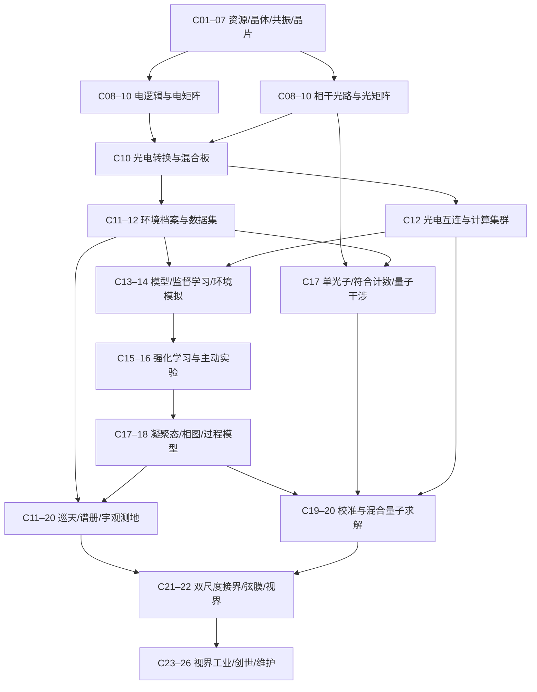
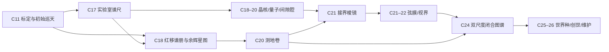

# 完整科技依赖与节点表

> R1已统合完成：[当前审核总案](REVIEW_SYSTEM.md)。本文件保留为此前候选/审核依据，未按R1逐段重写，不作为当前完整流程的规范。

Rebuild 0.3：十一时代、二十六章，光电并行，微观与宇观交织。建模首次获得能力的依赖，不是全部Minecraft物料配方。`+`全部必需，`/`替代前置。

main表示标准内容路径，不代表每个节点都是通关硬门槛；是否必需由终点前置决定。五件套保留正式实验，专用光控/光RAM不锁学习与物理。challenge为深化挑战，external为可禁用外部后端。

## 主干

分组概览不替代下表和JSON的精确AND/OR前置。

## 节点表

| ID | 章 | 内容 | 首次前置 | 产出与约束 | 路线 |
| --- | --- | --- | --- | --- | --- |
| `start` | C01 | 开局资源契约 | 开局契约 | 可再生木材、圆石来源、水、基本种植条件 | main |
| `manual` | C01 | 无铁筛与木盆 | start | 木质工具，不用铁或工业滤膜 | main |
| `powder` | C01 | 手工分离 | manual | 碎屑、水和工作量→基础粉末与滤渣 | main |
| `metal` | C01 | 金属、玻璃与基础红石 | powder | 确定性粉末积分与燃料熔炼 | main |
| `crucible` | C02 | 粗坩埚与均值化 | powder + metal | 石质热处理，不需要晶体 | main |
| `seed` | C02 | 白噪晶种 | crucible | 基底、滤渣、水、手动压制 | main |
| `fractionation` | C02 | 分馏塔与排污 | metal + manual | 自动化既有手工分离流程 | main |
| `blast` | C03 | 模拟爆炸室 | metal + seed | 普通结构、缓冲和工艺爆震粉，不要求TNT | main |
| `raw` | C03 | 粗卡玛恩晶体 | blast | 基材、晶种与合格冲击 | main |
| `special` | C04 | 三类专化晶体 | raw | 导波、承压、稳谱，各有用途 | main |
| `frame1` | C04 | 基本I型框架 | raw + metal | 粗压头与结构，不要求偏振传感器 | main |
| `polar` | C04 | 偏振与应力观察 | frame1 | 先压合出偏振，再做传感器升级 | main |
| `repair` | C04 | 退火与回收 | raw + crucible | 缺陷可降级使用或有损回收 | main |
| `fe` | C04 | 自带燃料发电 | metal | 本模组提供FE，外部FE可替换 | main |
| `tuning` | C05 | 切片、调谐与记录 | special + polar | 锁相样本，区分知识与物质 | main |
| `bio` | C05 | 生物分离 | tuning + fractionation | 有机基底与样本→纤维/树脂/培养前体 | main |
| `probe` | C06 | 探针与类型化信号 | tuning + metal | 类型、单位、来源、时效与置信度 | main |
| `bus` | C06 | 总线与阈值控制 | probe + special | 条件、滞回、缓存与安全执行 | main |
| `logistics` | C06 | 物料接口与简易泵 | metal + fe + bus | 前期手工/漏斗，此时补自动搬运 | main |
| `loop` | C06 | 实际工艺闭环 | bus + fractionation + logistics | 污染→停料→清洗→恢复 | main |
| `ce` | C06 | 初级相干稳压 | special + tuning + fe | FE→初级CE，不用单频光源或泵浦塔 | main |
| `chem` | C07 | 制造与化学前体 | metal + bio | 硅基材、掺杂剂、蚀刻剂和封装材料 | main |
| `wafer` | C07 | 掺杂退火晶片 | chem + special + ce | 公开窗口制造首批标准晶片 | main |
| `mask` | C07 | 机械预设掩膜 | metal + tuning | 第一掩膜不用EDA或成品芯片 | main |
| `optics` | C07 | 基础光路器件 | wafer + mask | 曝光、刻蚀、清洗、测试 | main |
| `logic` | C08 | 电逻辑与诊断 | wafer + mask + probe | 常温有限门；诊断由探针自举 | main |
| `local_light` | C08 | 局域相干光源与干涉 | optics + ce | 经典干涉、相位扫描；不要求F4或模型 | main |
| `eda` | C08 | EDA原理图 | logic + optics | 编辑功能图，明确输入输出 | main |
| `young_record` | C08 | 杨氏条纹片 | local_light + probe | 干涉对照记录，用于光路标定；不冒充量子关联 | main |
| `layout` | C09 | 版图与时序 | eda | 布局、连线、域隔离、采样与缓存 | main |
| `tapeout` | C09 | 分层掩膜与流片 | layout + optics + loop | 真实材料制造裸片并分档 | main |
| `frame2` | C09 | II型稳定制造 | optics + loop | 固定公开曲线先造；学习仅优化已有工艺 | main |
| `f4` | C09 | F4与单频光源 | frame2 + local_light + ce | 精密参考扩展同步，不是基础光矩阵门槛 | main |
| `package` | C10 | 封装与端口 | tapeout | DIP/QFP/BGA等按接口/环境选择 | main |
| `board` | C10 | 主板与存储槽 | package + logic + fe | 安装实体芯片、供能、散热和端口 | main |
| `record` | C10 | 独立持久记录柜 | tuning + metal | 空白记录页先造，不依赖信息中心 | main |
| `electric_matrix` | C10 | 电矩阵与激活瓦片 | board + logic | 独立电域算术、非线性与基准计算 | main |
| `eo_bridge` | C10 | 光电转换与校准 | package + logic + optics + local_light | 调制、光电读出、ADC/DAC抽象和转换预算 | main |
| `hybrid_board` | C10 | 光电混合计算板 | board + electric_matrix + photonic_matrix + eo_bridge | 共同运行小矩阵任务；电存储和激活可用 | main |
| `nonlinear` | C10 | 非线性介质与晶胞 | special + optics + frame2 | 材质范围和写入参数分开 | main |
| `photonic_matrix` | C10 | 光GPU与MZI | optics + local_light | 基础线性矩阵，不依赖非线性介质/光RAM/模型 | main |
| `photoelectric` | C10 | 光电效应对照实验 | eo_bridge + local_light | 比较频率/光强与读出，有限光电模板 | challenge |
| `center` | C11 | 信息中心 | record + board + bus | 先核心、后中心；数据库为应用模块 | main |
| `survey` | C11 | 环境档案 | center + probe | 跨地点/工况采样，重复副本不算新证据 | main |
| `radiometry` | C11 | 普朗克标定片 | center + eo_bridge + young_record | 热辐射对照与响应标定；实体基片承载校准 | main |
| `sky_watch` | C11 | 巡天接收台与初始星录 | radiometry + optics + survey | 有限天区数据，分前景/背景，不要求量子 | main |
| `network` | C12 | 交换路由与DNS | center + board | 预设root/zone/cache/local服务链 | main |
| `runtime` | C12 | Schema与Runtime | network + record | 格式转换、任务、预算、时限和权限 | main |
| `dataset` | C12 | 数据集与实验出处 | survey + runtime | 时间/地点/批次分组，训练验证分离 | main |
| `pump` | C12 | 激光泵浦塔 | f4 + fe | 扩大CE通量，不是第一份CE来源 | main |
| `photonic_io` | C12 | 光协处理器互连 | hybrid_board + f4 + network | 电管理面与光数据面，不要求光RAM或光控核 | main |
| `cluster` | C12 | 光电机柜与集群 | photonic_io + network + runtime + pump | 任务落到个体板/芯片/端口，早于学习 | main |
| `parameter_space` | C13 | 参数实验空间 | runtime + record | 有限可返回编辑场，不产资源 | main |
| `model` | C13 | 有限模型实际求值 | hybrid_board + parameter_space + dataset + cluster | 光电共同后端，小shape实际算子 | main |
| `optical_model` | C13 | 模型光电分区部署 | model + photonic_matrix + eo_bridge | 算子分配与端到端成本，不是首次获得光计算 | main |
| `feedback` | C14 | 监督学习与版本 | model + dataset | 标签/损失/有限优化、留出工况和回滚 | main |
| `simulator` | C14 | 可复位环境与轨迹 | survey + runtime + model | 有限热/场动态、传感延迟、动作边界与回放 | main |
| `rl` | C15 | 强化学习策略 | feedback + simulator + cluster + bus | 状态-动作-奖励-下一状态；有限回合训练和独立验收 | main |
| `agent` | C15 | 实体控制与协作 | rl + bus | 指定代理搬运、路径与合作 | challenge |
| `dialogue` | C15 | 对话交易与对抗 | agent + feedback | 离线有限状态NPC、可复现评价 | challenge |
| `active_lab` | C16 | 主动采样与实验调度 | rl + survey + cluster | 比较不确定度与试验成本，提出实验再实测 | main |
| `photonic_control` | C16 | 光控制核 | nonlinear + f4 + package | 相干区有限状态机，替代部分电控路径 | main |
| `photonic_pulse` | C16 | 光脉冲处理器 | nonlinear + f4 | 光域非线性与脉冲任务专化 | main |
| `photonic_ram` | C16 | 光RAM与刷新 | nonlinear + f4 + photonic_control | 短期光状态，电存储可先支撑模型 | main |
| `optical_specialization` | C16 | 全光五件套协作实验 | optical_model + photonic_control + photonic_pulse + photonic_ram + photonic_io | 专化光路径保留，不锁首次模型/集群/物理实验 | main |
| `model_families` | C16 | CNN/Attention/MoE | cluster + feedback | 有限网格、序列、专家数和实际算子 | challenge |
| `api` | C16 | 外部后端网关 | runtime + feedback + cluster | 同任务离线替代，限流/超时/权限 | external |
| `cryo` | C17 | 普通低温与场线圈 | frame2 + survey + ce | 普通铜线圈与换热自举，不用超导 | main |
| `response` | C17 | 微观响应与相图 | cryo + active_lab + optical_model | 温度/外场/组分扫描，记录重复性和有效域 | main |
| `condensed` | C17 | 初级凝聚态材料 | response | 基础公开模板制超导/拓扑/相变 | main |
| `frame3` | C17 | III型精密场框架 | condensed + cryo | 前级材料制造升级，不要求视界 | main |
| `single_photon` | C17 | 关联光子与预告单光子源 | nonlinear + f4 + optics | 泵浦与非线性对源，预告/多光子污染可测 | main |
| `spad` | C17 | SPAD与符合计数 | wafer + eo_bridge + f4 | 半导体读出、暗计数、死时间和时间标签 | main |
| `quantum_lab` | C17 | 量子光学基础实验 | single_photon + spad + survey + optical_model | g2统计与双光子干涉；无需SNSPD或量子计算机 | main |
| `atomic_spectra` | C17 | 巴耳末谱尺 | radiometry + response | 样本谱线与仪器响应对照，实验室标尺服务巡天 | main |
| `feynman` | C18 | 费曼过程设计 | response + frame3 | 输入、顶点、传播、守恒和环境校验 | main |
| `remote` | C18 | 远程站与无线G1–G4 | network + survey + condensed | 早期代际S5可起步，此时扩多地采样 | main |
| `tunnel` | C18 | 隧穿配对 | feynman + condensed | 持久配对与在线状态分开 | challenge |
| `latent` | C18 | VAE/Diffusion候选 | model_families + feynman | 有限latent和迭代，候选仍需实测 | challenge |
| `hamiltonian` | C18 | 有限哈密顿量任务 | feynman + quantum_lab + cluster | 登记态空间、耦合与可测量；小规模经典精确基准 | main |
| `bloch_core` | C18 | 布洛赫晶核 | condensed + frame3 | 合格晶格基材加工的功能核心，名称为理论致意 | main |
| `cosmic_baseline` | C18 | 哈勃谱册与余辉星图 | sky_watch + atomic_spectra + remote + dataset | 红移多谱线匹配、背景前景分离；观测不是物质 | main |
| `classical_curve` | C19 | 经典保守曲线 | feynman + optical_model + survey | 量子自举与故障维修备用 | main |
| `snspd` | C19 | SNSPD低温读出 | condensed + cryo + optics | 已有超导制造探测器，首个超导不用它 | main |
| `quantum` | C19 | 量子光学协处理器 | quantum_lab + snspd + frame3 + classical_curve + hamiltonian | 可控态制备/测量与任务支持范围，非通用量子机 | main |
| `quantum_calibration` | C19 | 量子读出与误差校准 | quantum + dataset | 效率/损耗/可见度/重复制备，误差缓解不等于纠错 | main |
| `bell_record` | C19 | 贝尔关联签 | quantum_lab + quantum_calibration | 登记纠缠态/测量设置的关联报告，不可超光速通信 | challenge |
| `quantum_curve` | C20 | 混合量子求解与候选窗口 | quantum_calibration + hamiltonian + feedback | 经典更新参数、量子估计观测量，有限VQE式任务 | main |
| `protocol` | C20 | 可靠合成协议 | frame3 + survey + (classical_curve / quantum_curve) | 候选来自经典或量子路线，框架实测验证 | main |
| `crosscheck` | C20 | 量子交叉验证报告 | protocol + quantum_curve | 长流程毕业成果；知识保留供维修 | main |
| `advanced_network` | C20 | 无线G5–G6与高级脚本 | remote + cluster | 高密度、低延迟、预算化循环 | challenge |
| `casimir` | C20 | 卡西米尔间隙腔 | frame3 + active_lab + eo_bridge | 制实体精密腔并测间距/力响应，不提供无限真空能 | main |
| `metric_atlas` | C20 | 爱因斯坦测地卷 | cosmic_baseline + cluster + active_lab | 有限引力透镜模型与观测校验，不是造引力的物品 | main |
| `chirp_archive` | C20 | 啁啾回声匣 | cosmic_baseline + photonic_io + remote | 双站相关瞬变与噪声排查，LIGO启发挑战 | challenge |
| `dimension_samples` | C21 | 下界末地实际样本 | metal | 正常探索或明确定义的可再获得来源 | main |
| `boundary` | C21 | 边界档案 | remote + feynman + dimension_samples + metric_atlas | 微观响应与宇观几何对照，保留采样出处 | main |
| `string` | C21 | 稳定戈古尔斯弦 | boundary + frame3 + condensed + scale_bridge | 接界棱镜校准后由基材凝聚；普通末地材制锚 | main |
| `constraint` | C21 | 高阶约束材料 | protocol + condensed | 曲线与实际基材，数据不替代物质 | main |
| `membrane_blank` | C21 | 空白膜基材 | constraint + frame3 + condensed | 普通框架制造，不用膜刻写器 | main |
| `membrane_writer` | C21 | 全息膜刻写器 | optics + center + constraint | 普通写入头与存储接口，不用全息膜 | main |
| `membrane` | C21 | 功能全息膜·界面铭膜 | membrane_blank + membrane_writer + record + scale_bridge | 微观基材写入宇观边界档案，数据不替代物质 | main |
| `scale_bridge` | C21 | 接界棱镜 | boundary + casimir + crosscheck + bloch_core + constraint | 微观核心+宇观标定+物理基材，首次跨尺度耦合件 | main |
| `entropy` | C22 | 熵流泵与排热 | constraint + cryo + fe | 普通泵升级，明确热/流体/CE预算 | main |
| `quench` | C22 | 独立安全熄灭 | entropy + fe + bus | 机械联锁与预充储备，主控失稳仍可用 | main |
| `horizon` | C22 | 首次人造视界 | string + constraint + membrane + entropy + quench + pump + crosscheck | 外部FE/CE启动、受控停机与恢复 | main |
| `generation` | C23 | 视界发电 | horizon | 质量进料与维持成本，产有限FE/残渣 | main |
| `horizon_buffer` | C23 | 视界能源缓存 | generation + special | 先有正常副产，再制缓存 | main |
| `holo_data` | C23 | 全息存储读写 | horizon + membrane + center | 真实档案与校验，切模式仍持久化 | main |
| `rule_solver` | C24 | 黑洞规则求解 | horizon + holo_data + boundary | 登记候选集，绑定档案版本 | main |
| `late_optics` | C24 | WDM/长期光存储/全光交换 | holo_data + constraint + photonic_io | 通道、容量和并发升级 | challenge |
| `closure_archive` | C24 | 双尺度闭合图谱 | rule_solver + metric_atlas + scale_bridge | 比对受控视界响应与外部档案，约束可行世界模板 | main |
| `heart` | C25 | 世界之心采样 | rule_solver + frame3 + boundary | 受控采样，不毁原维度 | main |
| `genesis` | C25 | 创世编译与点火 | world_seed | 晨曦世界种绑定唯一实例，固定槽和返回入口 | main |
| `world_seed` | C25 | 晨曦世界种 | heart + closure_archive + holo_data + horizon_buffer + string | 实体核心装配并写入已验证模板，不复制世界 | main |
| `maintenance` | C26 | 维护与专化工厂 | genesis + logistics | 覆盖维护预算，休眠可恢复 | main |
| `crossdim` | C26 | F5跨维度网络 | genesis + network + photonic_io | 版本/时间边界与恢复，不无限强加载 | main |
| `finish` | C26 | 完整长流程终点 | maintenance + crossdim | 新维度专化产线运行并安全休眠恢复 | main |

## 量产反馈，非首次前置

- `feedback` → `special`：优化晶体工艺，不是首次前置。
- `optical_model` → `tapeout`：提高复杂版图良率。
- `condensed` → `photonic_ram`：改善缓存/温控。
- `generation` → `fe`：升级能源，不是第一次启动来源。
- `maintenance` → `fractionation`：专化产区扩大产能，付维护成本。
- `rl` → `loop`：验收策略改善动态工况，阈值控制先能工作。
- `active_lab` → `survey`：选择下一组实验，数据仍来自实测。
- `quantum_curve` → `active_lab`：估计观测量辅助排序，不直接授予工艺成功。
- `condensed` → `sky_watch`：微观材料提升接收灵敏度，不锁初始巡天。
- `cosmic_baseline` → `active_lab`：宇观残差提出新的实验目标。
- `horizon` → `metric_atlas`：内部实验与外部观测对照，不替代原始宇观证据。

## 微观与宇观的三次交汇

故事、实验和命名物品见[研究与故事](RESEARCH_AND_STORY.md)。分组箭头是概览，节点表的精确前置为准。

## 验证边界

禁用量子后，经典曲线和约束材料仍可生产，但长流程首次视界要求量子交叉验证。禁用挑战/外部后端仍可到达终点。

无环不证明物料数量、能源速率、场地和研究条件平衡；这些需要逐配方与游戏原型验证。
